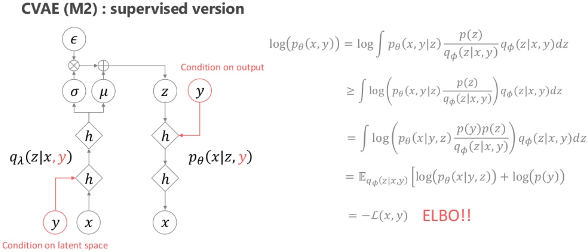
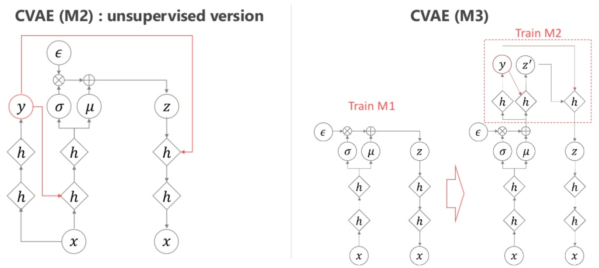
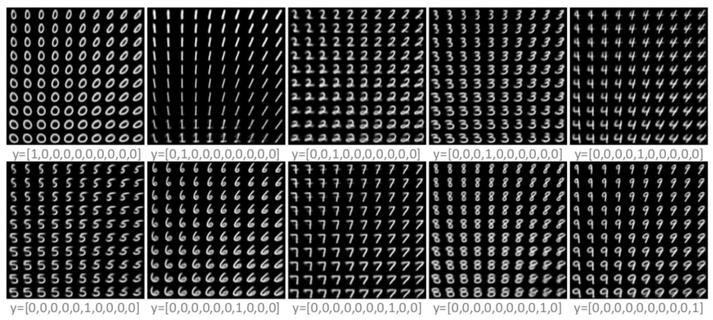
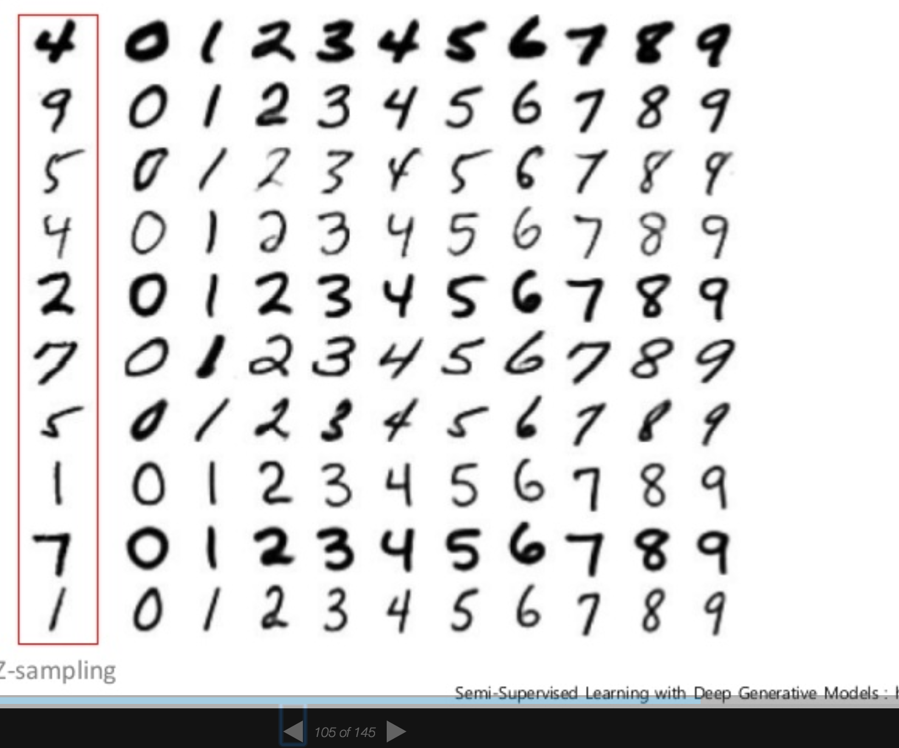
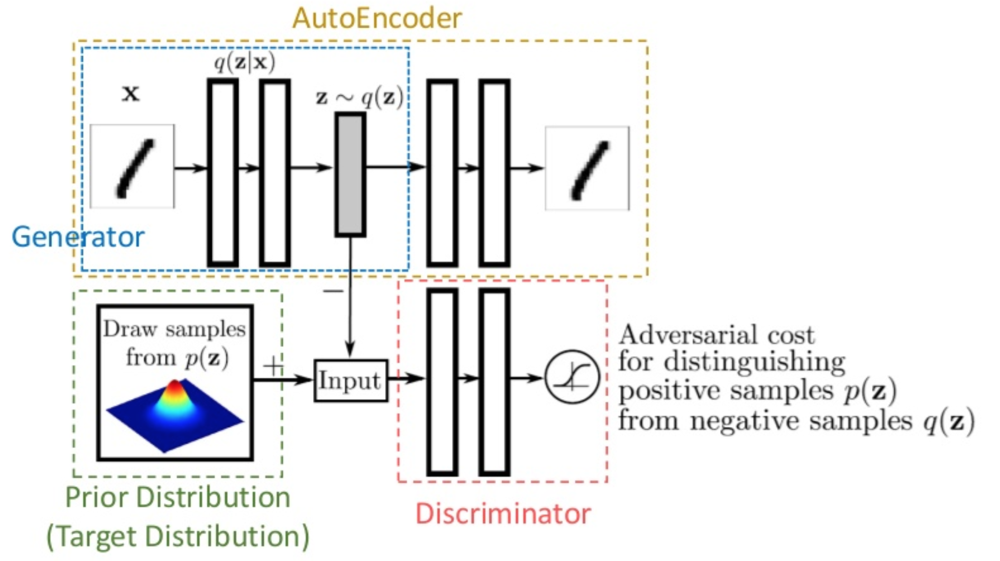
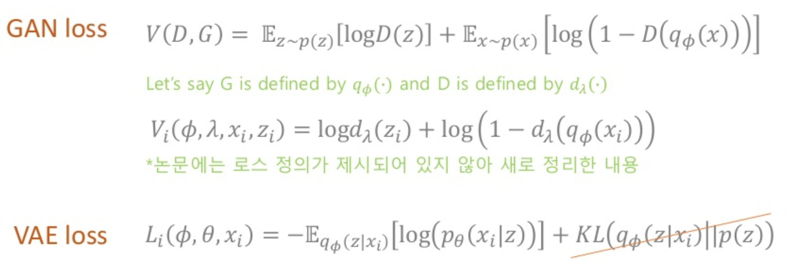
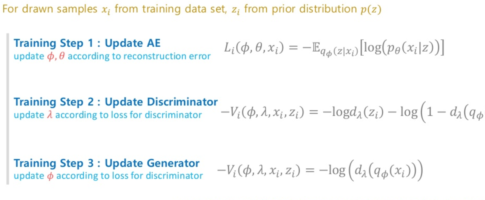

# CVAE, AAE

## Simple summary

>CVAE은 label 데이터를 이용해 VAE 학습 더 빠르게, 더 콘트롤 할 수 있게 만든 모델이며, AAE는 다양한 prior 분포를 사용하기 위해서 KL Term 대신에 GAN의 discriminator을 학습

## CVAE (Conditional Variational Auto Encoder)

- label y 데이터를 이용해 학습 시킨 AE 모델

### 종류

- Supervised model

  - encoder, decoder 입력단에 label y를 넣어 학습
  - 중간에 Jensen's inequality 이용됨. 

  $$
  f(E(x)) > E(f(x)), f(x) = convex function
  $$

- unsupervised model
  - 첫번째 방법 : x를 이용해 y를 예측하고, 예측된 y를 encorder, decorder의 입력으로 사용
  - 두번째 방법 : 먼저 기존 방법으로 VAE를 학습한 후, 학습된 encoder의 윗단에 y를 예측하는 부분 추가

### Example

- 라벨이 숫자일 경우

- 라벨이 스타일일 경우

  

## AAE (Adversarial Auto-Encoder)

- VAE의 KL-Divergence를 이용한 regularization 사용시 사용할 수 있는 prior가 한정적임, 그러므로 이를 극복하기 위해 KL-Divergence 대신 GAN의 Discriminator 이용
- 여러 모양의 prior 사용 가능

### 방법

- prior에서 뽑은 데이터를 진짜, AutoEncoder의 encoder가 만든 데이터를 가짜라고 하고 discrimiator가 이를 구분하도록 학습

- 우선 AE를 학습한다.
- 그런 다음에 AE가 생성한 데이터와 prior가 생성한 데이터의 구분하는 discriminator 학습
- 이후, Discriminator을 속이기 위해 AE의 encoder을 학습

### 원하는 z 위치에서 데이터 생성시키는 법

- 아래 그림의 10개 gaussian mixture을 사용할 때, 원하는 위치에서 데이터 분포 시키는 방법

-  Discriminator을 학습시킬 때, 
  - prior p(z)는 데이터 샘플링의 위치에 해당되는 라벨 정보를 넣어주어 학습
  - posterior p(z|x)는 encoder입력에 해당되는 라벨 정보를 넣어 주어 학습
- 결과시, 각 샘플과 동일한 위치에서 같은 스타일이 학습된다.

## Reference

- 오토인코더의 모든것 - 이활석 https://www.slideshare.net/NaverEngineering/ss-96581209
