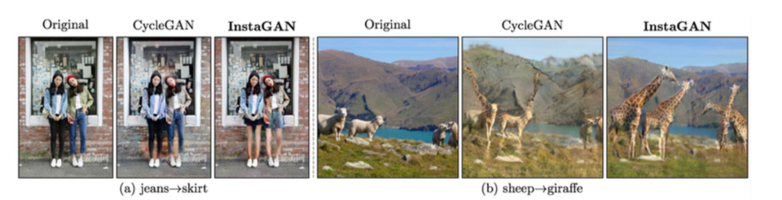
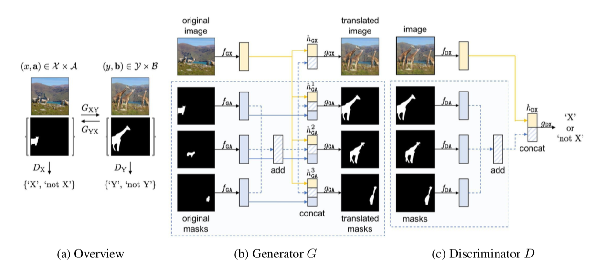
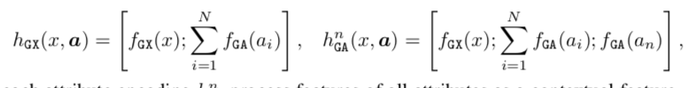
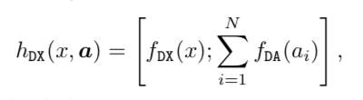
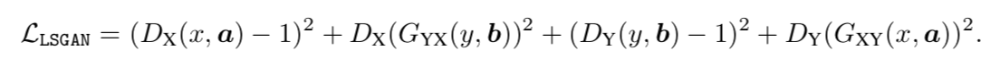
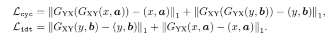
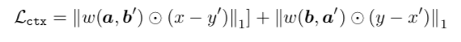
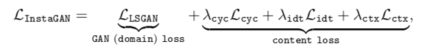
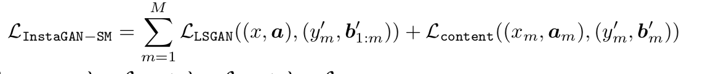
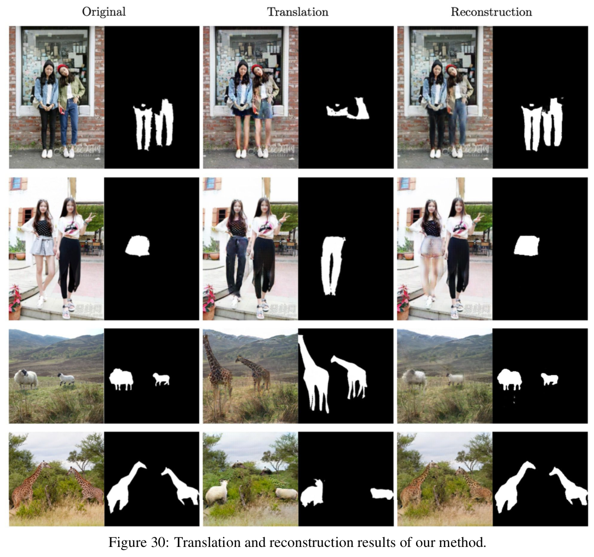

# INSTA GAN: Instance-aware Image-to-Image Translation

- Date : 2018.12 
- Author : Sangwoo Mo, Minsu Cho, Jinwoo Shin

## Simple summary

> instance만 변경하는 un-paried image translation이다. 기본 베이스는 cycle gan 이며, intance의 정보를 이용하기 위해서 feature extractor을 이용해 add하여 순서 상관없이 intance을 이용했고, hidden vector을 Generator와 Discriminator에 넣어주었다. 배경을 유지하기 위해 context preserve loss 사용했고, intance의 갯수 상관없이 GPU메모리 유지를 위해 새로운 학습 방법을 제안했다.

## 

- 특징 instance만 변경하는 un-paired image translation method

## 구조

- permutation equivariant : instance의 순서에 상관 없기 위해 각 instance의 featuremap을 생성한 뒤, **Add** 을 하여 처리

- fGX, fGA(generator), fDX, fDA(discriminator) : feature을 뽑는 네트워크 4개 

- gGX, gGA : 생성자 2개
- gDX : 도메인 X인지 구분하는 구분자 1개

- hGX, hGA : 생성자에 들어가는 벡터

- hDX : 구분자에 들어가는 벡터

### Model

- ResNet Block 9개
- PatchGAN : 5 convolution layer
  - feature Extract : 3 Conv
  - classifier : 2 Conv
- Encoder : ResNet Block + downsampling block
- Generator : ResNet Block + downsampling + upsampling

- Instance Normalization 적용 (G, D)
- Spectral Normalization 적용 (D에만)

## Traning Loss

- domain loss : 이미지 변환을 시켜주는 Loss
  - domain loss, cycle-consistency loss, identity mapping loss
- Content loss : 원래 이미지를 유지 시켜주는 Loss
  - context preserving loss 

- Domain loss : LSGAN을 이용

- cycle-consistency loss, identity mapping loss : Cycle GAN을 이용

- Context preserving loss :
  - 오직 intance에만 적용
  - 각 변경 전과 변경 후 이미지에 weight (배경이 1, instace 0)을 곱한 뒤, l1-dist적용
  - 이 때, 변경 전과 변경후 배경이 다르기 때문에, 둘다 존재하는 배경만 고려

- Total loss

## Sequential Mini-Batch Translation

- Instance 수에 따라 GPU memory 요구

### 방법

- 우선, instance set을 여러개의 mini-batch로 나눔
- 첫번째 iter에서는 첫 mini-batch만 변형
- 변형된 이미지를 이용해, 그다음 mini-batch inctance 활용
- 반복

### 설명

- Content loss는 현재 mini-batch sample을 활용
- Gan loss는 합쳐진 mini-batch sample을 활용
  - 부분만 이용했을 때 실패

## 결과

