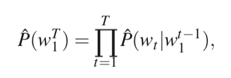
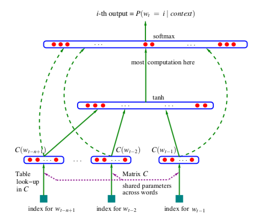
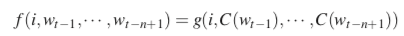
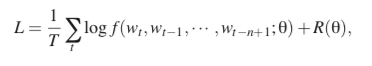
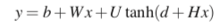
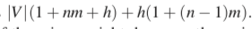

# NNLM

## Summary

    language model에서 `curse of dimension` 문제로 인해 
    training set에 너무 overfitting되는 현상 이 발생.
    
    이 부분을 해결하기 위해서 word를 distributed representation을 학습하고
    이를 이용해 다음 단어를 예측하는 모델을 구성하여 해결한다.
    
    즉, training set에 없는 문장 구성이라도, 
    학습된 representation을 이용해 비슷한 단어로 교체하여 다양한 문장을 생성할 수 있도록 학습한다. 

## Abstract

- language model의 목표는 단어 시퀸스의 joint dist를 계산하는 것
- 문제점 : curse of dimensionality, test와 train과 다름
- 해결 방안 : distributed representation을 이용해 학습
- distribution과 probability function을 학습한다.
- training에서 보지 않았던 단어들도 dist representation을 통해 similar가 학습되어 generation하게 학습이 가능

## Introduction

- 문제 : curse of dimension

    - discrete random variable에서 100,000개에서 10개의 연속된 분포를 학습할 때, 많은 파라미터가 필요

- **conditional probability**

    

- 일반적으로 가까운 단어에 의존적하기 때문에 n-gram 모델 사용

- training에서 학습되지 않은 단어가 나왔을 때
    - 더 작은 context size을 이용해 확률을 예측한다.
    - 이 때, 새로운 단어는 기존에 학습된 단어에 겹쳐놓는다.

- 기존 방법의 문제
    - 1 or 2개 이상의 단어를 고려하지 않음
    - similarity를 고려하지 않음

### 1.1 fighting the curse of dimensionality with distributed representation

- word을 word feature vector로 매칭
- feature vector로 joint probability function 표현
- word feature와 probability를 동시에 학습

- vacabulary보다 휠씬 작은 size로 생성 가능
- probability function은 이전 것에 의해 다음에 나올 확률로 학습

- similar word를 통해서 generalization이 가능
- 왜냐하면 비슷하기 때문에 feature가 작게 변해도 output도 작게 변한다. 즉, 하나의 문장이외에 비슷한 다양한 문장의 확률을 구할 수 있다.

## 2. A Neural Model

- 목표 : f(wt, ..., wt-n+1)=P(wt|w^(t-1)_1)로 학습

- Figure

- 기능
    - word vector를 distributed feature vector C에 mapping
    - 입력으로 n개의 C가 들어갔을 때, 다음 단어 C의 확률을 구하는 함수 학습

    

    - C : embedding function
    - g : neural network (dnn, rnn)

- loss

- equation
    - x : 이전 단어 feature vector의 concatenate
    - W : 선택적인 내용 추가할지 말지 설정 가능

- parameter 수
    - b : |V|
    - d : hidden layer의 element의 수
    - U : |V| x h (hidden → output)
    - W : |V| x (n-1)m (word feature → output)
    - H : h x (n-1)m (word feature → hidden)
    - C : |V| x m (convert embedding)

## 문제점

- 아직도 많은 파라미터 계산이 요구된다.