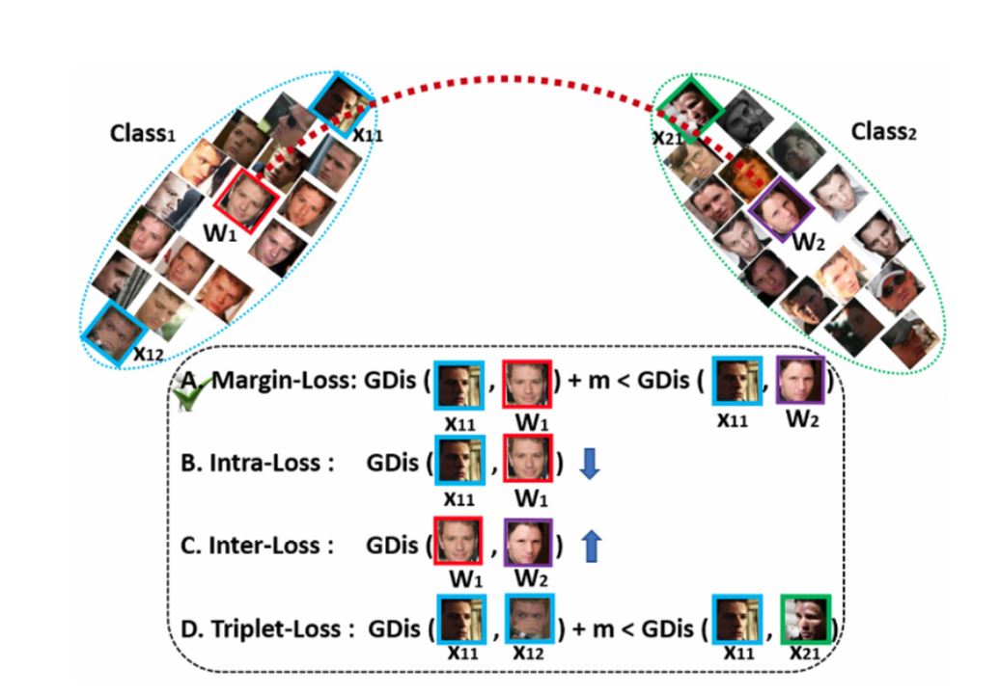
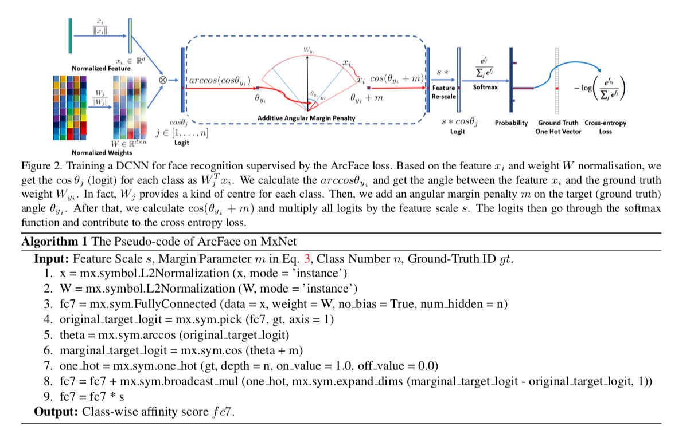
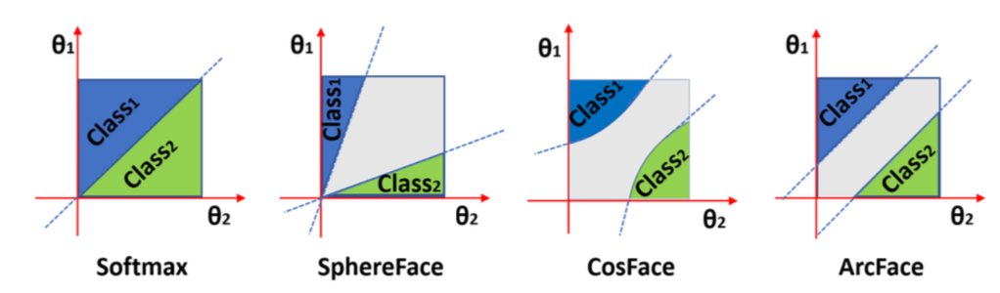

# ArcFace

## Abstract

- face recognition시 분별력이 높은 loss을 선택이 중요
    - centre loss : class의 center와 deep feature간의 유클리드 거리를 줄이는 방식
    - sphereFace : angular space에서 fc의 weight가 class center을 나타냄, weight와 deep feature간 angle에 제한두어 학습
- ArcFace은 sphereFace의 연장선
    - geometric 해석이 가능
    - 계산도 효율적임

## Intorduction

- face recongnition의 목적 : intra-class을 줄이고, iter-class을 크게하는 것

- 최근 연구
    - 직접 embedding을 이용 : triplet loss, softmax loss
        - 장점 : large-scale 적합
        - 단점 :
            - softmax loss
                - class가 증가하면 W의 크기가 선형저으로 증가
                - 비슷한 set classification에 분류가 약함
            - triplet loss
                - class가 늘어나면, faca triplet의 수가 폭발적으로 증가
                - sampling mining이 매우 어려움
    - centre loss : feature와 class의 center의 거리를 줄이는 방식
        - 단점 : class의 center을 구하는 작업이 매우 힘듬
    - fc의 weight를 center로 사용하는 방식 : shpereFace, cosFace
        - shpereFace의 단점
            - approximation 과정이 요구 → 학습의 불안정
            - hybrid loss 제안
        - cosFace : 직접 cos에 제한을 거는 방식

- 제안하는 내용
    - Additive Angular Margin Loss
        - 1. normalized weight와 feature 사이에 angle을 계산
        - 2. taget angle에 angular margin을 더하고, cosine function에 의해 target logit을 다시 구함
        - 구해진 target logit을 re-scale한 후, softmax loss으로 다시 구함
    - 장점
        - Engagine : angle과 arc사이에 정확한 상호작용하는 장점이 있다.
        - Effective : face benchmark을 이용해 최고의 성능을 얻는다.
        - Easy : Pytorch로 구현이 간단한다. 안정적이게 학습됨

## Proposed Approach

### softmax loss

$$L_1 = -{{1}\over{N}} \sum{log{{e^{W^T_{y^i}x_{i}+b_{y_i}}}\over{\sum{e^{W^T_j} x_i+b_i}}}}$$

- intra class간 거리를 좁히고, inter class간 거리를 넓히기 힘듬

### 여러가지 loss

- margin-loss : margin을 두어 해당 클래스가 다른 클래스보다 적게 학습
- intra_loss : class내 샘플과 weight간을 줄임
- inter-loss : 서로 다른 class간 거리를 늘림
- triplet-loss : margin을 두어 hard positive와 hard negative의 거리를 학습

### 변형

$$L_2=-{{1}\over{N}}\sum log{{e^{s cos\theta_{yi}}}\over{e^{scos\theta_{yi}}+\sum{e^{scos\theta_{yi}}}}}$$

- b가 0이고, ||W||=1, ||x||=1로 normalization하고, s=을 고정하면, 반지름이 s인 구에 분포하는 embedding vector 학습이 가능하다.

$$L_3=-{{1}\over{N}}\sum log{{e^{s cos(\theta_{yi}+m)}}\over{e^{scos(\theta_{yi}+m)}+\sum{e^{scos\theta_{yi}}}}}$$

- 자신에 해당되는 angle에 margin을 더함으로 마진 만큽 좁아지게 하여 intra-class간 거리를 좁히고, inter-class간의 거리를 높힘

## 알고리즘

- normalized feature와 weight을 이용해 angle 구함
- 해당 클래스 angle에 margin을 더함
- cos을 통해 logit을 다시 구하고, scale을 곱해줌
- 이를 통해 softmax 계산
- 결과를 target logit과 cross-entrophy 계산

### Comparison with SphereFace and CosFace

- SphereFace : multiplicative angular margin
- ArcFace : additive angular margin
- CosFace : additive cosine margin

- shpereFace, ArcFace, cosFace의 margin을 모두 사용시 최고의 성능을 얻음

$$cos(m_1\theta+m_2)-m_3$$

- gepmetric Difference

