# BEGAN: Boundary Equilibrium Generative Adversarial Networks

- Date : 2017.03 

- Author : David Berthelot, Thomas Schumm, Luke Metz

## Simple summary

>BEGAN은 discriminator을 auto-encoder을 사용하여, real 데이터와 fake 데이터의 auto-encoder loss의 W-distance을 loss로 삼는다. 기존의 EBGAN의 auto-encoder 개념과 WGAN의 개념을 동시에 사용한 듯 싶다. 또한, 여기서 D와 G가 안정적으로 학습하기 위해 equilibrium 개념을 소개한다. 이를 이용해 G와 D가 안정적으로 학습을 유도하고, GAN의 수렴 척도를 계산할 수 있다.

##Wasserstein distance 

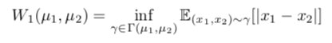

- 다른 말로 `EM(earth-moving) distance` 으로, 확률 분포 P의 흙 덩이를 다른 확률 분포 Q 흙 덩이로 이동 시키는 데 드는 비용을 나타냄 
- 두 확률 분포가 가까울수록, 이동시키는 데, 드는 비용이 매우 적음
- Inf : greatest value in lower bound

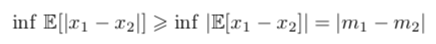

- jensen's inequality(f(E[x]) < E[f(x)]) 를 이용하면, 다음처럼 lower bound을 구할 수 있음

## auto-encoder loss

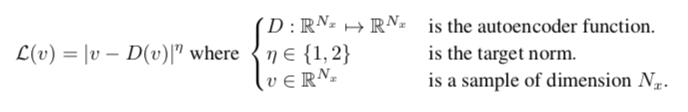

- 기존 discriminator의 0과 1로 샘플을 구분하는 것이 아니라, auto-encoder 구조를 이용해 학습
- 이 방법은 `EBGAN`에서 처음으로 제시

## GAN objective

- real data의 auto-encoder loss의 분포 u1와 fake data의 auto-encoder loss의 분포 u2 사이 `Wasserstein distance`가 최대화 되도록 discriminator 학습

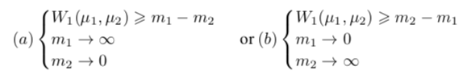

- (b)방법을 사용. 왜냐하면,  real data의 auto-encoder loss을 0으로 만드는 것이 자연스럽기 때문

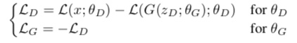

- 여기서는 위 식이 최소화되도록 학습
- z는 uniform-distribution을 사용
- discriminator는 진짜 이미지는 auto-encoder loss가 작아지고, 가짜 이미지는 auto-encoder loss가 커지도록 학습
- generator는 생성된 이미지가 진짜 이미지와 비슷하게 생성되도록 학습

### WGAN과 차이

1. 실제 sample의 분포를 생성하도록 하는 것이 아니라, real과 fake간의 loss가 비슷하게 만들기 위해서 학습
2. K-Lipschitz을 명시적으로 요구하지 않음 (추후 공부)

## Equilibrium

- 가정 : discriminator가 real 데이터와 fake 데이터를 구분하지 못한다면, 각 auto-encoder loss도 같아 질 것이다.

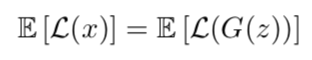

- Diversity Ratio

  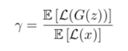

  - 진짜 분포를 생성하는 목적과 가짜를 분류하는 목적 두개를 사용
  - 값이 작아질수록, image의 diversity가 줄어듬

## Boundary Equilibrium GAN

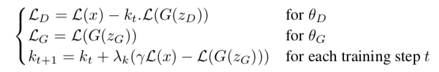

- k를 이용해 discriminator의 loss의 balance를 결정
- k은 초기 0이다가 학습 시간이 지날수록 업데이터
  - 초기에는 generator가 구분하기 쉬운 이미지를 생성하여, real 데이터로 생성하는 것보다 더 큰 loss를 가지는 경우가 많음.
  - 그러므로, 초기에는 real를 복원하는 쪽으로 가중치를 더 주게 학습

## Convergence measure

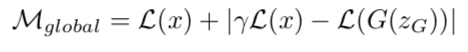

- 기존의 GAN의 경우, min-max game이기에 GAN이 수렴되었는지를 확인하기가 힘들었다.
- measure가 L(x)와 얼마나 가까운 가를 통해 측정이 가능

## Model architecture

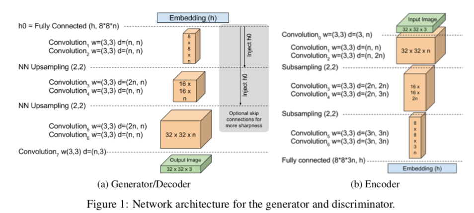

- 3x3 ELU 컨볼루션을 이용.
- 각 레이어는 두번씩 반복 (여러번 반복할수록 성능은 더 좋았다.)
- upsampling으로 Nearest Neighbor 이용
- encoder와 decoder 중간에는 fc layer을 활용

- Generator도 Decoder와 같은 형식으로 쌓음

- z로 uniform distribution 사용

### 학습 팁

- vanish residual을 이용해 network 초기화
  - 연속적으로 같은 레이어가 사용될 때, 다음 레이어의 input은 이전 레이어의 input과 output의 조합으로 학습 (input_x+1 = carry * input_x + (1-carry) * output_x)
  - carry가 1로 시작해서 16000 step까지 0으로 수렵되게 학습
- Skip connection
  - decoder에서 upsampling을 진행할 때, up-sample된 embedded vector와 concat 수행
- batch normalization, dropout등 테크닉이 사용되지 않음

## 실험결과

- Adam (lr = 0.0001), convergence measure이 멈출 때마다 1/2식 감소
- h, z는 64-dim vector이용
- 128x128 image 학습시 2일, 32x32 image 학습 4시간 걸림

### Image diversity and quality

- 고화질의 다양한 얼굴 사진을 얻음
- gamma에 따라 diversity 조절

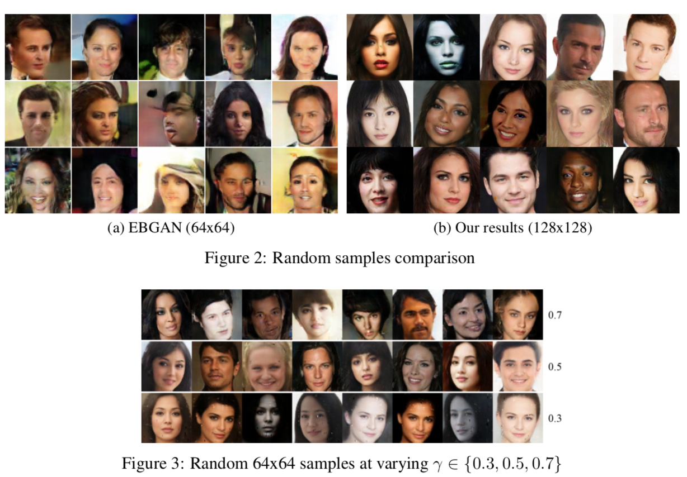

### Space continuity

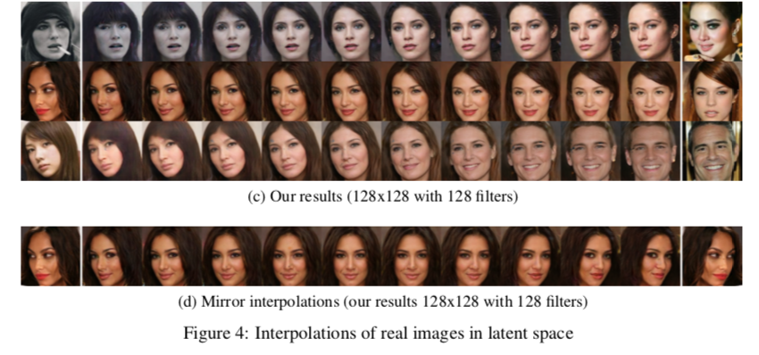

- 두개의 실제 사진(real)을 받고 이에 해당되는 z를 값을 얻음
  - adam을 이용해 z를 minimize함
- 그리고는 , 두 z값에 대한 interpolation을 구하고, 이 값을 이용해 실제 사진을 생성

- 중요하지 않은 물체는 사라짐
- 회전은 자연스러우나, 프로필 사진안에 사람이 유지 되지 않는 경우 발생
  - 이는 데이터셋에 해당 사람이 없다고 판단

### Convergence measure and image quality

- 사진 퀼리티와 convergence은 비례
- 수렴속도는 매우 빠름

### Numerical experiments

- CIFAR 10 이미지의 inception score 계산
- 다른 GAN 이론에 비해 높은 성능을 얻었음

## 제한점

- Auto-encoder에 최적화된 latent vector는 무엇인가?
- Auto-encoder의 변종을 사용하면 어떤가?

