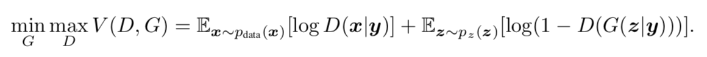
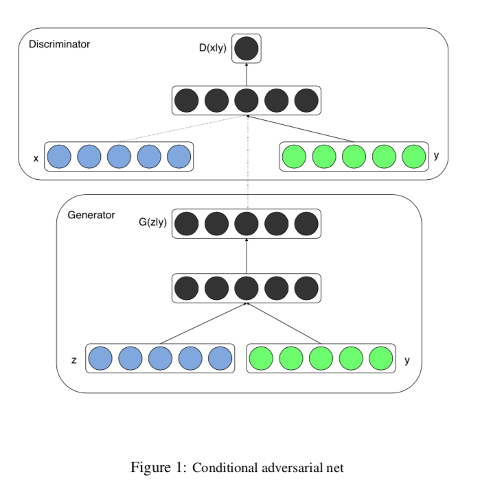
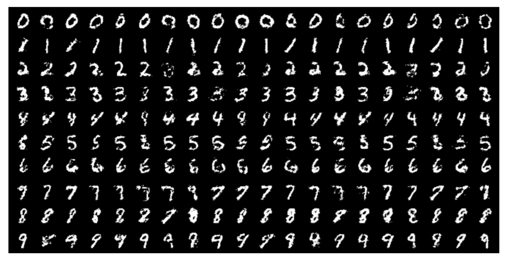
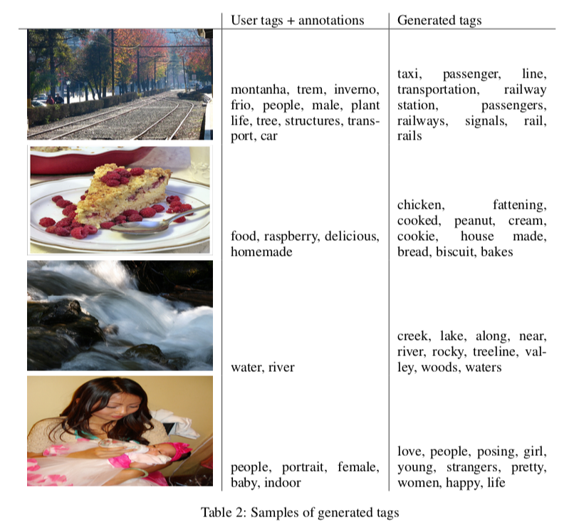

# Conditional Generative Adversarial Nets

## Abstract

- 추가적인 정보 y를 이용한conditional GAN를 소개
- Generator, Discriminator 둘 다 정보 y를 추가한다.
- MNIST, image tagging을 experiment 한다.

## 1. Introduction

- 다루기 힘든 확률분포를 근사화의 어려움을 줄이기 위해서 generative model 소개
- GAN 장점
    - Markov chain이 필요없음
    - 오직 backpropagation으로 학습
    - 학습 중에 inference가 필요 없음
    - 다양한 factor을 추가가 가능
    - 실제 같은 샘플 생성이 가능
- Condition GAN
    - 추가적인 정보(class label)를 넣어 multi-modal의 data 생성이 가능
- Experiment
    - class label을 이용한MNIST 생성
    - Flickr data을 이용한 image tagging

## 2. Conditional Adversarial Nets

### 2.1 Generative Adversarial Nets

- 구성
    - Generative model G
    - Discriminative model D
    - non-linear mapping fucntion (MLP) 구성
- Generative model : noise dist pz(z)에서 data space를 매핑하는 함수
- Discriminative model : 실제 데이터와 가짜 데이터를 하나의 scalar data(진짜일 확률)로 매핑하는 함수
- G, D를 동시에 학습 (min-max game)
    - G는 log(1-D(G(z))를 minimize한다.
    - D는 log(D(X))를 minimize한다.
- Objective model

### 2.2 Conditional Adversarial Nets

- 추가적인 정보 y를 조건으로 G, D에 넣어 GAN를 확장
- Generator
    - noise input pz(z)와 y를 조합해서 넣음
    - y로 인해 hidden representation의 상당히 유연하게 생성이 가능
- Discriminator
    - x와 y를 같이 입력으로 넣음
- Objective model

- Model

## 3. Experimental Results

### 3.1 Unimodal

- y로 one-hot vector의 class label를 사용해 MNIST 학습
- Generator
    - z(100-dim, uniform dist)
    - z는 Linear(200, ReLU) 통과
    - y는 Linear(1000, ReLU) 통과
    - 두 결과를 concat하여 Linear(784, sigmoid) 통과해 MNIST image 생성
- Discriminator
    - x는 maxout(240, 5 piece)를 통과
    - y는 maxout(50, 5 piece) 를 통과
    - 두 결과를 concat하여 maxout(240, 4 piece, sigmoid)를 통과
    - Discriminator의 구조는 중요하지 않다. 충분한 구별 능력을 가지고 있다.
- train
    - mini-size : 100
    - learning rate : 0.1, exponential scheduler 0.000001
    - Momentum : 0.5, increase 0.7
    - Drop out : 0.5
- Result

### 3.2 Multimodal

- data
    - filck에서 이미지와 유저가 단 태그 정보 활용
    - 특징 : 좀더 설명력 있고, 같은 개념도 다르게 표현
    - word embeding (200-dim)을 이용해 tag normalization 수행
    - 총 150,000 개 사용

- Automated image tagging
    - cgan을 이용해 tag을 예측하는 모델 작성
    - input vector로 imagenet으로 pre-train model의 중간 hidden vector (4096-dim) 사용

- Model
    - CNN, LM은 cgan을 학습하는 데 fix 시킴
    - image와 tag에 대한 feature을 CNN, LM을 이용해 추출
    - multi-labeled data는 반복 사용
    - Generator
        - noise vector(100-dim)은 Linear(500, ReLU)를 통과
        - image vector는  Linear(2000, ReLU)를 통과
        - 두 결과를 concat한 후, Linear(200, ReLU) 통과해 word vector를 생성
    - Discriminator
        - word vector는 Linear(500, ReLU) 통과
        - image vecot는  Linear(1200, ReLU) 통과
        - 두 결과를 concat한 후, maxout (1000, 3 piece, sigmoid)를 통과
    - train
        - SGD
        - mini-batch : 100
        - learning rate : 0.1, exponential scheduler 0.000001
        - Momentum : 0.5, increase 0.7
        - Drop out : 0.5

- eval
    - image vector를 입력으로 넣고, 결과에 해당되는 word vector와 cosine similar가 높은 20개의 단어를 voca에서 추출

- 결과

