# Unpaired Image-to-Image Translation using Cycle-Consistent Adversarial Networks

- Date : 2017.03 
- Author : Jun-Yan Zhu, Taesung Park, Philip Isola, Alexei A. Efros

## Simple summary

>Cycle GAN은 unpaired data를 이용해 학습한 Image Translation 모델이다. 기존의 pix2pix는 paired data가 필요했지만, 데이터를 얻기 매우 제한적이었다. 그래서 Cycle GAN은 기존의 adversarial loss와 cycle consistency loss를 이용해 unpaired data로 학습이 가능하게 만들어 주었다. 

## 기존 pix2pix의 문제점

- 기존의 pix2pix와 같은 image transfer의 문제는 학습을 위해서는 `paired dataset`이 요구 되었다. 이런 `paired dataset`은 얻기가 매우 힘들다.
- 하지만, `cycle gan`은 `unpaired data`로 생성이 가능

## Loss function

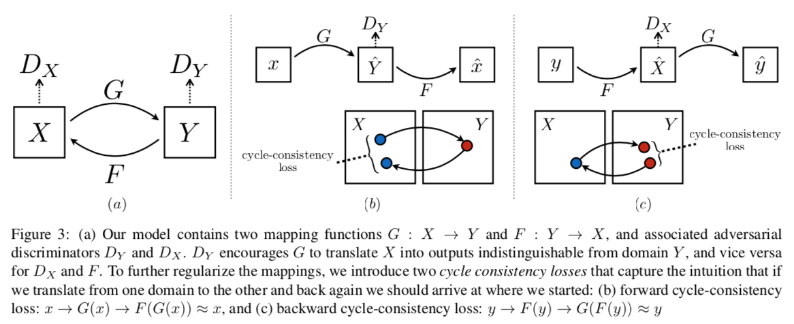

- Adversarial Loss
  - 기존의 minmax게임으로 학습

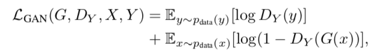

- Cycle Consistency Loss 
  - 단순히 adverarial loss 사용시, random한 이미지를 생성하게 된다.
  - 똑같은 모양을 만들어 내기 위해서, cycle consistency loss를 추가

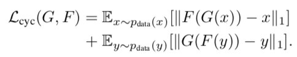

- Total Loss

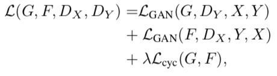

- adversarial auto-encoder의 형태와 비슷

## Architecture

- 2개의 stride-2 conv + residual block + 2개의 stride 1/2 conv
- instance normaliation

- Discriminator경우, 70x70 patchGAN
  - patchGAN 이용시, 다양한 크기의 이미지 사용 가능

## Detail

- LSGAN 이용!!

  - minimize G

  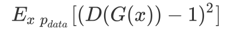

  - minimize D

  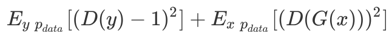

- history of generated images (discriminator)
  - model oscillation을 줄이기 위해서 사용
  - D가 최근에 생성한 데이터에 적합하게 학습
  - 이전에 생성한 이미지 입력
  - 이전에 생성한 50개 이미지 저장

- Adam 사용
- lambda : 10
- batch size : 1
- learning rate : 0.0002
- learning rate decay : 100 epoch 까지는 유지, 그 이후로 linear 하게 감소

## Result

- 평가 방법 : Pix2Pix와 같음
  - Amazon Mechanical Turk
  - FCN score

- 다른 방법과 비교

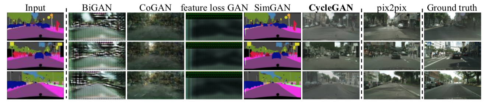

- loss 비교
  - Cycle alone, GAN + backward은 실패
  - GAN alone, GAN + forward은 mode collapse

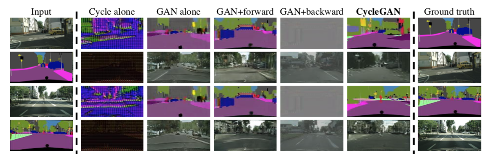

- application

  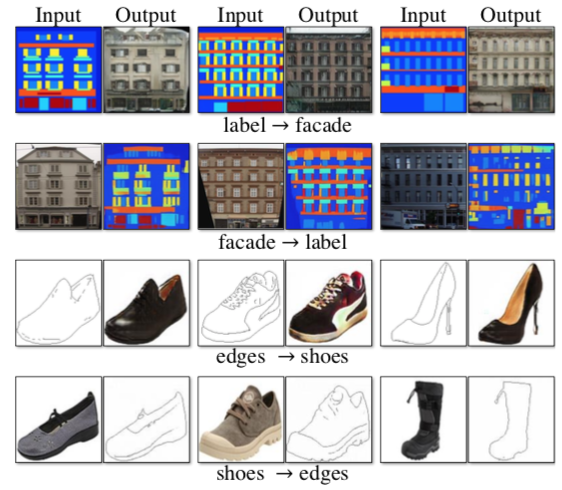

  - style transfer : 526, 1073, 400, 563개 사용

  - Object transfigure : 1000개 사용

  - Season transfer : 1273개 사용

  - Photo generation form paintings

    - 여러 날씨를 가지고 있는 데이터 때문에, 사진의 색조가 변하게 됨

    - 새로운 loss를 추가

  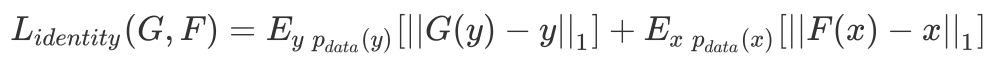

  - Photo engancement

## Limiations

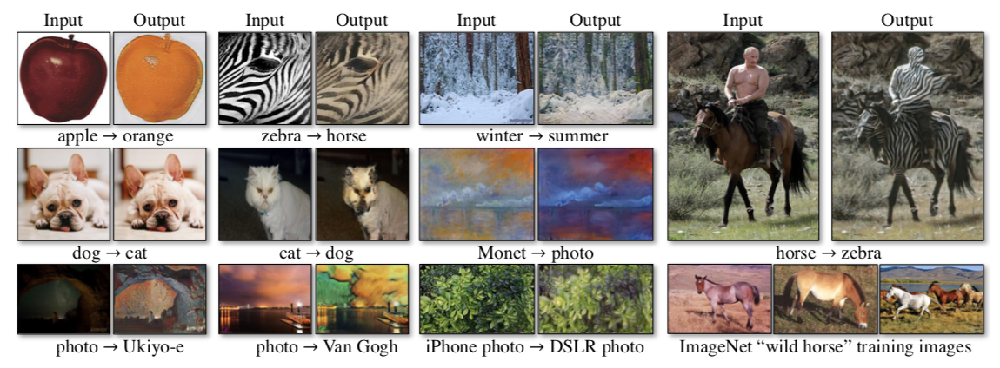

- 위치적인 변화가 있는 경우, 조금 성공했다.
  - 예 dog <-> cat
- data의 분포때문에 실패하는 경우 발생
  - 예를 들어 train에 말타는 사람이 없을 경우, model이 사람을 구분하지 못함.
- 여전히, paired training data와 갭이 존재
  - 이 문제를 해결하기 위해서는, semi-supervised method를 사용 가능