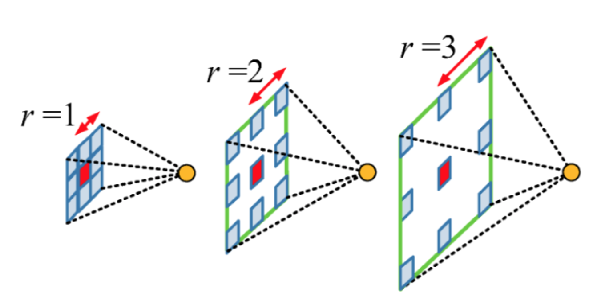
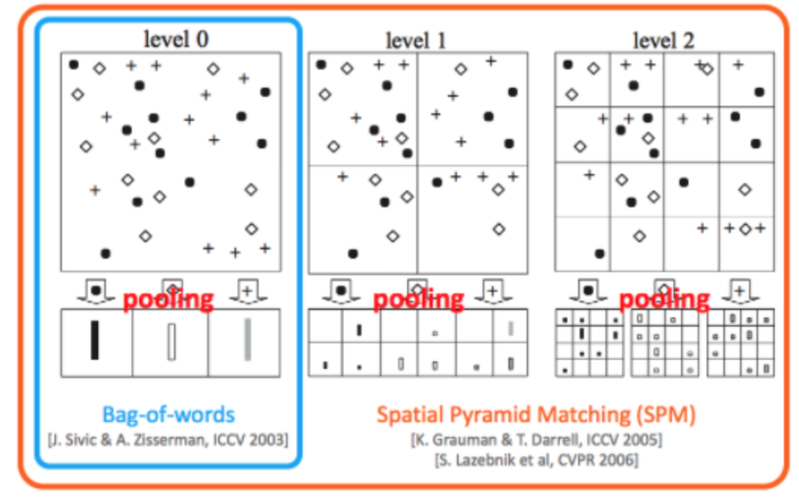
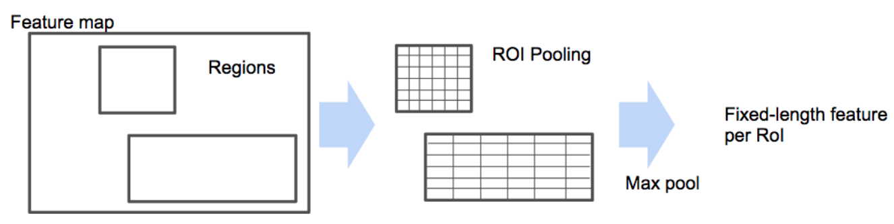
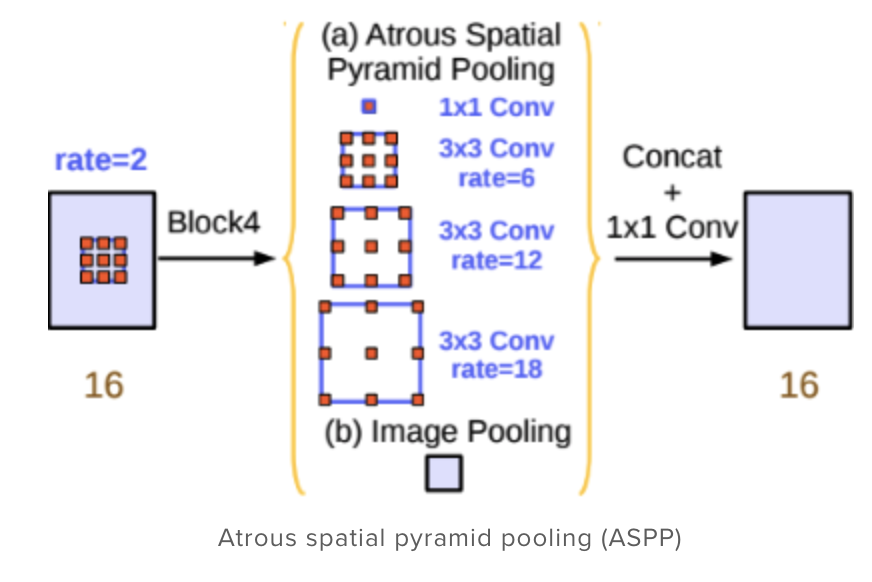
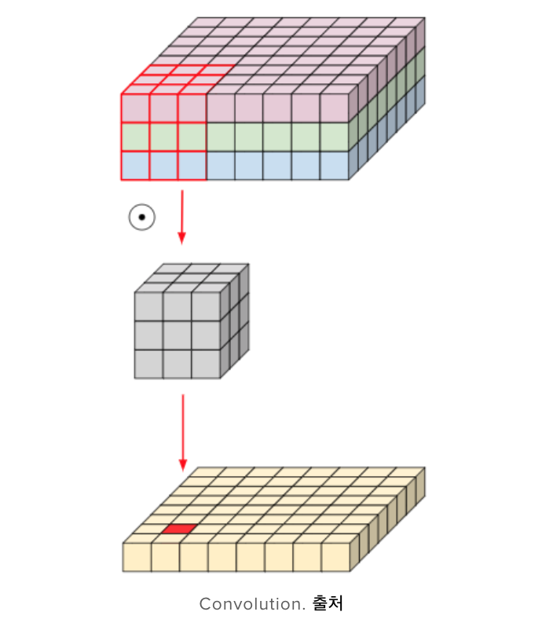
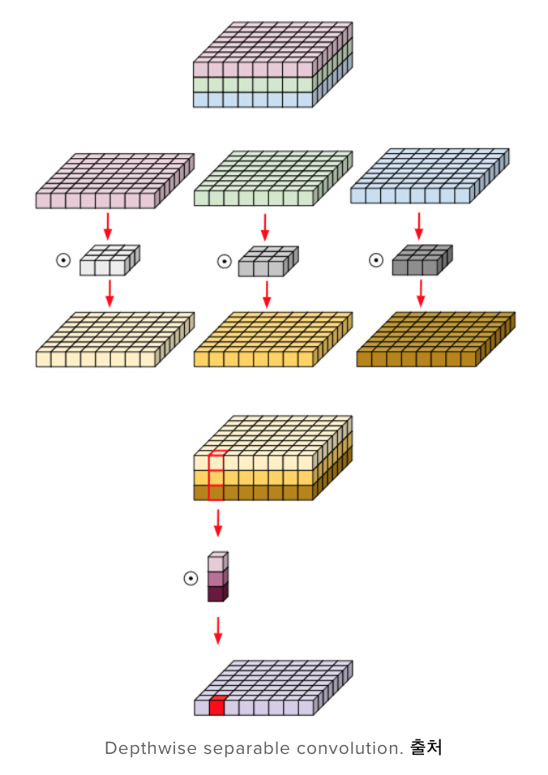
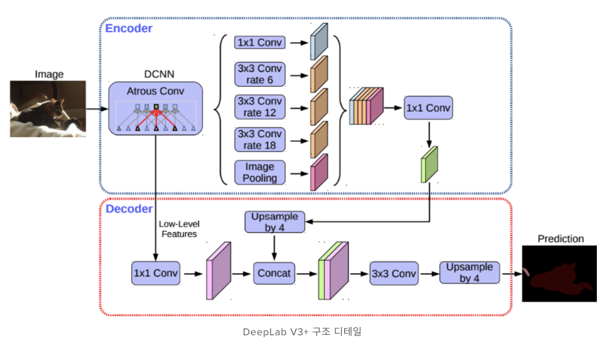
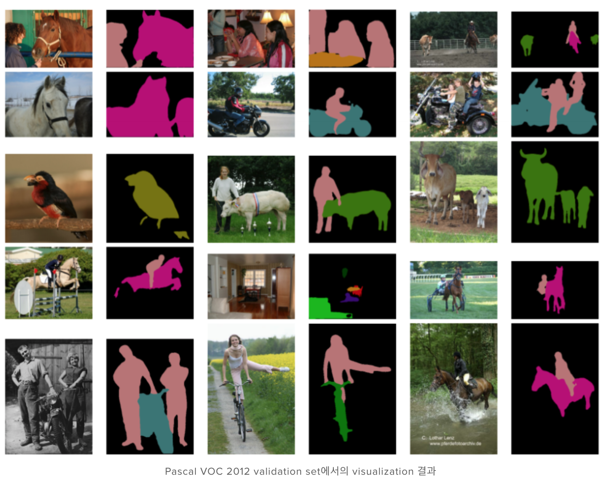

# DeepLab v3+

- Lunit Tech Blog 참조 https://blog.lunit.io/2018/07/02/deeplab-v3-encoder-decoder-with-atrous-separable-convolution-for-semantic-image-segmentation/

## Simple summary

> DeepLab은 구글에서 개발한 semantic segmentation을 위한 모델이다. Deep Lab은 atrous convolution을 베이스로 개발되었으며, 현재 총 4가지 버전 (1, 2, 3, 3+)이 출시 되었다. Deep Lab v2은 multi-scale을 위한 ASPP, DeepLab v3은 Resnet과 encoder, decoder구조를 이용한 방법, v3+은 separable convolution을 적극 사용한 ASSPP를 이용했으며, encoder-decoder구조 대신에 U-net구조를 사용하였다.

### semantic segmentation 

입력 영상의 각 주어진 픽셀에 class label을 할당

- 주요 벤치마크 : PASCAL VOC 2012

## DeepLab

- 총 4갱의 개정본 출판 (1, 2, 3, 3+)

### 각 버전별 주요 내용

- DeepLab v1 : atrous convolution 
- DeepLab v2 : Atrous Spatial Pyramid Pooling (ASPP)
- DeepLab v3 : Resnet + atrous convolution
- Deep lab v3+ : separable convolution + atrous convolution (atrous separable convolution)

### Atrous Convolution

- kernel 내부에 빈공간을 둔 채 작동하는 convolutions
- r을 통해 빈공간을 채울 것을 결정

- 이점: 기존의 동일한 양의 파라미터를 가지고, `넓은 receptive field`를 얻을 수 있음
  - semantic segmentation의 성능은 한 픽셀의 receptive field 영역이 매우 중요 

### Spatial Pyramid Pooling

- **기존의 Spatial Pyramid Pooling**
  - 다양한 입력 크기에서 일정 크기 feature을 얻는 방법 중 하나가 BoW
  - 하지만, BoW의 경우 이미지가 지닌 특징의 위치정보를 잃어버리게 됨
  - 이를 보안하기 위해, 이미지를 일정 지역으로 나누고, 각 지역에서 BoW를 취해 위치 정보를 유지

- **object detection의 SPPNET에서의 SPP layer**
  - 각 Region별로 고정된 vector 크기를 얻기 위해 사용
  - feature map을 정해진 갯수로 영역을 나누고, 각 영역 마다 max pooling, average pooling을 취해 고정된 vector 크기를 얻음

- **Deep Lab v2에서의 ASPP**
  - Multi-scale context를 적용하기 위해 사용
  - 다양한 rate를 가진 atrous convolution를 한 feature map에 여러개를 처리한 후, 이를 concat한 뒤, 1x1 conv를 통해 처리

### Encoder-Decoder

- 주로 U-Net을 사용한다. 
  - encoder을 통해 핵심 semantic 정보를 얻고, decoder을 통해 이를 복원하는 과정으로 학습
  - decoder로 복원할 때, encoder의 feature map을 가져와 학습하여, 정보 정확한 boundary segmentation을 가능하게 학습

### Depthwise Separable Convolution

- 일반 CNN 구조 
  - channel : 3, filter : 3x3, number of filter : 16
  - 3 x 3 x 3 x 16 = 432

- depthwise separable convolution
  - 우선적으로 channel로 convolution을 적용하고, 그 이후에 1x1 conv를 적용
  - channel : 3, filter : 3x3, number of filter : 16
  - 3 x 3 x 3 + 3 x 16 = 75  

* sementic segmentation의 경우, 더 넓은 reception feild을 위해 많은 파라미터를 사용하게 되는 데, parameter 수를 대폭 줄이기 위해 depthwise separable conv를 사용

## Deep lab v3 구조

- encoder를 Resnet에서 separable conv를 사용한 `Xception`으로 대체
- separable convolution과 atrous convolution을 합친 ASSPP(atrous seperable spatial pyramid pooling)
- decoder을 U-Net 구조 사용

## Experiment

- Decoder를 U-Net 구조를 사용했을 때, mIOU 1.64% 향상
- Encoder를 Xception으로 사용했을 때, mIOU 2% 향상
- separable convolution 사용시, 성능은 비슷하나, 연산량이 획기적으로 줄어듬

