# Learning to Discover Cross-Domain Relations with GAN

- Date : 2017.03

- Author : Taeksoo Kim, Moons Cha, Hyunsoo Kim, Jung Kwon Lee, Jiwon Kim

## Simple summary

>DiscoGAN은 un-pair 데이터을 이용해 두 도메인간의 관계를 학습하는 알고리즘이다. 두 도메인간의 Reconstuction Loss을 추가하여, Mode Collapse가 없이 학습한다. Cycle GAN과 거의 비슷한 모델이지만, 차이는 CycleGAN은 residual block을 이용하지만, DiscoGAN은 Encoder-Decoder 구조를 이뤘다. 이를 통해, DiscoGAN은 정보 손실을 가져오지만, 좀더 자유로운 이미지를 생성할 수 있어 모양이 다른 것도 생성이 가능하다.

## 목적

- `un-paired` 데이터를 활용해 두 도메인간의 관계를 밝혀내는 것

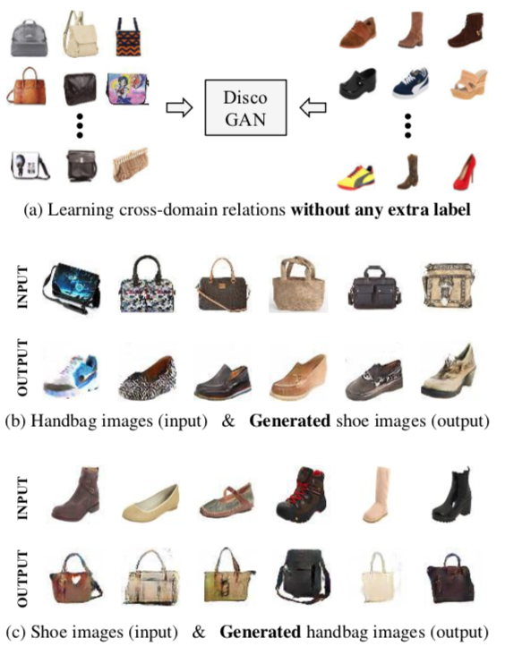

### 학습의 문제점

- 학습 데이터 준비의 어려움 : labeling, paired data를 얻기가 힘듬

=> `reconstruction loss` 을 이용해 `un-pair` 데이터 활용

## Model

### Notation

- $G_{AB}$ : A domain -> B domain
- $G_{BA}$ : B domain -> A domain

### Architecture

- Generator 
  - Encoder-Decoder 구조
  - Encoder : 4x4 filter, leaky ReLU
  - Decoder : 4x4 filter, ReLU
  - Convolution, Deconvolution layer의 수는 4~5 layer
  - input : 64x64x3 A image, output : 64x64x3 B images
- Discriminator
  - Generator의 Encoder 구조
  - leaky ReLU
  - 4x4 filter Conv 추가
  - 마지막에 sigmoid layer 추가 
  - Input : 64x64x3, output : [0, 1]
- 입력으로 Noise vector값 대신에 `Image`을 사용

### GAN with a Reconstruction Loss

- 일반 GAN의 Mode Collapse을 해결하기 위해 `reconstruction loss` 추가

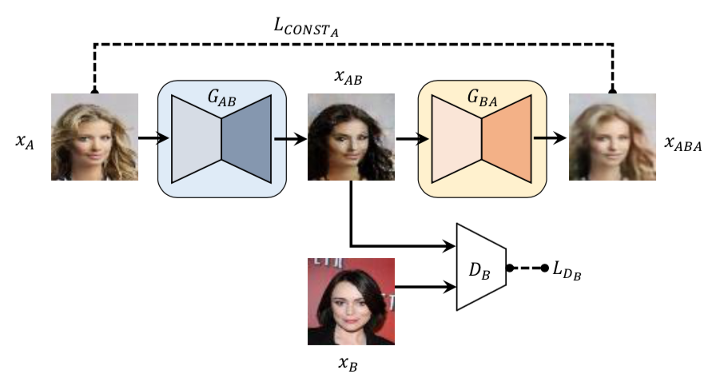

- **Loss**
  - CONST Loss : 생성한 이미지와 실제 이미지의 차이를 계산
    - distance는 L2, L1, Huber Loss 사용 가능
  - GAN B Loss : 

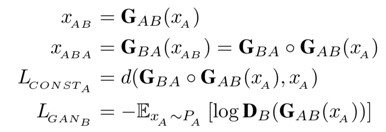

- **Generator**

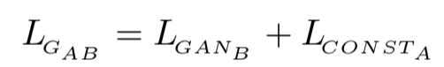

- **Discriminator**

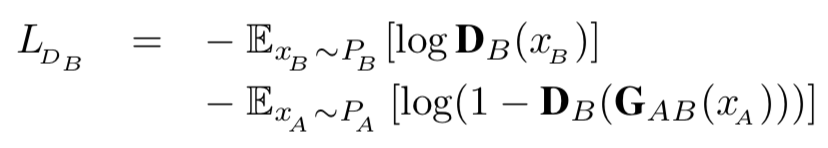

- 문제점
  - Reconstruction loss가 injective하기 때문에 학습이 어려움
  - `oscillation` 문제가 발생

### Discovery GAN

- Reconstruction loss를 bijective하게 사용

  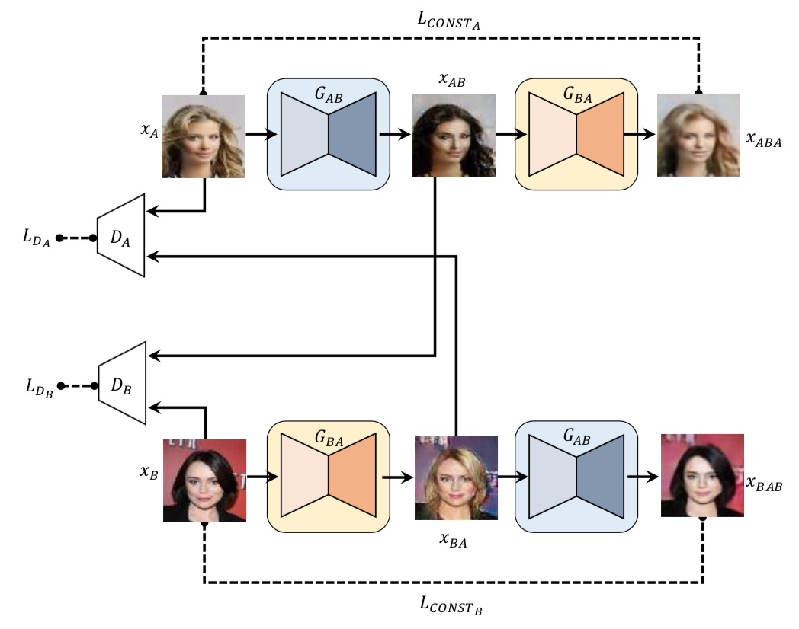

- 두개 $G_{AB}$ 와 $G_{BA}$ 은 파라미터를 공유
- **Loss**

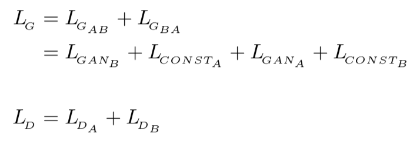

## Experiments

### Toy dataset

- input : GMM 5 mode, target : GMM 10 mode

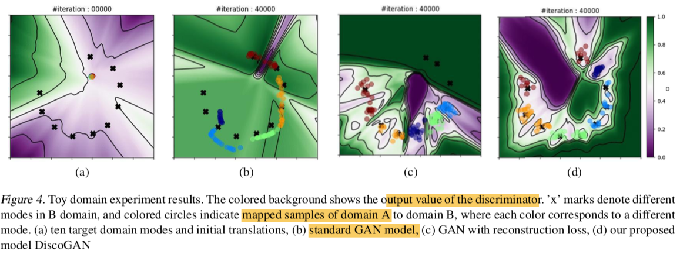

- Standard GAN : mode collapse, oscillate 발생
- GAN with reconstruction loss : Standard GAN에 비해 현상을 줄어들었지만, 여전히 mode collapse 발생
- DiscoGAN : 잘 학습됨

### Real Domain Experiment

- input : 64x64x3 images
- Adam (lr : 0.0002,  beta1 : 0.5, beta2 : 0.999
- BatchNormalization 사용
- weight decay : 0.0001 
- batchsize : 200

#### CAR2CAR

- 데이터셋 : 15도씩 회전하는 car 이미지
  - Train, Test 분리, 그리고 Train을 2 그룹으로 분리(A, B domain)
- **train**
  - Standard GAN, GAN with reconstructure loss, DiscoGAN으로 학습
  - 추가적으로, train set으로 회전 각도를 예측하는 regressor을 학습
- **evaluation**
  - test set으로 학습된 GAN을 이용해 translation하고, input과 transleated image를 regressor로 회전을 예측
  - GAN과 GAN with reconstructure loss에서 mode collapse가 발생

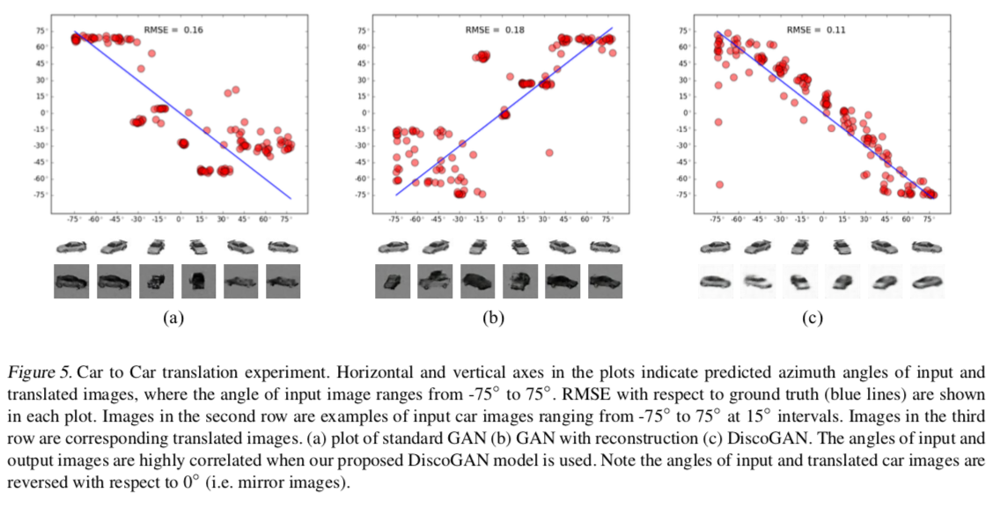

#### Face2Face

- Car2Car와 비슷하게 실험
- 기존 방법보다 다양한 rotation이 생성

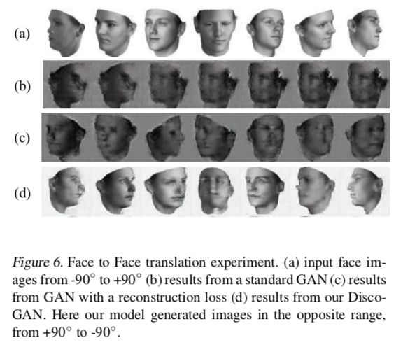

### Conversion

#### Face

- 대부분 특징을 공유하는 데이터셋(CelebA)
  - domain간 하나의 특징만 다르고, 나머지는 특징을 공유하는 데이터셋

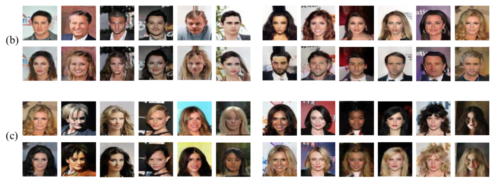

#### CHAIR2CAR, CAR2FACE

- 두 도메인간에 하나의 single feature만 공유

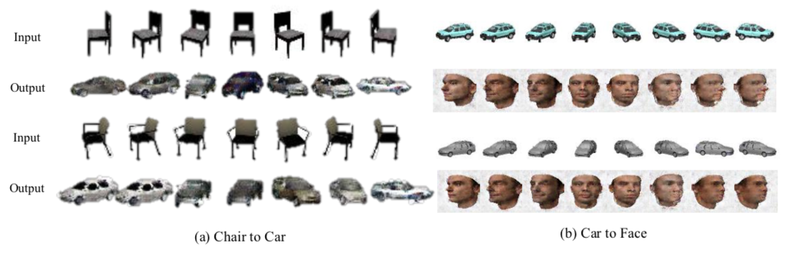

#### EDGE2PHOTO

- 1-to-N problem

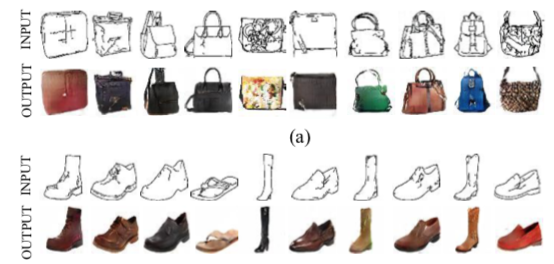

## DiscoGAN vs CycleGAN

### Model

- CycleGAN : Residual Block, instance normalization, 70x70 PatchGAN
- DiscoGAN : Encoder-Decoder

- Encoder-Decoder 구조로 선명한 이미지 생성은 불가능하지만, 이미지 생성에 대한 자유도가 높아져 구조적으로 다른 이미지 생성이 가능

### Loss

- CycleGAN : LSGAN, Consistency Loss로 L1 사용
- DiscoGAN : 일반 GAN Loss, Reconstructure Loss로 L2 이용

## Conclusion

- Pair data가 없이 Domain간의 relation을 학습