# Everybody Dance Now

- Date : 2018.08

- Author : Caroline Chan, Shiry dinosaur, Tinghui Zhou, Alexei a. Euros

## Simple summary

>Everybody Dance Now 논문은 source 이미지의 움직임을 target 이미지에 전달해주는 방법을 소개한다. Motion transfer을 위해 pose stick과 실제 이미지를 입력으로 한 Pix2PixHD을 베이스로 만들어 졌으며, 추가적으로 temporal coherent을 위해 Temporal-smoothing기법과 pre-smoothing keypoint을 제안했으며, 좀더 현실적인 영상을 만들기 위해, Face GAN 기법을 소개했다. 그 외에 souce와 target의 크기를 맞추기 위한 pose normalization, L_VGG, L_FM등 추가적인 방법이 제안되었다. 

### 목적

- 두 사람의 이미지를 pixel기반으로 motion translation하는 것이 목표

## Method overview

- corresponding pair : target image, pose stick figure 사용
- 이전 프래임도 조건으로 입력 : temporal smoothness을 위해
- specializded GAN 이용 : 사용자의 얼굴을 명확히 하기 위해.

### 전체적인 방법 (3단계)

1. **pose detection** : 이미지에서 pose stick figure을 생성
2. **global pose normalization** : target과 source의 모양과 위치를 맞추기 위해서 normalization
3. **motion transfer**

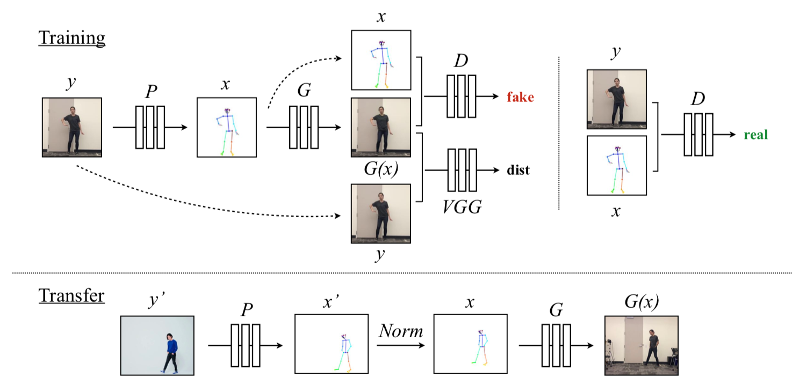

- **training**
  - source에서 pose stick figure을 생성
  - Generator는 pose stick figure에서 실제 이미지를 생성하도록 학습
  - Discriminator는 (실제이미지, pose stick figure), (가짜이미지, pose stck figure)을 구분하도록 학습
  - Discriminator은 또한 VGG을 이용해 생성된 이미지와 실제 이미지를 비슷하게 맞추어 줌.

- **transfer**
  - target에서 pose stick figure을 생성
  - global pose normalization을 수행 (크기나 위치가 서로 다를 수 있기 때문에)
  - normalization된 영상을 입력을 넣어 G를 통해 새로운 이미지를 생성

## Pose estimation

- 이미 학습된 pose detection을 이용해 추출 (open pose)
- **training** : generator의 pose stick figure가 들어감
- **transfer** : global pose normalization을 위해, joint estimization이 추출되고, normalization이 진행되면, 다시 figure로 생성

## Global pose normalization

- 팔다리의 비율이 다르거나, 카메라의 위치가 달라질 수 있기 때문에, transfer에서 pose keypoint을 normalization 시켜줌
- Height와 ankle position을 분석하여 normalization 시킴
  - 가장 멀리 있는 ankle 위치와 가장 가까이 있는 ankle위치를 서로 linear mapping을 시킴

**Detai**l

- 발이 땅에 붙어있을 때, ankle 위치의 최소, 최대 값을 구함
  - 카메라에서 얼마나 떨어져 있는지를 나타냄
  - ankle 위치가 최대일 때, 카메라에 가까이에 위치
  - 이 때, 최소 ankle위치는 클러스터링을 구하고, 그 내에서 최대값을 선택
    - ankle의 median보다 작고, median과 max사이의 거리에 비례해서 median값에 대한 거리에 있는 값을 사용

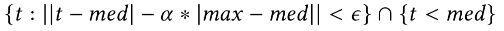

- Translation : linear mapping

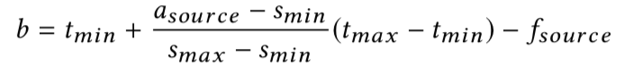

- Scale : mimimum과 maximum 주변의 height을 clustering하고, 그중에 제일 큰 값을 찾음. 이 때, maximum의 height을 t_close, minimum의 height을 t_far이라 함

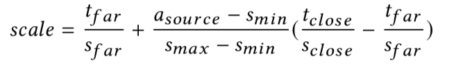

## Adverarial Traning

- `pix2pixHD` 을 기본 베이스에 `temporal coherent video` 와 `face synthesize` 특징이 추가

### pix2pixHD

- Multi-scale discriminators D = (D1, D2, D3)

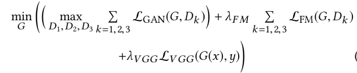

- objective function 

  - L_gan : pix2pix에서의 loss

  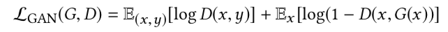

  - L_FM : discriminator의 feature matching을 이용한 loss
  - L_VGG : VGG-net의 feature을 이용한 loss

### Temporal smoothing

- 비디오의 coherence을 위해 추가
- single image generation을 수정
  - Generator : 현재 프래임의 stick figure와 이전에 생성된 이미지를 이용해 현재 프래임의 이미지 `G(x)` 를 구함.
  - Discriminator : fake (x_t-1, x_t, G(x_t-1), G(x_t))와 real (x_t-1, x_t, y_t-1, y_t)을 구분

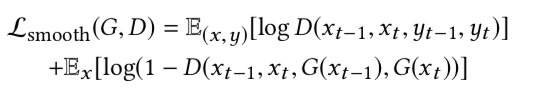

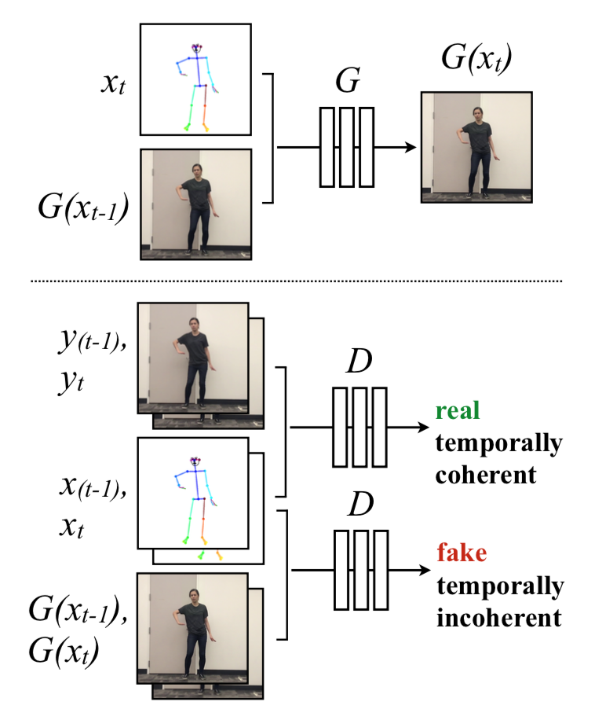

### Face GAN

- 얼굴이미지을 명확하게 만들기 위해서 수행
- 우선, stick figure와 생성된 이미지에서 face 부분만 추출하고,
- Generator : 실제 pose stick과 생성된 이미지을 이용해 residual 이미지 생성 (pix2pixHD의 global generator)
- Discriminator : real(실제 stick, 실제 이미지), fake(실제 stick, r+생성된 이미지)을 구분 (70x70 discriminator)

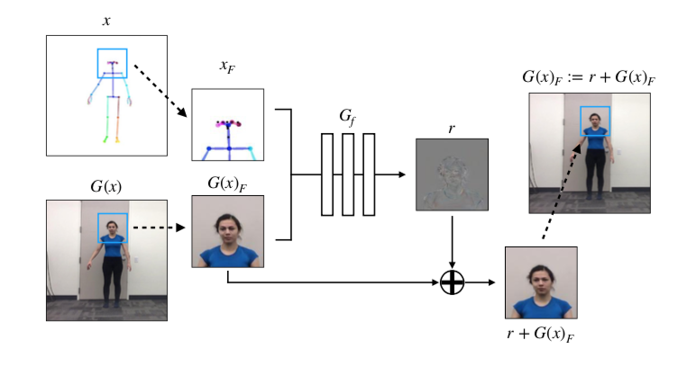

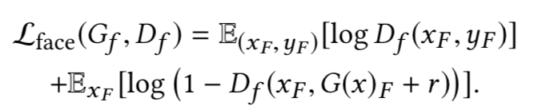

### Full Objective

- Motion transfer

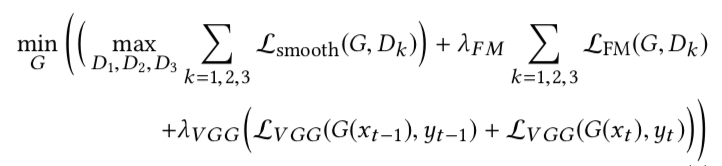

- face gan

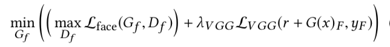

## Implementation

- 데이터 수집 : 모바일 폰을 이용해 초당 120프레임으로 20분동안 촬영
  - 영상은 충분히 많은 동작이 있어야 하며, blur가 적어야 한다.
  - Cloth 정보를 줄이기 위해서, 타이트한 옷을 입고 촬영
- pre-smoothing pose key points : 흔들림을 줄이기 위해서 
  - frame이 낮은 것에는 median smoothing을 활용
- LSGAN을 이용

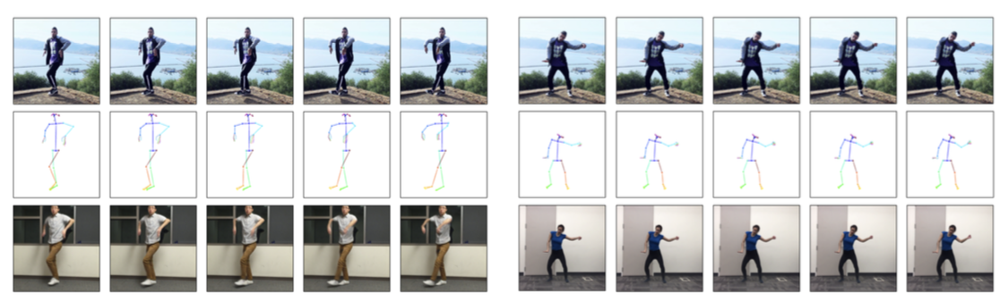

## Experiments

- SSIM, LPIPS
  - body의 경우, SSIM은 모두 비슷하게 측정
  - face의 경우, full model이 성능이 제일 좋음

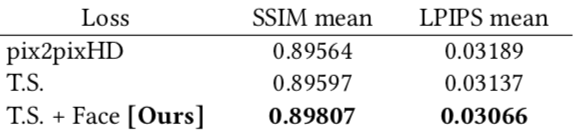

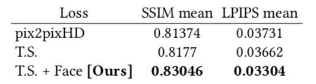

- L2 distance of reconstructive key point
  - Full model이 Face, hand, overall에서 좋은 성능을 보임

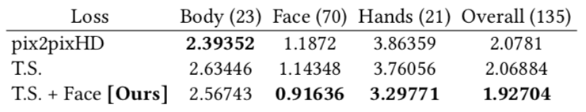

- the number of missed detections

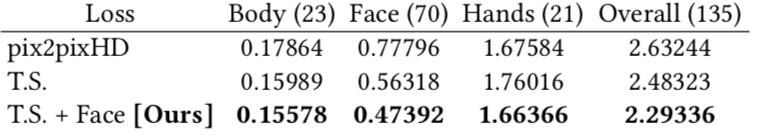

- Qualitative Assessment
  - 이미지 개개인별로는 pix2pixHD를 이용했을 때, 괜장히 좋게 측정
  - 하지만, temporal smoothing은 시간적인 연속성 면에서 좋은 성능을 보임 (smooth motion, color consistency)
  - FaceGAN도 외관상 더 좋은 성능을 보임

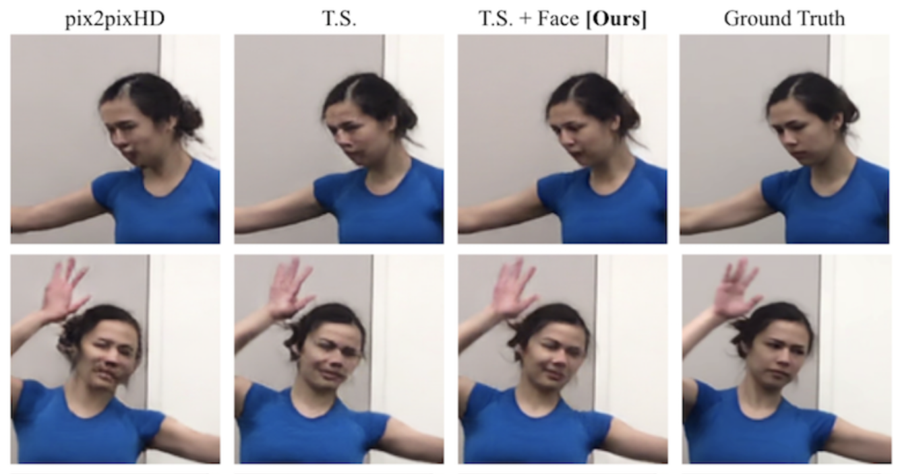

## Discussion

- Limitation
  - keypoint가 올바르지 않거나 놓칠 경우, 결과가 좋지 않음
  - pre-smoothine과 temporal coherence을 이용했지만 흔들림이 계속 발생
  - 움직임 속도와 training의 행동이 많이 다를 경우, error 발생
  - 여기서 사용된 simple한 pose normalization은 팔다리의 길이와 카메라 위치, 각도를 설명해 주지 않는다.
- future work
  - temporally coherent을 강화
  - Pose stick figure 없이 motion transfer을 수행