# f-GAN

## Abstract

GAN은 variational divergence estimation의 특별한 경우다. 다양한 divergence의 선택에 이익에 대해서 토론한다.

## 1. Introduction

- Sampling : model에서 sample을 생성해서 문제를 해결
- Estimation : sample dist에서 true dist에 비슷한 것을 찾는다.
- Point-wise likelihood evaluation : sample x을 얻고, 이를 이용해 likelihood Q를 평가

### generative neural sampler

- generative neural sampler : 인풋이 noise, 아웃풋이 샘플인 probabilistic feedforward neural network model
- GAN도 이 모델 중 하나

### GAN

- Jensen-shannon divergence을 이용해 분포를 줄이는 기법
- 학습의 핵심 : discriminator을 동시에 optimize하게 학습하는 것

- 여기에서는 f-divergence을 이용해 일반화하는 것을 보여준다.

### Contibution

- GAN object을 f-divergence을 유도
- 다양한 divergence을 제시
- saddle-point optimization을 간략화한다.

## 2. Method

### 2.0 두 확률 분포의 측정

1. Integral Probability Metric
- dQ = q(x)dx
- Q, P의 f에 대한 평균으로 구함

2. Proper Score Rules

- S(Q,x) : 잘 알고있는 분포 Q의 fitting score의 평균
- 일반적인 loss 함수

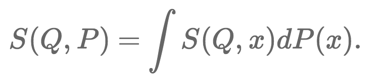

3. f-divergence

### 2.1. The f-divergence Family

- kl-divergence의 일반화된 버전
- 두 확률 분포의 차이를 측정

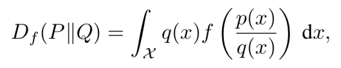

- generator function f
    - convex
    - f(1)=0, lower-semicontinuous function
    - f를 통해 다양한 divergence 생성이 가능

### 2.2. variational Estimation of f-divergences

- variational divergence minimization (VDM)
    - P와 Q의 sample을 이용해 f-divergence을 estimation하는 것

- f - f*(convex conjugate function, Fenchel conjugate)
    - f**=f
    - f*(t)는 f(u)에 y절편과 관련된 함수
    - 즉 ut와 f(u)사이에서 가장 작은 위치를 고르는 것
    - prml 10-5 참고

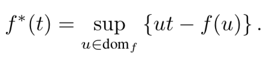

- `convex 함수 f는 모든 선형 함수의 supereme의 모임이다` 라는 가정을 통해 다음 식이 만들어짐

- f-divergence의 lower bound
    - jensen's inequality
    - class of funtion T을 이용

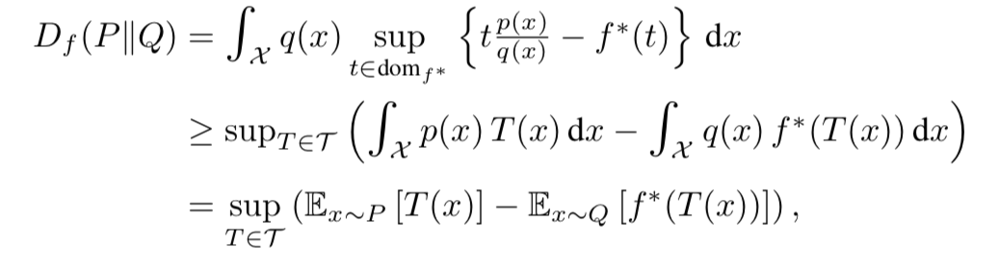

- 이를 만족하는 T(x)의 조건 : 이를 이용해서 f를 선택하는 데에 가이드라인을 제시

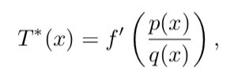

- 이를 이용해 다양한 내용 제시

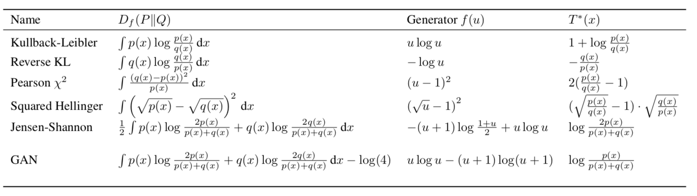

### 2.3 Variational Divergence Minimization (VDM)

- lower bound와 2개의 신경망을 사용
    - Q : generative model (noise → sample)
    - T : vaitational funtion (sample → scalar)

- 목적함수
    - w를 maximise : lower bound가 divergence와 같아 지도록 학습
    - theta를 minimise : divergence가 낮아지도록 학습

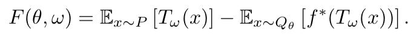

### 2.4 Representation for the Variational Function

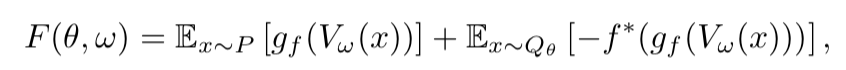

- Vw는 X → R로 매핑하는 함수
- gf는 R → dom f*로 하는 함수 (activation function)
    - monotone increasing function

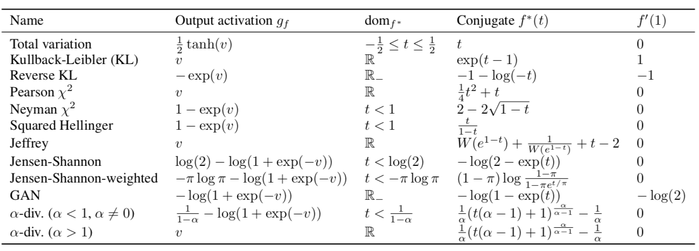

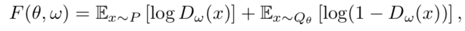

- 위 식의 특별한 경우, gf로 sigmoid 함수를 사용

## 3. Algorithms for Variational Divergence Minimization (VDM)

- 수치적으로 saddle point을 찾는 방법
    - 이안이 제안한 alternative 방법
    - 좀더 직접적으로 optimization 하는 방법

- double-loop method로 이루어짐
    - internal loop : lower bound와 f-divergence을 줄이는 방향
    - outer loop : generative model을 향상

- single step으로 실행이 가능

### 3.1 Single-step Gradient Method

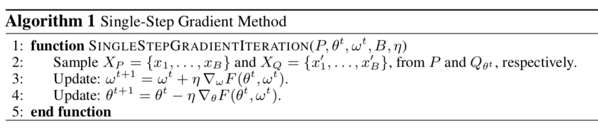

- F라는 local 지역의 saddle point를 주변이 theta에 대해서 convex하고 w에 대해서 concave하다는 조건이 있을 때, saddle point에 수렴
- 최적의 솔루션이 아니다.

### 3.2 Practical Considerations

- Eq[logD]을 최대하는 것을 사용( Eq[log(1-D)]대신에 )
- 학습할 때 real과 fake의 분포를 보는 것이 좋다.