# Flow-based Deep Generative Model

- https://lilianweng.github.io/lil-log/2018/10/13/flow-based-deep-generative-models.html 참조

## Generative Model

- generative model은 x의 분포 p(x)를 근사화 시키는 모델

### Type of Generative model

- GAN : generator와 discriminator의 minmax 게임으로 학습
- VAE : ELBO을 maximize하여 generator model 최대화
- Flow-based model : invertible transformation을 이용해 generator model 학습, 이전 모델과 달리 직접적으로 p(x)을 학습

## Basic Theorem

### Variable Teorem

- 1:1 매핑 함수 x = f(z)을 이용해, known dist p(z)을 unknown dist p(x)로 변환하는 이론

- Single variable
  - z=f-1(x), dz = (f-1(x))'dx

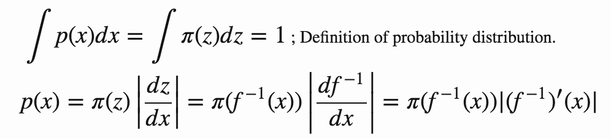

- Multivariable

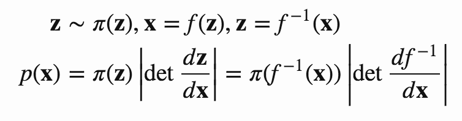

## Normalizing Flow

- 단순한 분포 p(z)을 연속의 `invertible transformer` 함수를 이용해 복잡한 분포 p(x)를 만드는 과정

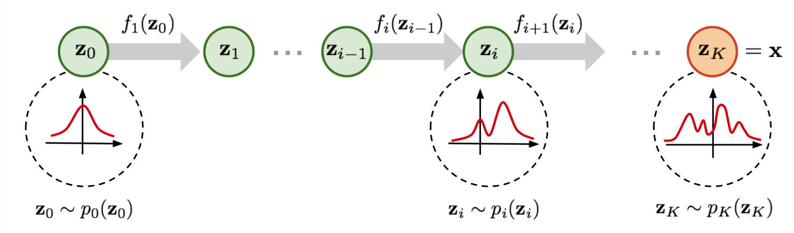

#### zi-1 -> zi 에 대한 분포 변환식

- Variable Theorem에 따라 정의

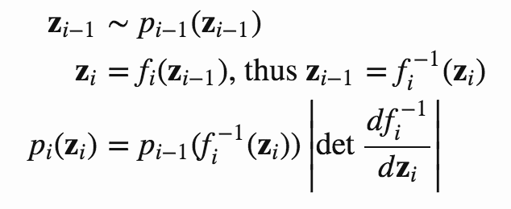

- zi-1에 대한 식으로 변경

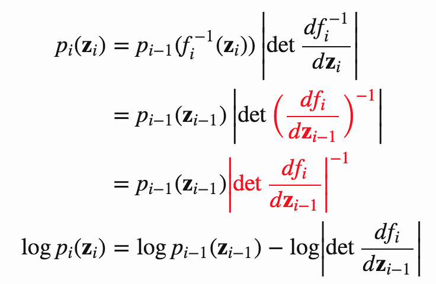

- 중간 과정

  - 두번째 줄

  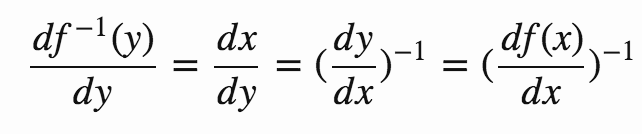

  - 세번째 줄

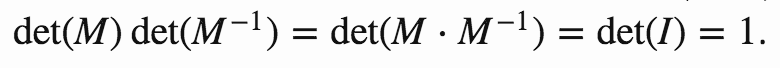

#### z0 -> zi 연속의 분포 변환에 대한 식

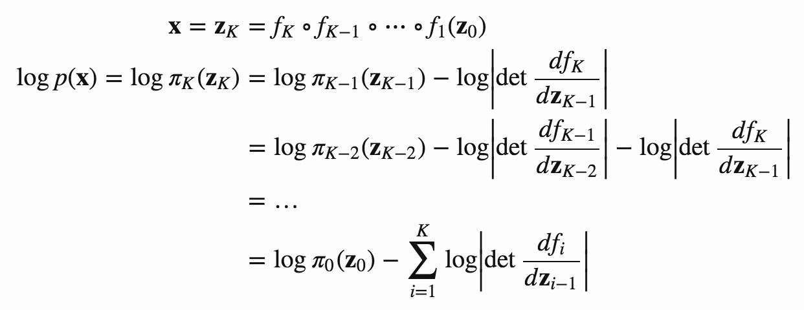

- `flow` : zi = fi(zi-1)에 대한, invertible function 
- `normalizing flow` : 연속된 분포 pi로 이루어진 full chain 

#### Transformation function의 조건

>1. invertible해야 한다.
>2. jacobian determinant의 계산이 쉬워야 한다.

### Loss

- 직접적으로 p(x)을 구하기 때문에 `negative log-likelihood` 을 이용해 학습

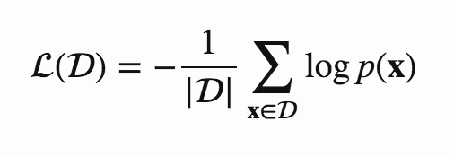

## Flow based model

### RealNVP

- Real valued Non-Volume Preserving

- flow function으로 invertible bijective transformation인 `affine coupling layer` 이용

- `affine coupling layer`

  - input dimension은 두 부분으로 분할 
  - 첫번째 dimension은 똑같이 유지
  - 두번째 dimension은 affine transformation 수행
    - Sacle, Translation은 deep model 이용

  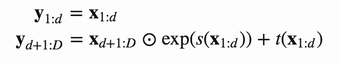

- affine coupling layer의 특징

  - Easy invertible : s, t의 inverse을 계산할 필요가 없음

  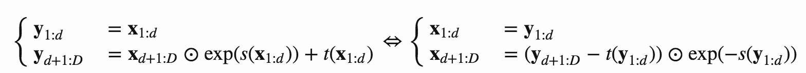

  - Easy jacobian determinant : s와 t의 jacobian을 구할 필요가 없음

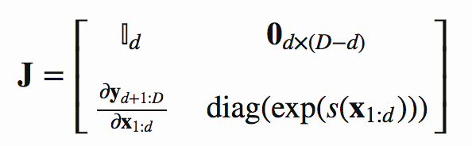

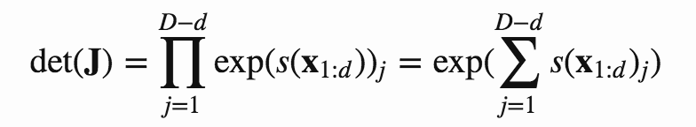

- s와 t는 deep learning 학습 가능

- 변화하지 않는 부분이 존재하기 때문에, 각 레이어에서 reverse 부분을 추가
  - BN이 학습을 도와줌

### NICE

- Non-linear Independent Component Estimation
- `affine coupling layer` 의 scale term을 제거
  - `additive coupling layer`

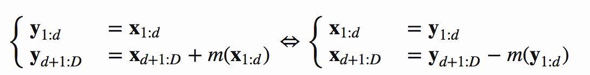

### Glow

- Reverse permutation을 대신해 invertible 1x1 convolution을 사용

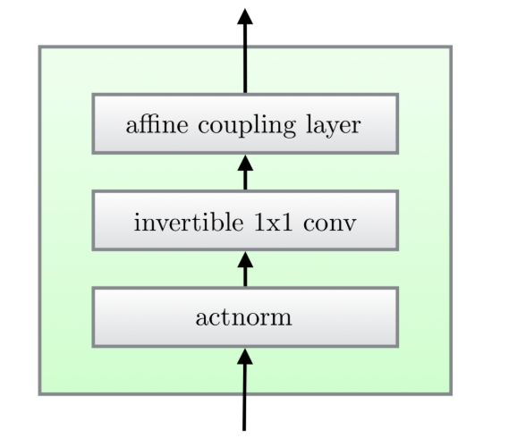

#### 구조

- Step 1 : `Activation normalization`
  - BN처럼 channel별로 scale과 bias을 이용해 affine transformation 수행
  - 초기에는 initialization을 한다. mean: 0, std: 1이 되도록 한다.
- Step 2 : `Invertible 1x1 conv`
  - Reverse permutation을 대신하기 위해서 사용
  - input과 output의 channel이 같게 나오는 1x1 conv을 사용

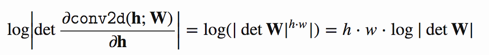

- Step 3 : `Affine coupling layer`
  - RealNVP와 같음

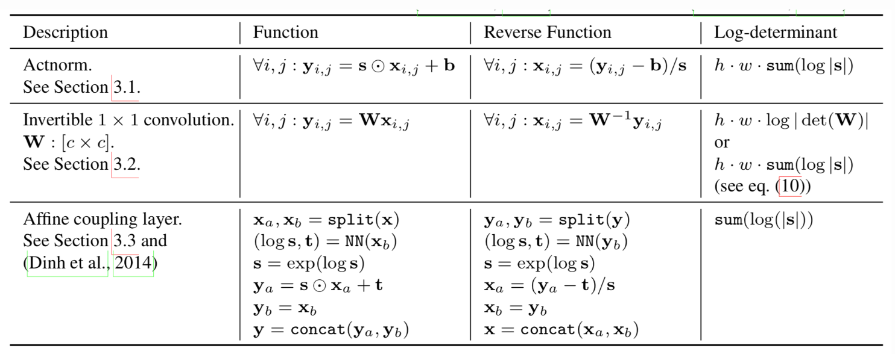