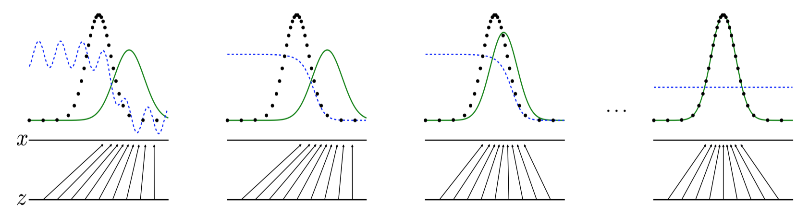
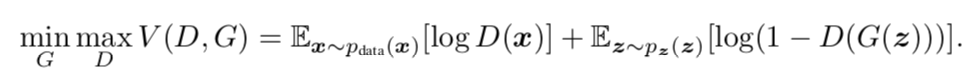
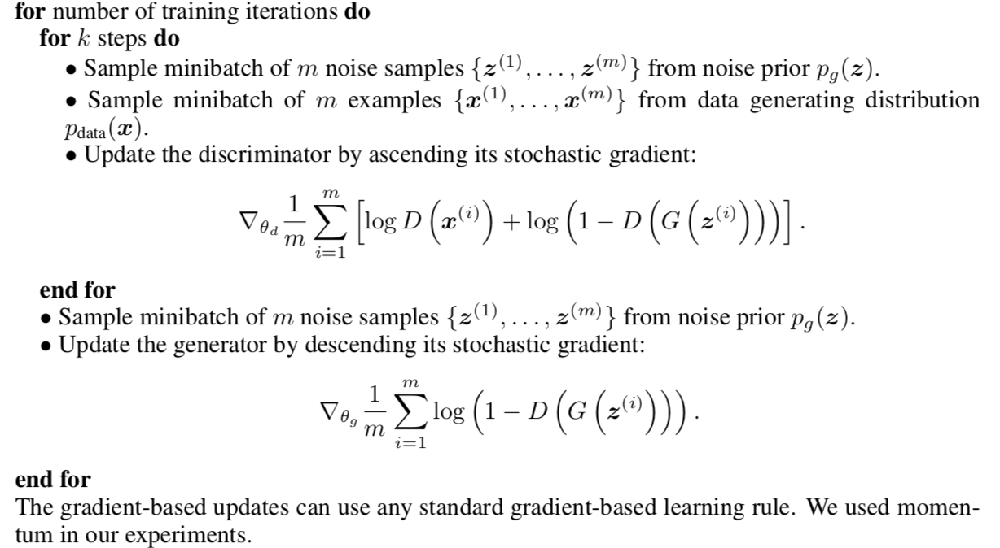
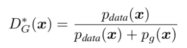
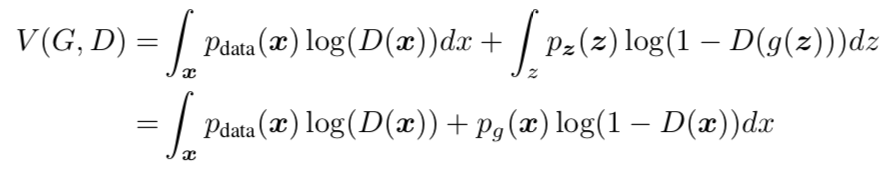
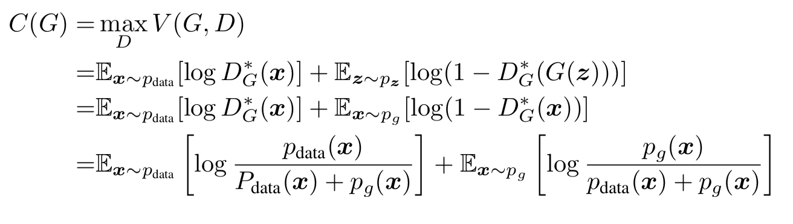
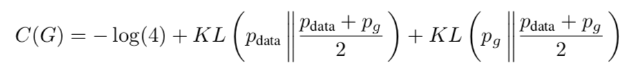
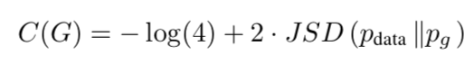
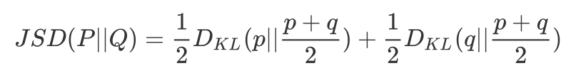
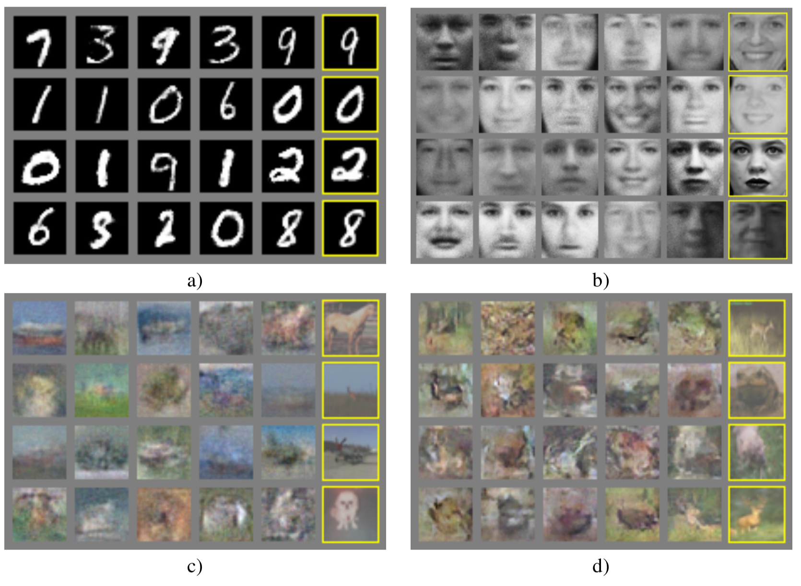

# Generative Adversarial Nets

- Date : 2014.01 
- Author : Ian J.Goodfellow, Jean Pouget-Abadie, Medhdi Mirza, Bing Xu, David Warde-Farley, Sherjil Ozair, AaronCourville, Yoshua Bengio


## Simple summary

>  GAN은 adversarial method을 통해 학습하는 generative model이다. GAN은 두가지 네트워크로 구성되는 데, 데이터를 생성하는 Generator와 데이터를 구분하는 Discriminator로 구성되고, 이 둘은 서로 번갈아가면서 학습하며, 결국 D가 G에서 생성된 데이터를 구분하지 못할 때까지 학습된다. 
>
>  이 논문에서는 GAN을 증명하기 위해서, 수식적으로 증명했다. 첫번째 증명은 G가 고정되었을 때 optimum D에서의 값이 pdata/pdata + pg, 두번째 증명은 optimum D에서 optimum G는 pg = pdata가 같음, 세번째 증명은 G, D가 충분한 능력을 가졌을 때, G는 항상 수렴. 이 세가지 증명을 통해 GAN이 학습시 pg와 pdata가 같아짐을 증명했다.


## Adversarial Nets

- 기존의 Generative model의 어려움

  - 확률 계산을 근사화하는 데 어려움
  - ReLU와 같은 piecewise Linear unit의 사용의 어려움


- Model 구성

  - Discriminative model : 실제 데이터와 가짜 데이터를 구분하는 역할
  - Generative model : Discriminative을 속이기 위한 가짜 데이터를 생성하는 역할

- 목표 : discriminative가 가짜 데이터를 속일 때까지 진행




#### 학습 방법

- Objective function (minimal, sigmoid cross entropy 사용)

  


  - D를 최대화할 경우, 진짜는 1로, 가짜는 0으로 학습
  - G를 최소화할 경우, 가짜를 1로 학습


- 학습 알고리즘

  

  1. gaussian noise에서 m개의 sample 추출
  2. 실제 데이터에서 m개의 sample 추출
  3. D에 대해 loss를 최대화하여 학습 (G는 고정)
  4. 1-3 반복
  5. m개의 noise sample 추출
  6. G에 대해 loss 최소화하여 학습 (D는 고정)


## 이론적 접근

- 세 가지 증명을 통해 GAN을 증명

### prof 1

> G가 고정되었을 때, optimum D는 다음 아래의 식과 같다.






- a log y + b log(1-y)를 최소로 하는 y의 값은 a / (a+b) 이다.
- 그러므로, 위 식을 아래로 치환하면, prof 1이 증명된다.
- **data point x에 대한 증명**


### prof 2

> 최적의 값 C(G)은 pg = pdata일 때이며, 최소값은 -log4 이다





- 각 log 안의 분모, 분자를 2로 나누어주고 계산하면, reverse-KL divergence가 된다.  



- 다음 식은 jensen-shannon divergence로 표현이 가능

- 즉, Generator의 최적의 값은 pg=data가 같을 때이다.


- JSD(jensen-shannon divergence)

  - Symmetric 하고, 항상 non-zero

  

### prof 3

> G, D가 충분한 capacity를 가질 경우, 최적환된 D에서 G는 항상 최적에 도달한다.

```
The subderivative pf supremum of convex functions include the derivative of the function at the point where the maximum is attained
```

-> 조건 : convex 함수의 상한선의 서브 미분값은 최댓값에서의 함수의 미분값를 포함한다.

- subderivative : $\lim_\limits{x \rightarrow x_0^-}{f(x)-f(x_0)\over x-x_0}$,  $\lim\limits_{x \rightarrow x_0^+}{f(x)-f(x_0)\over x-x_0}$,


- $V(G, D)=U(p_g, D)$라고 했을 때, U가 $p_g$에대해 convex function이고 **1.1**에서 단일 최소값을 가진다. 그러므로 단일 최소값은 함수의 미분값이다.


- 하지만, 실제로 G가 multilayer perceptron로 이루워 졌을 때, 다수의 critical points가 있을 수 있다. 하지만 이론적 증명이 부족해도 multilayer을 이용하는 이유는 실제로 학습이 잘되기 때문이다.


## Experiments




## Advantages and Disadvantages

### 단점

- pg(x)의 표현이 명확하지 않음
- D, G는 훈련하는 동안 싱크가 맞아야함
  - 특히, G는 D가 학습되지 않으면, 제대로 학습되지 않음
- Helvetica secnario 발생 : 항상 같은 x 값이 출력되는 현상


### 장점

- Markov chain, 샘플링이 필요하지 않음
- inference가 필요하지 않음
- 다양한 데이터 분포에 학습이 가능


## Future work

- G, D를 학습할 때, label c를 추가하여 conditional generative model 사용가능
- x가 주어졌을 때, z를 예측하는 auxiliary network를 학습함으로 approximate inference 학습 가능. (학습된 generator를 고정시킴으로..)
- Semi-supervised learning : 제한된 데이터를 가지고 있을 때, discriminator와 inference net의 feature를 이용해 classifier 성능을 증가.
- Efficiency improvements : G, D의 coordinating을 위한 방법을 고안하거나 더 좋은 z 분포를 사용하여 더 빠른 학습이 가능하다.
