# Hierarchical Attention Networks for Document Classification

## Abstract

- 특징
    - document의 hierachical 구조를 반영
    - word-level 과 sentence-level의 attention을 사용
- 6개의 text classification에서 실험

## 1. Introduction

- Text classification : text에 label을 달아 주는 작업

- 기존 방법
    - sparse lexical feature을 이용해 분류
    - deep learning : CNN, LSTM 이용

- 가정
    - 문서의 구조적 특징(문서 - 문장 - 단어)을 이용하면 더 문서를 representation이 가능
    - 문서의 모든 문장, 단어는 classification하는 데 도움이 되지 않는다.
    - 같은 단어여도 context에 따라 중요도가 달라질 수 있다.

- 구조 : 2 level (문장-단어)의 attention mechanism 사용

- Attention의 장점
    - 성능이 좋아지다
    - visualization 가능하다

## 2. Hierarchical Attention Networks

- Model
    - word sequence encoder
    - word attention layer
    - sentence encoder
    - sentence attention layer

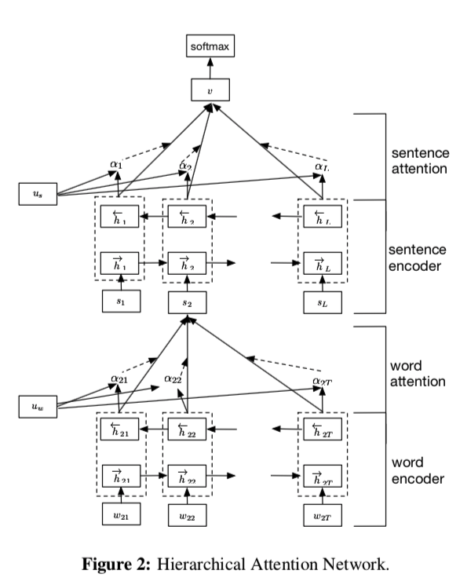

### 2.1 GRU based sequence encoder

- GRU : cell state없는 gating mechanism
- reset gate, update gate

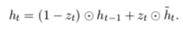

- update gate : 이전 hidden과 새로운 hidden을 어떻게 조합할 정도

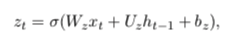

- reset gate : 이전 정보를 얼마나 잊어버릴 정도

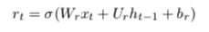

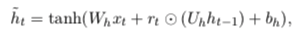

### 2.2 Hierarchical Attention

- 목적 : Document classification, Document representation
- word vector에서 document vector로 표현하는 방법 제시

### Word encoder

- word에서 context information
- embedding matrix → bi GRU 사용

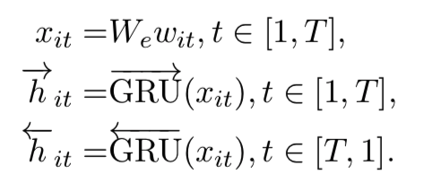

- embdding vector로 hidden vector을 사용

### Word Attention

- word hidden vector를 hidden vector u로 표현하고, contex vector uw와 내적과 softmax를 이용해 attention vector 생성
- context vector uw
    - 가장 정보를 잘 나타내는 단어 벡터는 무엇인가에 대한 표현
    - random init을 하고, 학습 가능하다.
- 그런 뒤, word embedding vector의 wieght sum을 이용해 sentence embedding vector을 계산

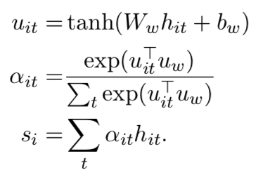

### Sentence Encoder

- bi GRU를 이용해 embedding vector 생성

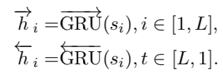

### Sentence Attention

- 비슷한 방식으로 중요한 sentence vector을 뽑아내는 attention 수행
- v은 document embedding vector

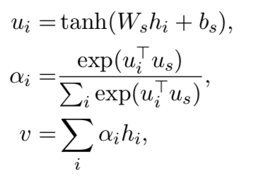

### 2.3 Document classification

- 단순 MLP 사용

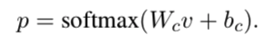

- Loss : negative log likelihood loss 사용

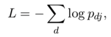

## 3. Experiment

### 3.1 Configuration and Training

- initialize embedding using W2V
- embedding : 200
- GRU : 50
- mini-batch : 64
- document의 sentence 길이는 비슷하게 맞춤
- SGD momentum : 0.9
- lr : grid search

## 4. Result

- Attention : 중요한 단어 뿐만아니라 중요한 context로 뽑아냈다.

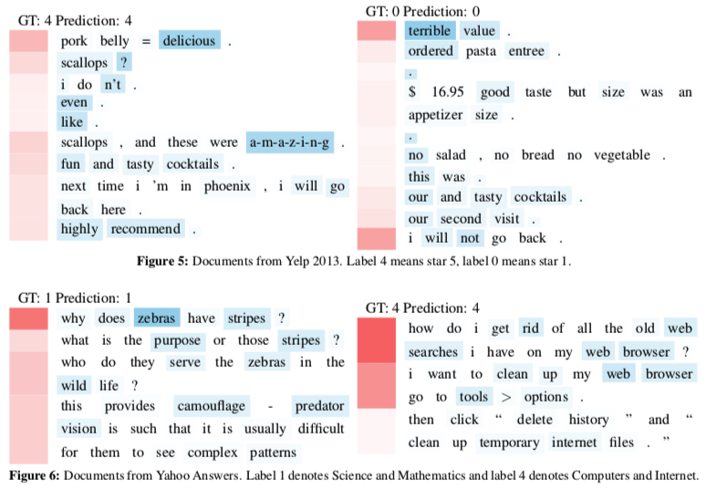

### 5. Conclusion

- hierarchical attention을 이용한 document classification 수행
- 좋은 visualization 가능
- word vector에서 document embedding