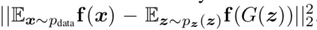
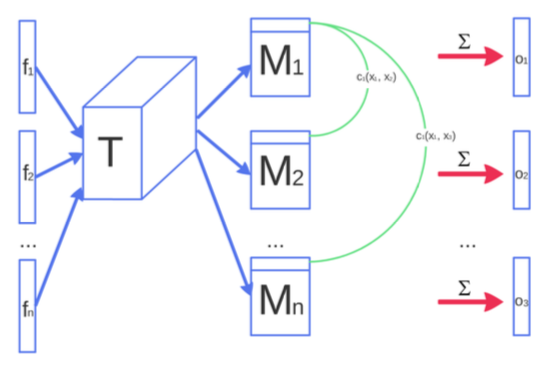
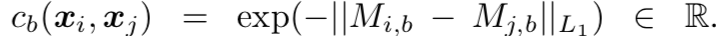
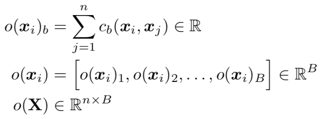
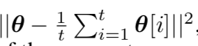
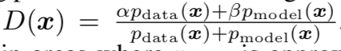
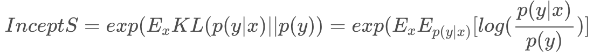
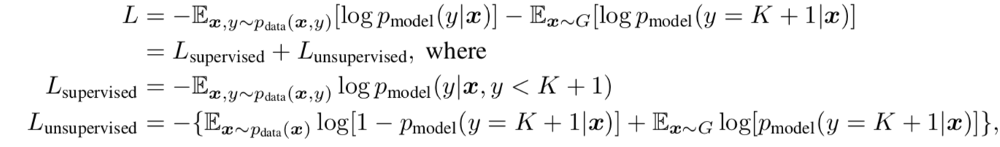
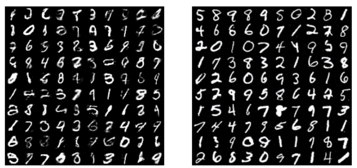

# Improved Techniques for Training GANs

- Date : 2016.10 
- Author : Tim Salimans, Ian GoodFellow, Wojciech Zaremba, Vicki Cheung, Alec Radford, Xi Chen

## Simple summary

>GAN의 mode collapse등 학습의 어려움을 해결하기 위해서 여러 방법을 소개했다. 그 방법으로 Feature matching, Minibatch discrimination, History averaging, label smoothing, VBN을 소개했다. 또한 gan 결과에 대한 metric인 inception score에 대해 소개하였다.

## 기존 GAN 학습의 어려움

- 기존 GAN은 `Nash equilibrium`을 통해 학습
  - Nash equilibrium : 게임이론에서 상대방에 대응해 최선의 선택하면서, 결국 자신의 선택을 바꾸지 않는 평등한 상태가 되는 상황.
- 하지만, Nash equilibrium을 찾는 것은 매우 어려움
  - Non-convex
  - Parameter space is high dimensional
- J^(D)를 줄이도록, D의 파라메터를 업데이트 시키면, 실제 J^(G)의 값은 상승하게 된다.

## 여러 가지 학습 기법

### Feature matching

- generator의 목적함수에 discriminator의 output를 매칭시키는 것이 아니라,  중간층의 activation을 매치시키는 방법

- 실제 데이터와 통계적으로 비슷한 분포를 만들게 하는 효과를 가짐
- 또한, discriminaor에 overtraining 되는 것을 방지하는 효과
- 수학적 근거는 없음, 경험적

### Minibatch discrimination

- GAN 실패의 주된 요인 : mode collapse (특정 하나의 샘플 결과만 생성)

  - 생성 원인 : 보통은 minmax로 최적한 discriminator을 학습한 후, generator가 학습되어야 하지만, 최적의 D를 학습하지 않고 진행됨, 그럴 경우, generator는 D만 속이기면 되기 때문에 가장 속이기 쉽은 부분에서만 데이터를 생성하고, 그후, D가 학습할 때, 이 위주로 학습되어, 영원히 이 곳에서만 학습하게 된다. (다른 자료에서 봄...)
  - single mode가 시작되면, D는 이 부분만 보고 학습. 다른 곳에서 데이터가 생성될 수 있다고 말해줄 수 있는 알고리즘이 없다면 다른 곳 학습이 불가

  

- activation f(x)에 matrix T를 곱한 다음에,  각 M에 대한 같은 row의 exp(L1)를 구해 더해 o(x)를 구한다.
- 이를 discriminator에 입력 -> 다양한 feature을 볼 수 있도록 도와줌.
- `minibatch discrimination`은 여러 데이터를 볼 수 있도록 허락함
  - discriminator가 여러 데이터의 조합을 볼 수 있도록 제공.
  - Real data, fake data 독립적으로 수행 (미리 어떤 데이터인지 라벨링)

- feature matching보다 뛰어난 성능을 보여줌, 하지만 semi-supervised에서는 성능 발휘하지 못함

### Historical averaging

- 각 G, D의 파라미터에 historical averaging term을 추가

- Low-dimension, non-convex에 해당됨

### One-sided label smoothing

- label data로 1,0 대신에 0.9, 0.1 같은 smoothed value 사용

- 실제로는 positive label alpha만 smoothing 함

### Virtual Batch Normalization

- 문제 : output이 같은 minibatch 내 input에 크게 영향을 받게 된다.
- `VBN` : x를 reference에서 얻은 통계값으로 normalize시킴
- 단점 : 계산량이 많다. -> feed forward시 두개의 minibatch를 계산해야 된다.
- generator에만 적용

## Assessment of image quality

- Amazon Mechanical Turk

  - 사람이 직접 생성된 이미지와 진짜 이미지를 구분
  - 단점 
    - 업무와 동기부여에 따라, 측정값이 변함
    - feedback에 따라, 측정이 달라짐

- Inception Score

  

  - Inception model에 이미지를 넣어 conditional label distribution을 얻음.
  - 의미있는 데이터를 생성시, 낮은 entropy를 가지게 됨 (한 곳에 몰려 있음) p(y|x)
  - 다양한 데이터가 존재할 때, marginal 데이터는 큰 entopy를 가지게 됨(고르게 분포) p(y)

## Semi-supervised learning

- 'generated' 클래스 K+1를 더 생성하여, Generator에서 생성한 샘플로 semi-classification 가능
- 즉, GAN에서 1-D(G(x))에 해당되는 부분을 추가

- L supervised는 G가 충분히 학습될 때 의미가 있음.
  - D를 이용해 GAN학습이 필요하다.
- feature matching이 학습에 도움이 된다. 
- 하지만, minibatch discrimination은 도움이 되지 않음

## Experiments

### MNIST

- Semi-supervised 수행
- 20, 50, 100, 200 개 라벨 데이터를 이용(초기) 
- G, D : 5 hidden layer, weight normalization, 
- D의 layer마다 Gaussian noise를 추가
- Feature matching 영향 없음. 하지만, minibatch discriminator는 영향이 큼

### CIFAR-10

- Semi-supervised 수행
- Discriminator : 9 layer deep CNN, dropout, weight normalization
- Generator : 4 layer deep CNN, batch normalization

- 여기서 학습 기법을 하나하나 빼가면서, 사람이 측정한것과 inception score을 비교시 어느정도 상관관계를 가짐

### SVHN

- cifar-10가 설정 같음

### ImageNet

- 이 때, 당시 128x128 image에 1000개 카테고리를 생성하는 모델을 만든 적이 없음
- 위에서 제한한 방법을 적용한 DCGAN을 이용해 학습

