# Least Square Generative Adversarial Networks

- Date : 2014.01 
- Author : Xudong Mao, Qing Li, Haoran Xie, Raymond Y.K. Lau, Zhen Wang, Stephen Paul Smolley

## Simple summary

>LSGAN은 기존 GAN에 D의 Sigmoid Cross Entropy Loss를 대신 Least Square Loss를 사용한 모델이다. 기존 GAN은 Generator 학습시, Discriminator가 진짜라고 판단한 가짜 샘플의 학습이 잘 되지 않는다. 하지만 LSGAN은 decision boundary와 멀리 떨어진 가짜 샘플의 학습이 가능하면, 기존 GAN보다 gradient가 더 크기 때문에 학습이 잘 된다.

## 기존 GAN의 문제점

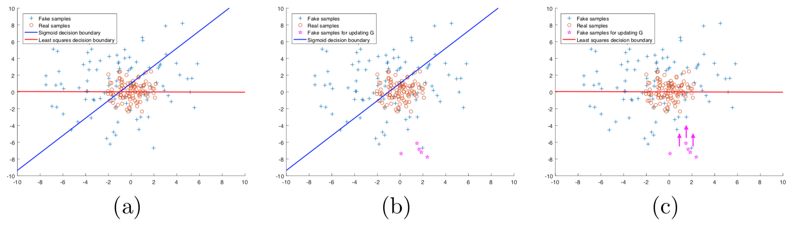

- 기존의 GAN의 Discriminator는 **sigmoid cross entropy loss**를 사용

- G를 학습할 때, 기존의 loss를 사용할 경우, 진짜로 판단한 영역중에 Decision bourndary에서 멀리 떨어진 곳에 생성된 가짜 데이터는 학습이 불가능하다.
- 즉, 이미 D가 진짜라고 판단한 가짜 데이터는 학습이 불가능해진다.

- 이 문제를 해결하기 위해서 Discriminative의 loss를 **least square**을 사용

## LSGAN

- 기존 GAN의 D loss

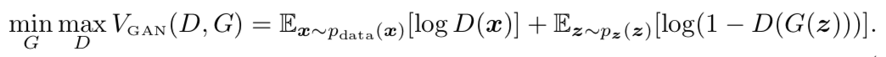

- LSGAN의 D loss

### LSGAN의 장점

- High quality
  - Discriminator가 진짜라 판단한 가짜 샘플의 학습이 불가능
  - 위에서 언급

- Stability
  - Decision boundary에서 멀리 떨어진 sample의 gradient가 더 강함.
  - sigmoid cross entropy는 한쪽이 평평하지만, least square는 한점에서만 평평함 

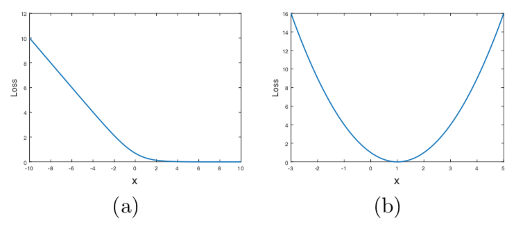

## f-divergence와의 관계

### f-divergence

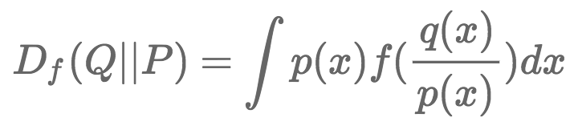

- KL divergence, JS divergence의 일반화된 버전
- f-gan에서 먼저 논의 됨
- Generator f를 이용해 정의
  - f는 convex function, f(1)=0
  - 즉, q(x)=p(x) 일 때, 0

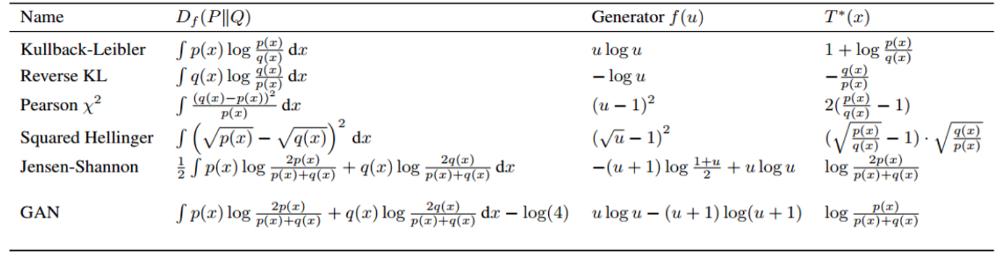

- 여러가지 f-divergence table

### lsgan의 Pearson khi square 유도

- Ian의 GAN의 유도 방식과 비슷하게 진행

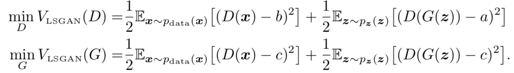

- 두번째 식에서, D에 대한 수식 추가 (D가 고정되기 때문에 최적화에 영향 없음)

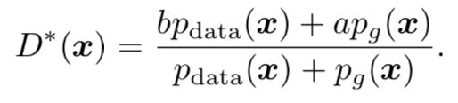

- 첫 번째식 미분후, 최적 D를 구하면 다음과 같음

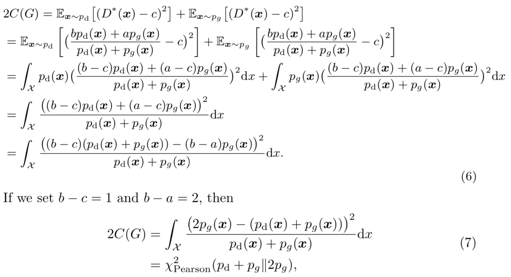

- 결국, pd_pg와 2pg의 분포를 같게 만들도록 학습, 즉 pd = pg

- a, b, c의 선택 (a=-1, b=1, c=0) or (a=0, b=1, c=1)
  - 실제 유도는 b-c=1, b-a=2일 때, 가능
  - 하지만, 실험시 a=0, b=c=1이랑 별 차이가 없었다. (여기서는 이방식 사용)

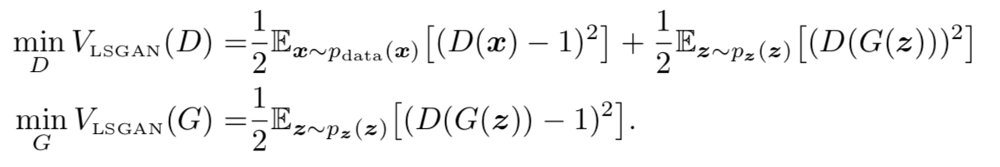

## Experiments

- LSUN Image Generator

- 아키 텍쳐, lr=0.001, Adam beta=0.05

- Chinese charactor generator

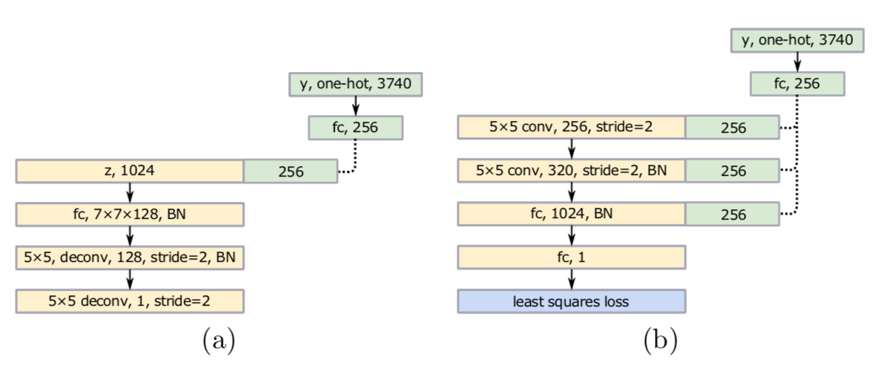

- Conditional GAN을 이용
- One-hot encoder를 linear function을 이용해 줄인다.

## Result

- LSUN data

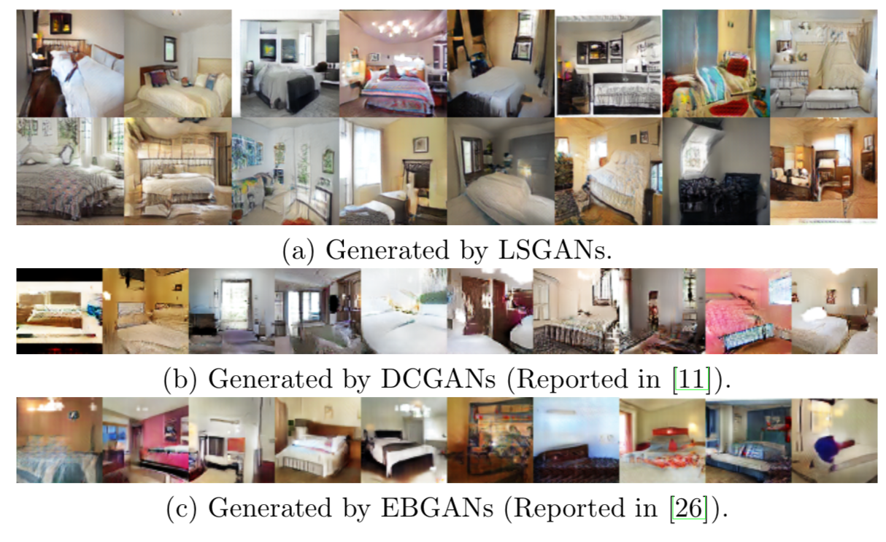

- Gaussian mixture model

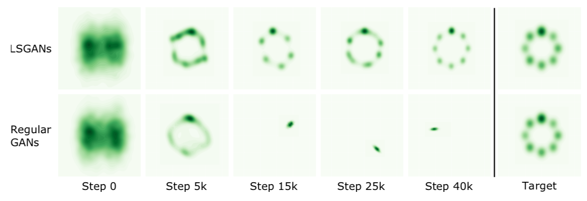

- chinese character 

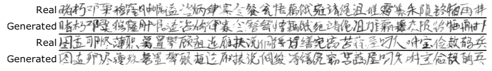