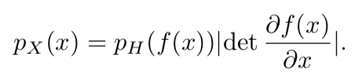
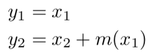
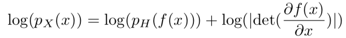
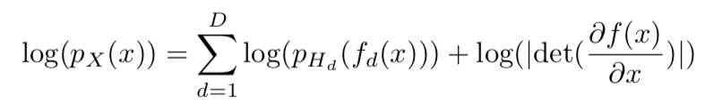
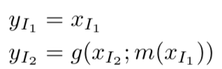
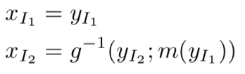
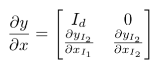
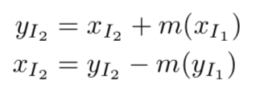
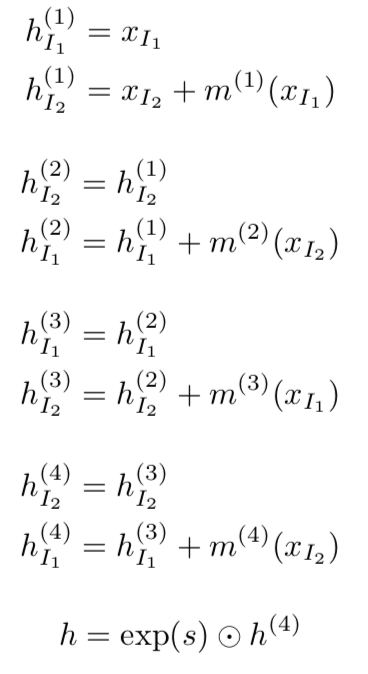
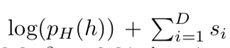

# NICE

>normalization flow을 이용해 data dist을 모델링한다.
>
>이 때, f가 쉬운 invert와 determinant jacobian을 위해 additive coupling layer, scaling layer을 이용

- transformation을 이용해서 data distribution 모델링

### Change of variation

### transformation의 조건

- inverse가 쉬워야 한다.
- Jacobian의 determinant가 쉬워야 한다.

- 이를 위해 x을 (x1, x2)로 분리하여 아래와 같은 transformation을 적용

---

## 2. Learning Bijective Transformation of Continuous Probabilities

- change of variation을 이용한 maximum likelihood을 이용해 데이터 분포 학습

- prior가 factorial한 경우, 다음과 같이 표현가능

- 직관적인 이해

  - 데이터를 축소시키면서 likelihood을 증가한다.
  - 하지만, 뒤에 자코비안 Term이 수축시키는 것을 방지해준다. 즉, dz/dx을 증가 시켜줌.

  - 벤지오에 따르면, representation learning에서 더 흥미있는 부분의 input과 관련된 영역이 확장됨

- VAE와 비교

  - f : encoder
  - f-1: decoder
  - ascestral sampling으로 쉽게 샘플링 가능

---

## 3. Architecture

- elementary components
  - 선택조건
    - jacobian 이 쉽다.
    - inverse가 쉽다.
  - 종류는 affine matrix와 triangular matrices 
  - 그중에 triangular matrices 이용
    - determinant: diag의 곱
  - weight가 triangular matrice를 선택하는 건 매우 제한적임
  - 그러므로, `jacobian matrice가 triangular`인 matrix을 선택 

### Coupling layers

- family of bijective transformation with triangular jacobian

#### General coupling layer

- g : coupling law

#### Additive coupling layer

- g(a;b)=a + b

- Jacobian determinant : 1
- multiplicative coupling law, affine coupling law도 정의 가능
- 하지만, additive coupling layer가 안정적

#### Combining coupling layer

- 복잡한 변형을 위해 여러 layer을 사용
- 적어도 3 layer을 사용

### Allowing rescaling

- 문제점 : 
  - coupling layer의 determinant은 1이기 때문에 combing coupling layer도 1이다. (volumen preserving)
- 이를 위해 마지막 레이어에 diagonal scaling matrix을 적용
- 다양한 모델 변형이 가능
- scaling factor을 PCA의 eigenspectrum과 연관이 있음.
  - scaling이 커질수록, 덜 중요한 dimension

### Prior

- Factorial distribution
- Gaussian dist 나 logistic dist
  - Logistic dist가 더 잘 gradient됨

----

## 5. Experiments

### 사용 모델

### Likelihood

- ADAM
  - lr : 10-3
  - momentum : 0.9
  - Beta2 : 0.01
  - lambda : 1