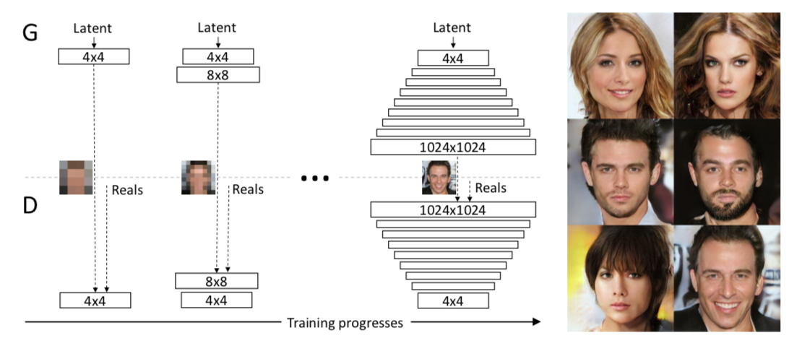
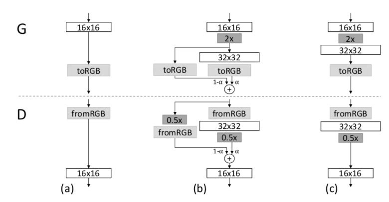
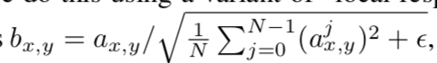
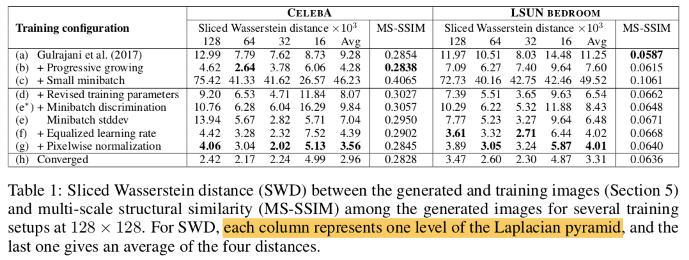
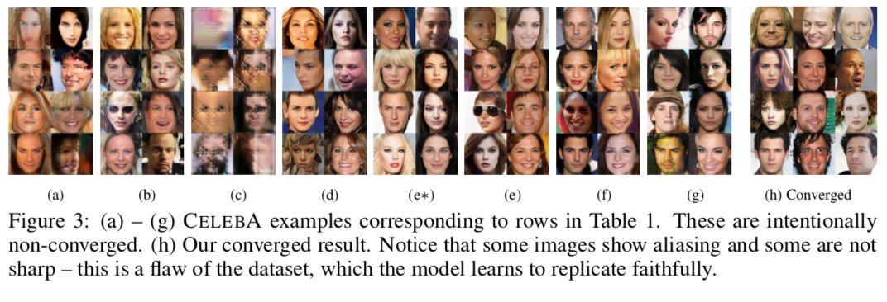
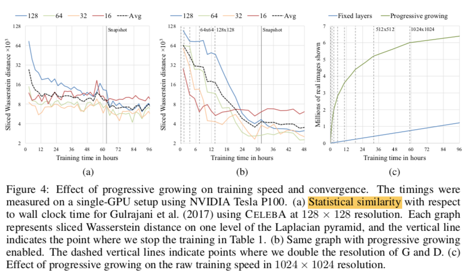
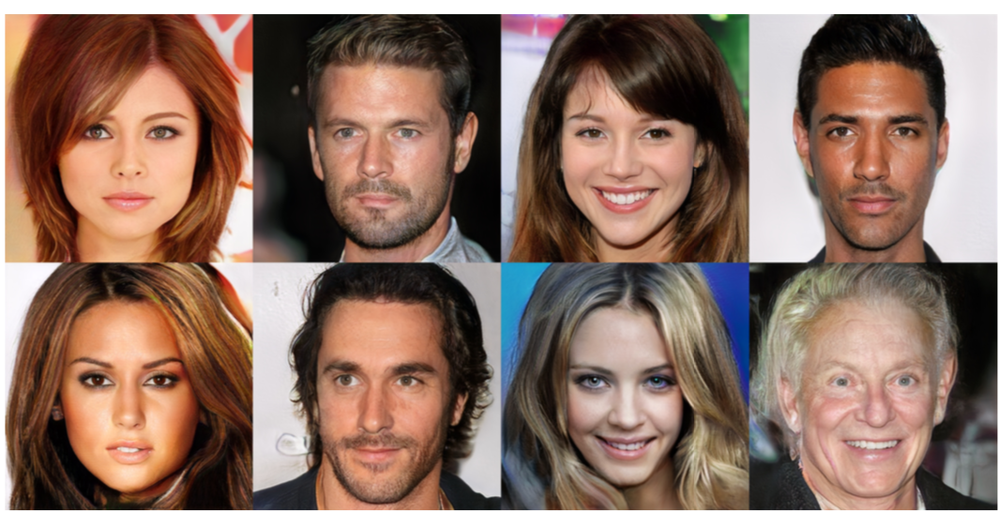
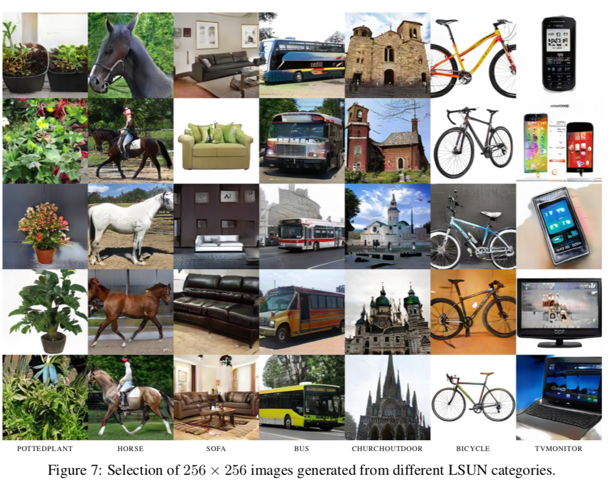

# Progressive Growing of GANs for Improved quality, stability and variation

- Date : 2017.10

- Author : Tero Karras, Timo All, Samuli Laine, Jaakko Lehtinen

## Simple summary

>PGGAN은 고화질의 이미지를 생성하기 위한 방법으로, low-resolution부터 학습을 시작하여, 점차적으로 레이어를 쌓아 high-resolution 이미지를 생성하는 방법이다. 그 외에도 다양한 기법을 소개했는데, 첫번째가 mode collapse을 방지하기 위해, mini-batch간의 std을 구해 discriminator의 output에 concat하는 방식과 signal을 줄이기 위한, wegiht initialziation과 feature normalization 방법을 소개했다. 마지막으로 Laplacian Pyramid을 이용한 새로운 GAN Metric 측정 방식을 소개하였다.

## Contribute

- generator와 discriminator의 레이어를 하나씩 늘려가면서 학습하는 `progressive method`방제안
  - 학습이 빠르고, 안정적임
  - 고화질의 이미지 생성이 가능
- 이미지가 다양하게 생성되는 기법 소개 (mode collapse 방지??)

- 디테일한 학습 방법
  - weight initialization
  - Generator의 signal magnitude escalation 방지하는 방법

- 이미지 퀼리티와 변화를 나타내는 새로운 `metric` 소개

## 기존 Generative model

- Autoregressive model
  - 선명한 이미지 생성, 하지만 매우 느림
- VAE
  - 학습이 빠름, 하지만 흐린 이미지 생성
- GAN
  - 선명한 이미지 생성, 하지만 작은 resolution일때만이고, variation이 제한적이다.
  - Generated image와 real image 분포가 겹치지 않을 때, discriminator의 gradient가 매우 작거나 커질수가 있다.

### high resolution image 생성의 어려움

- 고화질일수록, discriminator가 실제이미지와 가짜이미지를 쉽게 구분
- 메모리 문제로 적은 batch-size 사용 

## Progressive growing GAN

- low resolution에서 점차적으로 layer을 증가하면서, high resolution을 학습
  - 초기에는 전체적인 특징을 생성하고, 나중에 갈수록 미세한 부분을 학습
- 학습하는 동안, 존재하는 layer는 학습가능하게 유지

### 레이어 구조

- `32x32` : convolution layer
- `2x` : nearest neighbor filtering
- `0.5x` : average pooling
- `toRGB` : feature -> RGB
- `fromRGB` : feature -> RGB (1x1 convolution)

- Discriminator 학습시, 실제 이미지를 다운 샘플링하여 학습
- Generator, Dicriminator 학습시 두 이미지간에 interpolation을 진행

### 장점

- 학습이 안정적
  - low resolution이미지 생성은 적은 정보가 필요. 그러므로 하나씩 증가하면서 학습하면, 이전에 미리   적은 정보로 학습했기에 안정적
- 학습 속도
  - 일반 방법보다 2-6배의 속도가 차이를 가짐

## Variation using minibatch standard deviation

### mode collapse

- GAN은 학습데이터의 일부 부분만 학습하려는 현상이 발생

- 기존에는 `minibatch disciminator` 을 이용해, mini batch내 다양한 특징으로 학습하도록함.

- 여기서는 `minibatch discriminator` 의 단순한 버전을 소개

### 방법

- minibatch내 특징간의 standard deviation을 계산 (CxWxH)
- 각 std의 평균을 구해 하나의 스칼라 값을 생성 (1xHxW)
- 그런뒤, 그 값을 특징의 크기에 맞게 복제한 뒤, discriminator의 특징에 concat
- 실험시, down sampling layer뒤에 넣은 것이 가장 좋았음

## Normalization in generator and discriminator

- GAN은 signal의 크기가 조금씩 증가하는 문제를 가짐
- 기존에는 BN을 이용해 해결하려 했다.
- 하지만, BN은 covariate shift을 막기 위한 것. 실제 GAN에서는 covariate shift가 발생하지 않음
- 여기서는 두가지 방법을 소개.

### Eqaulized learning rate

- N(0, 1)로 초기화를 하되, weight을 실행단계에서 scaling 해주는 방법
- weight scaling할 he initialization의 per-layer normalization 으로 나누어줌
  - he's initialization : sqrt(2/fan_in)
- Adam, RMSProp의 경우, parameter의 scale과 무관하게 학습되기 때문에, parameter가 큰 값은 학습하는데 시간이 오래 걸린다. 하지만, 제안한 방법은 parameter가 동적인 범위를 가지게 되어, 학습속도가 어느 파라미터에서 동일

### Pixelwise feature vector normalization in generator

- generator와 discriminator의 signal magnitude가 통제 불능이 되는 걸 막기 위해서, convNet의 feature vector을 normalization
- `local response normalization` 을 변형하여 normalization을 진행

- N : featuremap의 수

## Multi-scale statistical similarity for assessing GAN results

- MS-SSIM의 문제점 : mode collapse에느 강인하지만, 컬러나 텍스쳐와 같은 작은 효과에는 효력이 없음, training set의 similarity 과점에서 이미지 퀄리티를 평가

- 가정 : 잘 생성된 이미지는 모든 스케일의 local image structure을 가질 것이다.

### 방법

- Train image와 generator image에 다양한 Laplacian pyramid을 적용해 local image patch을 얻고, 이들의 statistical similarity을 구한다.
  - Pyramid는 16x16을 시작으로, 전체 이미지가 될 때까지 두배씩 증가
  - 각 single Laplacian pyramid level은 특정 공간적 주파수 대역을 나타냄 (DoG)
- 16384(2^14)개의 이미지를 샘플링
- 각 피라미드 레이어에서 128(2^7)개 descriptor을 뽑아냄. 그러므로 한 층에서, 2^21개의 descriptor을 만들어 낼 수 있다.
  - 각 descriptor는 7x7x3
- 그런뒤, 각 descriptor을 color channel별 mean과 std을 구함
- 마지막으로, SWD을 이용해 statistical similarity을 구함
  - 512 projection을 이용해 earthmover distance을 근사

### 특징

- 작을 수록, 공간적으로 실제 이미지와 생성된 이미지의 외모와 변화가 동등함.
- 가장 작은 크기에서 값은 전체적인 구조가 비슷하다는 걸 의미

## Experiment

### Statistical similarity 관점에서 제안한 방법의 중요도

- WGAN-GP로 학습
- 128x128 CelebA, LSUN 데이터로 학습

- (a)와 (h)을 비교해 보면, (h)가 더 이미지 퀼리티가 좋지만, MS-SSIM은 큰 변화가 없다.
  - MS-SSIM은 오직 output의 변화정도만 보기 때문이다.
- (c)에서 mini-batch을 16으로 줄여서 실패
- (d)에서 BN을 없애고, 하이퍼 파라미터를 조정해서 성공
- (e*) minibatch discriminator을 추가했을 시, 성능향상에 실패
- (e) std minibatch을 이용했을 때, 성능을 향상
- (f), (g)은 나머지 기여를 추가

### Convergence and Training speed

- 최적점에 잘 수렴
  - curriculum learning에 의해서 학습이 잘됨
  - progressive가 없다면, 디테일한 부분과 큰 부분을 동시에 학습
  - 하지만, progressive하다면, 해당 부분만 집중적으로 학습
- 속도가 2배 빠르다.

- (c)을 보면, progressive가 초기에 resolution이 낮기 때문에, 빠르게 많은 이미지를 볼 수 있다.
  - 5배정도 빠르게 이미지를 볼 수 있었다.

### CelebA-HQ

- 4일 학습
- resolution에 따라, 서로 다른 mini-batch 학습
- WGAN-GP, LSGAN 두 loss로 학습

### LSUN

### CIFAR-10

- 기존 7.9 (unsupervised), 8.87 (supervised) 
- PGGAN 8.8 (unsupervised)
- WGAN-GP을 다르게 사용
  - gamma = 750

