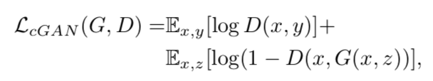
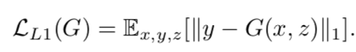
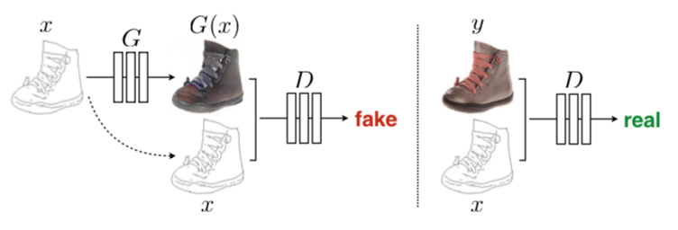
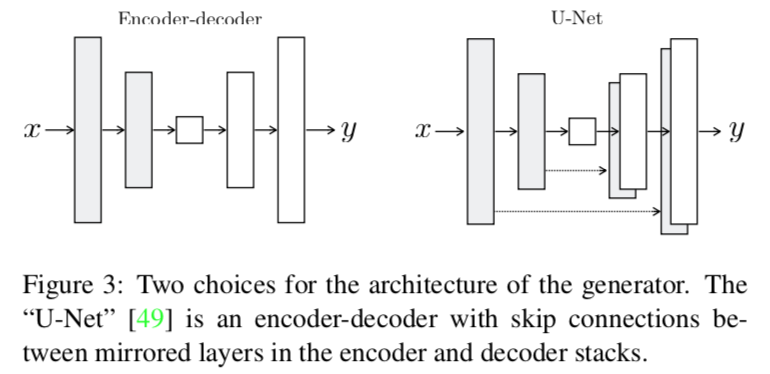
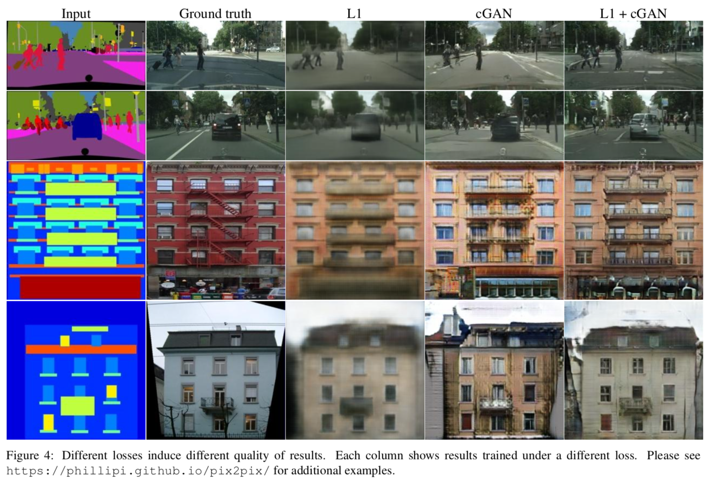
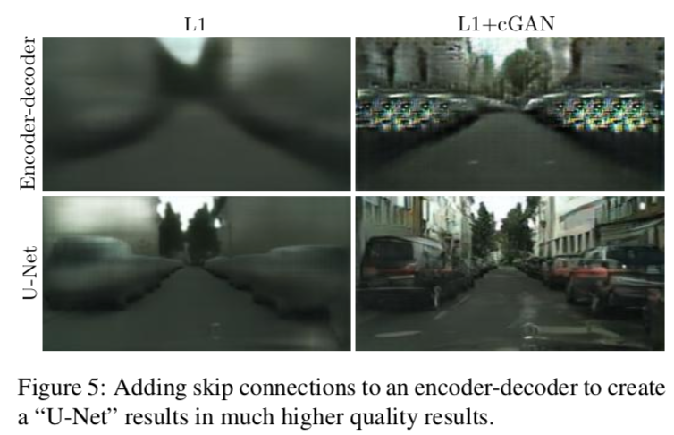
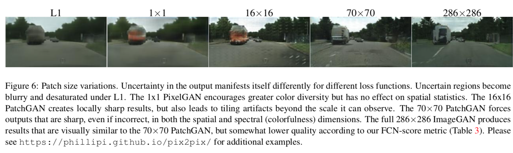
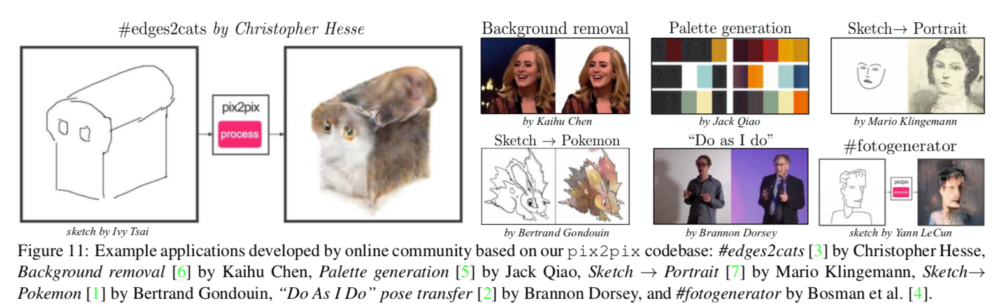

# Image-to-Image Translation with Conditional Adversarial Networks

- Date : 2016.11 

- Author : Phillip Isola, Jun-Yan Zhu, Tinghui Zhou,  Alexei A. Efros

## Simple summary

>VAE은 latent vector z에서 p(x)을 생성하기 위해 만들어 졌다. p(z)에서는 생성시 잘 되지 않기 때문에, p(z|x)을 이용해 p(x)을 생성한다. 하지만, p(z|x)을 모르기 때문에 다루기 쉬운 분포에 Variational Inference을 이용해 학습한다. 학습 할 때, SGA를 이용해 학습하기 위해 Reparametation trick을 이용해 구한다.

## 목적

- `conditional GAN`을 이용해서, input image를 output image로 translation

## 기여도

- 다양한 문제에 대한 이유있는 결과를 보여준다.
- 충분히 좋은 결과를 보여주였다.

## Objective

- cGAN의 방법 사용

- L1 distance (Generator)
  - discriminator을 속일 뿐 아니라, output과 비슷한 값이 나오도록 설정
  - L1이 L2에 비해 덜 blur
- Drop out 형태로 noise를 주었다.

## Network architectures

- G, D 모두 `conv-BatchNorm-ReLU` 형태를 이용해서 만들어짐

### Generator with skips

- input가 output은 표면적으로 다르지만, `전체적인 구조`는 비슷해야 된다.
  - 그러므로, `encoder-decoder`구조를 가짐
- 또한, low-level의 정보가 전달되기를 원함.
  - 예를 들어, colorization의 경우, 그림의 에지 정보는 유지 되어야 함.
  - 그러므로 `skip connection`
- 결론적으로, `U-Net`구조를 사용

### Markovian discriminator (PatchGAN)

- Low-frequencies의 경우, L1을 사용해서 정확도를 높였음.
- High-frequencies를 높이기 위해서, 전체 이미지를  local patch로 나눈 뒤, 각 로컬에서 discriminator가 판단 (**PatchGAN**)
- 각 로컬의 값의 average를 구해 결과값으로 출력
- texture/style loss로 이해될 수 있음.(?)
- 장점 
  - 적은 파라미터 사용
  - 빠른 처리
  - 큰 이미지에 적용 가능

### Optimization and inference

- 1:1 로 G, D 학습
- G 학습 시, log(1 - D(x, G(x, z))보다 log(D(x, G(x, z)))을 사용
- G를 학습 할 때보다 D 학습할 때, 적은 lr을 사용
- minibatch SGD, Adam(lr=0.0002, beta1=0.5, beta2=0.999)

- test시 dropout 적용, test batch의 통계로 batch normalization 적용
- `instance normalization`: batch size 1
- batchsize : 1-10

## Experiments

- 다양한 업무 수행
  - sematic label -> photo
  - architecture labels -> photo
  - map -> aerial photo
  - gray -> color
  - edges -> photo
  - sketch -> photo
  - day -> night
  - thermal -> color photo
  - photo with missing -> inpainted photo
- Data set and speed
  - 91 ~ 400
  - train time: 2 hour (Pascal Titan X GPU)
  - Test time: 1 second

### evaluation metrics

- Amazon Mechanical Turk(AMT)
  - 1초동안 가짜와 진짜 영상을 보여준 뒤, 가짜를 고른다. (colorization, aerial photo)
  - 피드백을 주기 위해서 처음 10개는 연습한뒤, 피드백 없이 40개를 수행
  - 세션당 하나의 알고리즘 수행, 각 알고리즘당 50명 이상의 유저가 참여
- FCN-score
  - 기존의 recongnition system을 활용, Inception Score와 유사
  - Pre-trained된 semantic classifier(FCN-8s)을 이용해 측정 (cityscapes)
  - 합성된 그림에 FCN을 적용해 얻은 값과 실제 labeled 값의 accurancy를 이용

### Analysis of the objective function

- L1의 효과

  - L1만 사용시 blur하고, cGAN만 이용시 artifact 발견. 하지만, 둘다 사용시 선명한 결과를 얻음

- discriminator에 condition 입력의 차이

  - condition이 없을 시, input과 output의 구조는 상관하지 않고, 진짜처럼 보이는 데만 신경씀
  - 매우 낮게 측정
  - mode collapse 발생

- Colorfulness

  - cGAN이용시 더 다양한 색상을 생성
  - L1이 어떤 색상을 줄지 불 명확할 때, gray색상(색상분포의 median)을 부여
  - 반면, gan이용시 discriminator가 아니라는 것을 알려줌

### Analysis of the generator architecture

- U-ner vs encoder-decoder
  - U-net의 장점은 L1 + cGAN일 때, 나타냈다.
  - cGAN일 때는 의미 없음

### From PixelGans to PatchGANs to ImageGANs

- 여러개의 patch size로 실험
  - 1x1: pixelGAN
  - 70x70: PatchGAN
  - 286x286: ImageGAN
- pixelGAN : sharpness에 문제 없음, colorful
  - color  histogram matching에 응용
- ImageGAN: 상당히 낮은 결과를 보임
  - 이유는 더 많은 parameter가 필요하기에, 학습이 어려움
- patchGAN: 70x70일 때 성능이 제일 좋음
- 고정된 discriminator을 이용해, 여러 크기의 이미지에 적용이 가능

### Perceptual validation

- AMT에 의해 실험
- map -> aerial photo : 18.9%가 속음, 반대는 6.1%가 속음
- colorization: 22.5명 속음

### other

- 이미지 생성와 같은 highly structure뿐 아니라, label도 가능	
  - 이 때, L1이 없어도 가능
- 다양한 어플리케이션 이용이 가능.

### 다양한 어플리케이션

