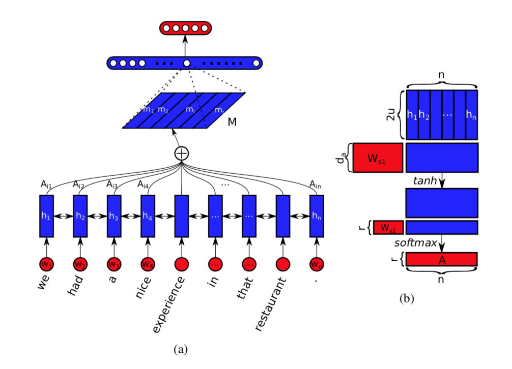
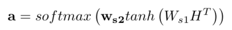
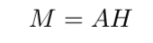
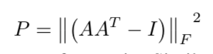
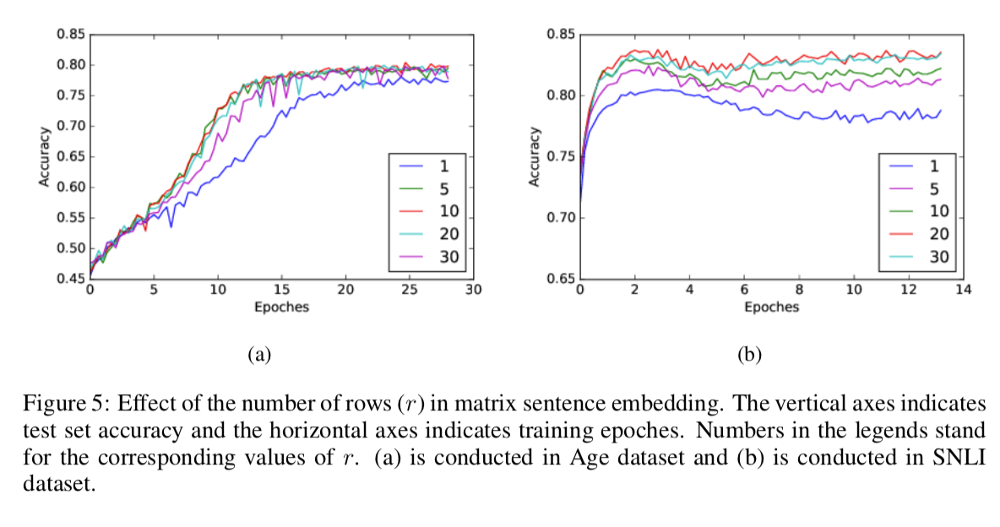

# Structured Self-Attentive Sentence Embedding

## Abstract

- self-attention을 이용한 해석 가능한 sentenc embedding model을 제공
- attention으로 2D matrix 활용
- attention을 이용한 시각화 가능

## 1. Introduction

- sentence embedding
    - unsupervised learning을 이용한 sentence embedding
    - supervised learning을 이용한 특정 task를 위한 sentence embedding : final hidden state의 output을 representation으로 활용

- attention : 추출된 embedding의 가이드를 주는 방법
    - 몇몇 방법에서는 추가적인 정보가 없어서 사용이 어렵다. 보통은 모든 스텝의 vector의 max pooling, average를 사용
    - self-attention을 이용한 방법 제안

- 효과
    - 추가적인 정보 없이 attention 가능
    - long term에 강경함, 모든 step의 hidden vector을 직접 연결하기 때문에
    - 시각적인 해석 가능

## 2. Approach

### 2.1 Model

- 구성
    - bidirectional LSTM
    - self-attention
    - downstream application

    - weight sum hidden을 embedding vector로 사용

- 방법
    - S (n x d)
    - biLSTM(n x 2u) : Sentence간 의존성을 높이기 위해서 사용
    - self-attention (r x n) : LSTM의 hidden vector에서 집중적으로 볼 vector 확인
        - 다양한 관점에서 바라보기 위해, r개의 attention을 생성

    

    - sentence embedding M (r x 2u)

    

### 2.2. penalization term

- embedding matrix M의 문제점 : 각각 r개의 attention이 비슷한 관점에서 생성
- 해결 방안 : penalization term을 추가
    - KLD를 이용한 방법 : attention matrix A는 매우 작기 때문에 사용이 어려움
    - 내적을 이용한 방법 : KL보다 계산량이 적다.

    

- 방법
    - 각 r의 attention은 softmax로 [0, 1]사이 값이기 때문에 각 위치에 해당되는 attention value의 곱도 [0,1]사이 값이다.
    - 만약 attention이 다르면 거의 0에 가까워진다.

### 2.3. visualization

- annotation matrix A를 이용한 시각화가 가능
- annotation matrix가 의미 : token의 lstm의 hidden vector 얼마나 task에 기여했는 지를 나타냄

- 모든 annotion matrix를 더하고, 총합이 1이 되도록 normalize 시킴 → general한  시각화가 가능

## 3. 실험

- author profile : AGE twitter data
- sentiment analysis : Yelp data
- text-entailment : textual entaiment

### 3.1 실험 결과

- class와 연관이 깊은 keyfactor를 추출하도록 학습됨
- 짧은 문장에서는 keyfactor 추출이 잘됨

- penalizatio term : 여러 관점을 보게 만듬, 결과도 사용했을 때가 더 좋음

- multiple vector의 효과 : 여러 관점에서의 embedding vector는 더 많은 정보를 전달 (10-20)일 때 성능이 가능 좋다.

## 4. 결론

- self-attention을 사용한 matrix setence embedding 방법 제안

- self-attention을 통해, LSTM의 모든 hidden state를 사용하지 않는다. 이는 long term depency에 강경하게 만듬.

- 문장을 fix된 embedding vector로 학습이 가능하다.

- decoder를 이용한 unsupervised method를 생각할 수 있다.  하지만, overfitting 문제를 가지고 있다.