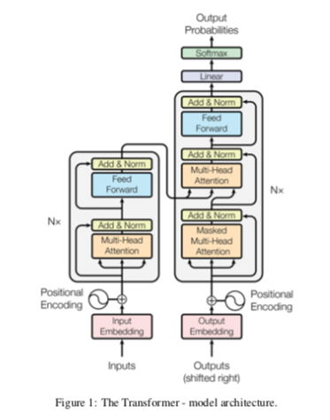
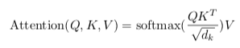
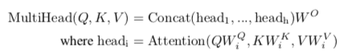
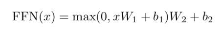
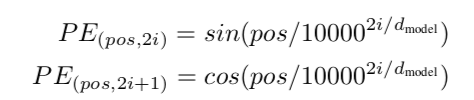
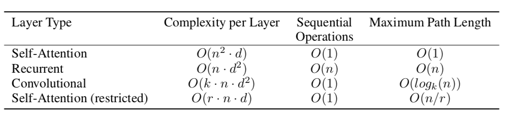
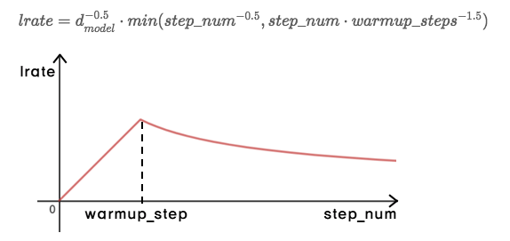

# Attention is All You Need

## Abstract

- 기존의 sequence변화 모델은 RNN, CNN + Attention
- Transformer : 오직 Attention만 이용한 모델
- parallelizable하고 training time도 적다

## Introduction

- 지금까지 translation, sequence 모델은 RNN + encoder/decoder 구조, 이 모델은 선천적으로 parallelize가 불가능하고, 문장이 길 때, 메모리 문제가 있다.
- Attention은 long-term memory에 독립적인 알고리즘이다.
- Transformer은 attention을 이용해 global한 단어를 보고, parallelize가 가능하게 하고, 퀄리티를 높이는 모델을 제안

## Model Architecture

- encoder / decoder
- 구성 모듈 : stacked self-attention, point-wise, fully connected layer

### 3.1 Encoder and Decoder Stacks

- Encoder : 6개의 encoder 모듈
    - 각 encoder 모듈 = multi-head attention + position wise fully connected layer
    - residual connection + layer_norm(하나의 batch의 mean, std을 계산)
    - output of dim : 512
- Decoder : 6개의 decoder 모듈
    - decoder 모듈 = multi-head attention + masked multi-head attention + position wise fc
    - residual connection + layer norm
    - 이후 position에 위치한 단어에는 영향이 없도록 self-attention 사용

### 3.2 Attention

- query + key-value pair을 이용해 output을 생성
- output은 value의 weight-sum, weight는 query와 key의 유사도를 의미

### 3.2.1 Scaled Dot-Product Attention

- query, key = dim_k, value = dim_v

- additive attention와 비교
    - 복잡도는 비슷하나 dot-product가 휠씬 빠른 계산과 space-effienction (mat mul이 가능)
    - dim_k가 작을 때에는 성능이 비슷하나,클 때에는 additive가 잘 동작. 이유는 dot-product일 때 값이 커지고 이로 인해 gradient가 커지게 된다. 그러므로, normalization 추가

### 3.2.2 Multi-Head Attention

- single query, key, value의 dim_k, dim_v를 구하는 것보다 h번의 dim_k , dim_v로 projection한 뒤, attention을 하는게 성능이 좋다.
- 각 처리를 한뒤, 마지막으로 output dim과 같은 크기가 되도록 projection 시킴

- dim_k, dim_v = 64, dim_model = 512
- head의 dim이 줄어들었기 때문에 계산량은 비슷

### 3.2.3 Attention

- encoder-decoder
    - query : previous decoder layer
    - key, value : output of encoder
- self-attention + encoder
    - query, key, value : input of encoder
- self-attention + decoder
    - query, key, value : input of decoder
    - mask : auto-regressive 특성을 위해

## 3.3 Position-wise Feed-Forward Network

- conv1 2개를 이용.
- dim_input = 512, dim_ff = 2048

## 3.4 Embedding and Softmax

- 기존 seq2seq와 같이, input token, output token을 embedding으로 바꾸는 모델과 output embedding을 다음 값으로 예측하는 모델을 softmax을 통해 결정

## 3.5 Positional Encoding

- seq의 순서를 지정하기 위해서 정보(positional encoding)를 주입
- sine and cosine function 사용 (다양한 encoding 존재)
    - pos : position
    - i : dimension

- sine postional encoding 사용시, 상대적인 위치를 학습하는데에 유리할 거라 가정한다. k보다 많을 때 k에 linear function으로 표현 가능
- learned positional embedding과 비교 했을 때, 거의 비슷. 하지만 sine version 사용했던 더 긴 seq도 사용이 가능.

## 4. Why self-Attention

- motivation of self-attention
    - computational complexity
    - parallelized computation
    - long-term dependency
        - feed-forward와 backward의 거리가 짧을 수록, long-term dependency에 강하다

- n : seq_len, d : represent dim, k : kernel size, r : size of neighborhood in self-attention

- 해석이 가능한 모델 : align을 이용해 어느 부분이 확인 되는 지 가능.

## 5. Training

- Optimizer : Adam( beta1=0.9, beta2=0.98)
- lr schedule

- regularization
    - residual dropout : , 0.1 사용
    - sub_layer(multihead, position) 후에 dropout 추가,
    - position encoding
    - embedding sum에 추가
- label smoothing 사용: 0.1
    - ture logit을 이용할 때, 큰 차이를 두면 overfitting의 위험이 존재 그래서 label을 smooth 하게 만듬

## 7. Conclusion

- rnn을 대신한 seq 변환 모델 사용
- rnn, cnn보다 빠른 학습이 가능