# StarGAN: Unified Generative Adversarial Networks for Multi-Domain Image-to-Image Translation

- Date : 2017.11

- Author : Tunjey Choi, Minje Choi, Munyoung Kim, Jung-woo Ha, Sunghun Kim, Jaegul Choo

## Simple summary

>StarGAN은 multi-domain tanslation을 위한 모델이다. 기존의 모델들은 두 도메인간의 image translation만 사용했기 때문에, multi-domain을 위해서는 다수의 모델이 필요하다. 하지만 stargan은 labeling data을 활용해 다수 도메인간의 translation을 가능하게 했다. 이는 CycleGAN + ACGAN으로 볼 수 있다. 또한 서로 다른 labeling된 데이터를 활용하기 위해, mask vector을 제안하였다.

## Contribute

- 하나의 모델을 이용해, 다양한 도메인간에 Image-translation 수행
- 서로 다른 레이블이 되어 있는 데이터를 사용하기 위한 방법 제안

## 기존 Image-to-Image Translaion 문제점

- 다양한 도메인 변환시 여러 모델이 필요
- k 도메인간에 변환 할 때, k(k-1)개의 모델이 필요
- 이는 매우 비효율적

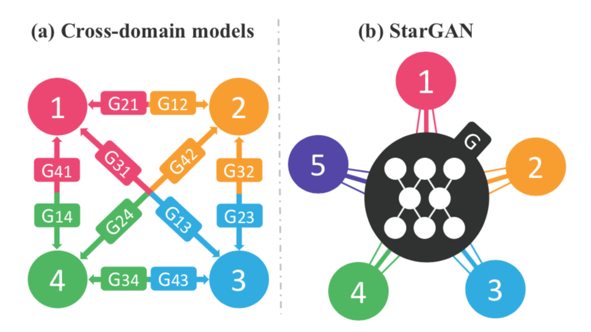

## Model

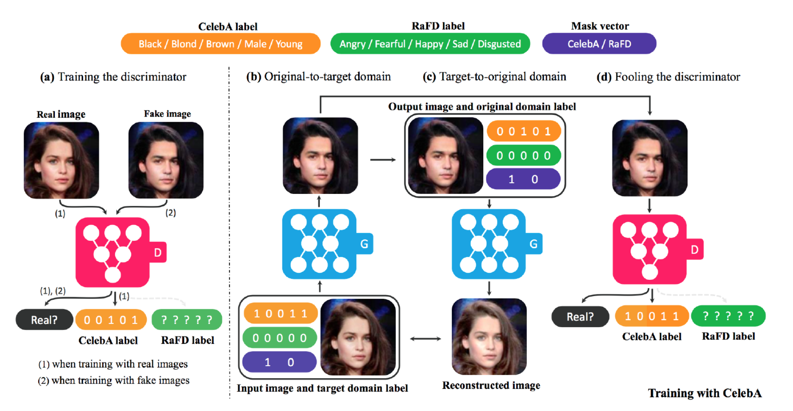

- 특징을 나타내는 `labeling data`을 이용

### Generator

- 실제 이미지와 랜덤한 labeling data을 입력으로 넣고, 이에 label에 해당되는 이미지 생성

- labeling data을 넣을 때, labeling을 이미지 크기로 확장한 후, 이미지와 concat함.

### Discriminator

- 실제 이미지와 생성된 이미지을 넣어, `real/fake`, `labeling data` 을 동시에 예측
- Real 데이터는 real과 실제 label 데이터가 나오도록 학습
- Fake 데이터는 fake와 변현된 label 데이터가 나오도록 학습

## Loss

### Adversarial Loss

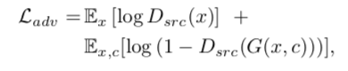

- Discriminator 학습시, real은 1로 fake은 0으로 학습
- Generator 학습시, fake가 1로 학습

### Domain Classification Loss

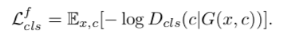

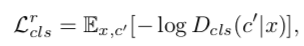

- D위에 `auxiliary classifier` 추가
- Discriminator 학습시, real data의 domain classification loss을 학습
- Generator 학습시, fake data의 domain classification loss을 학습

### Reconstruction Loss

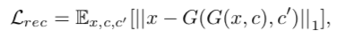

- 이미지 도메인간의 형태를 유지하기 위해, cycle gan의 `cycle consistency loss` 을 추가
- reverse translation할 때, `original labeling data` 추가

### Full Loss

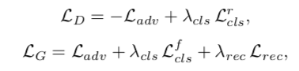

- class lambda : 1, reconstruct lambda : 10

## Multiple Dataset

- 서로 다른 labeling 되어 있는 여러 데이터셋을 활용하기 위해 사용
- 여러 데이터셋으로 학습시켜, 다양한 도메인간의 변화가 가능

### Mask vector

- labeling data에 데이터 셋에 해당되는 label을 넣어 concat
- [c1, c2, m] 
  - C1 : dataset 1의 labeling vector
  - C2 : dataset 2의 labeling vector
  - m : 해당 데이터셋의 one-hot vector 
- Mask vector을 이용해, 모델이 어느 라벨에 집중할 것인지 학습
- Discriminator의 auxiliary classifier의 class을 확장시켜야 함.
  - 알고 있는 라벨 데이터로만 학습, Multi-Task learning 학습

## Implermentation

- WGAN-GP 사용
  - gp-lambda : 10
  - generator 1번 업데이트하면, discriminator 5번 업데이트

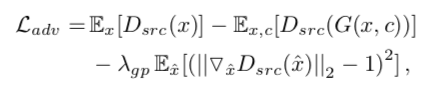

- Residual-Block 사용
  - conv (2) + Residual Block (6) + decent (2)
- instance normalization
- Patch GAN
- Adam (beta1 : 0.5, beta2 : 0.999, lr : 0.0001)
- Linear lr decay 사용
- Flip Data Augmentation
- Batch size : 16

## Experiments

- 비교 모델
  - DIAT, CycleGAN, IcGAN
  - DIAT, Cycle GAN은 모든 도메인간의 모델을 생성
  - Multi-attribute는 multi-step translation 사용

### Celeb A

- 다른 모델보다 잘동작
- 이유 : 여러 도메인을 이용해 multi-task learning으로 regularization이 됨
- IcGAN에 비해 face identity 유지

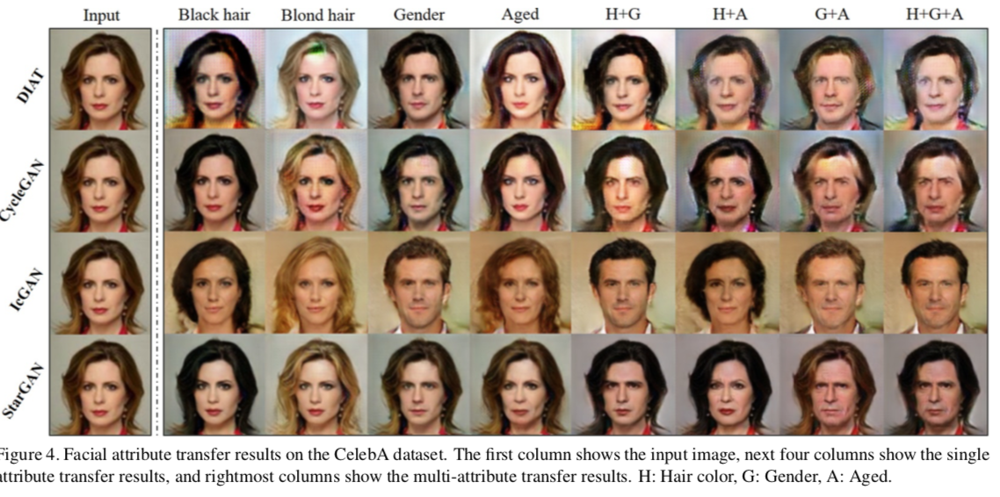

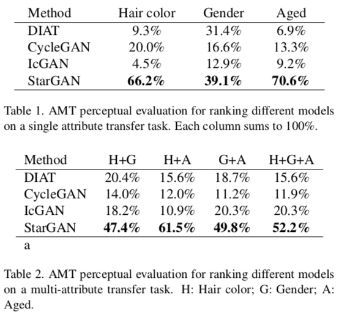

- AMT을 이용해 여러 모델에서 생성된 이미지에서 제일 좋은 것을 선택
- 100~146명의 인원이 30~40개의 질문을 받음
- Multi-attribute tranlsation에서 가장 좋은 성능을 얻음

### RaFD

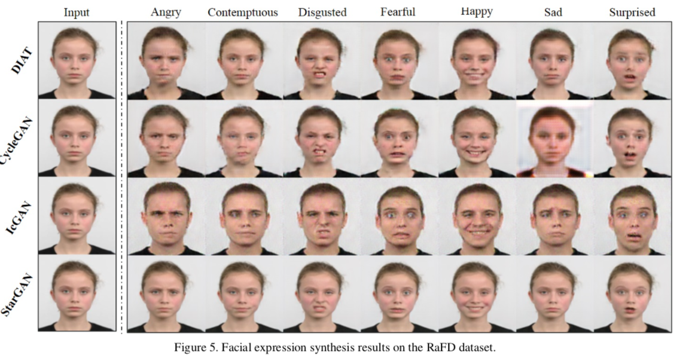

- DIAT, CycleGAN은 blurry image
- IcGAN은 Identity 유지가 어려움
- stargan은 DataAugmentation 효과를 가짐
  - single domain 변환의 경우, 해당 라벨만 가능
  - 하지만, starGAN은 모든 데이터를 활용이 가능

- 파라미터 및 Classification error 

- ResNet-18을 이용해 표정 classification 학습 (acc : 99.55)

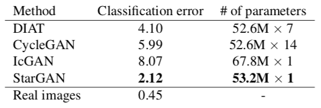

- 적은 파라미터로 좋은 성능을 가짐

### CelebA + RaFD

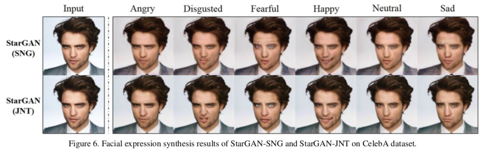

- 여러 데이터를 활용할 때, 이미지 퀼리티가 좋음
  - 더 많은 데이터를 활용했기 때문에
  - 이로 low level task (face key point detection, segment)가 가능
- 싱글은 blurr하며, 배경이 회색