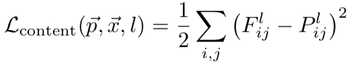
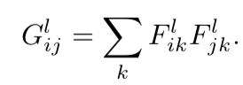
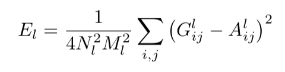
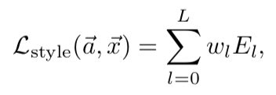
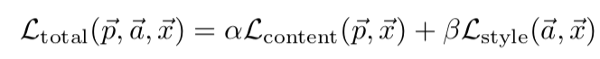
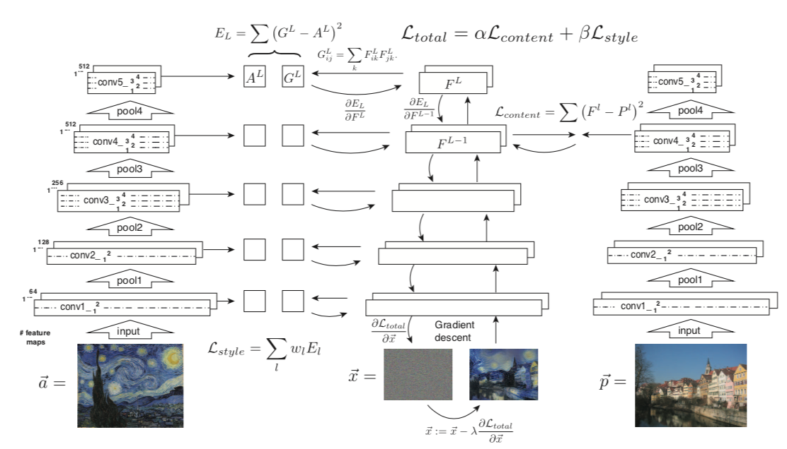
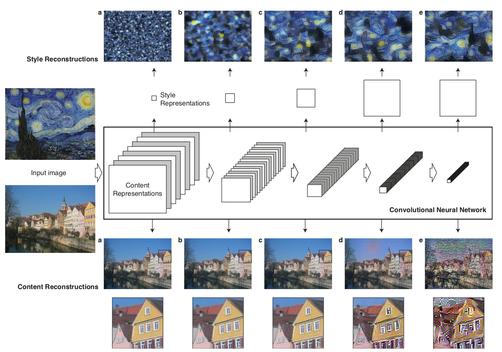
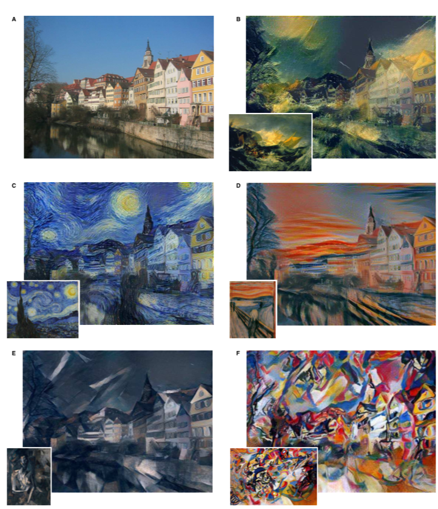

# Image Style Transfer Using Convolutional Neural Network

- Date : 2016
- Author : Leon A. Gatys, Alexander S. Ecker, Matthias Bethge

## Simple summary

>이 논문은 content image 에서의 이미지 구조를 유지하며, style image에서의 스타일을 전달하는 방법이다. 스타일 전달을 위해 VGG19를 이용해 content, style representation을 추출하고, Loss function으로 최대한 content, style representaion과 비슷하게 이미지를 생성한다. 이 때, Content represenstation은 VGG19 feature을 이용하며, Style representation은 feature을 correlate한 Gram matrix을 이용한다. 

## 목적

- content을 유지하며, style을 전달하는 방법
- 이를 위해서 content, style representation을 따로 분리해서 추출

## 방법

- VGG 19 이용
- weight normalization
- max pooling -> avg poiling을 사용

### Content representation

- F : 만들려는 image의 feature 
  - N (filter 갯수) x M (h * w)
  - 깊은 층일수록, 추상적인 물체 의미
- P : content image의 feature

### Style representation

- Gram matrix : feature끼리 correlation

- A : style image 의 gram matrix

- 여러 층에서 뽑아낸 차이끼리 웨이트 합을 구함

### Loss

- 다음을 loss를 back-propagation으로 구함
- 기존 back-prop : weight 학습 목표, image 고정
- style transfer back-prop : image 학습 목표, weight 고정
- L-BFGS 사용해 학습

- Content representation : conv 4_2
- Style representation : conv 1_1, conv 2_1, conv 3_1, conv 4_1, conv 5_1
- w : 1/5

- content는 딥할수록, content를 잃어버림
- style은 딥할수록, 국소적인 특징이 살아난다.

## 제한점

- resolution에 대해서 제한이 있음 
  - 클수록 속도에 제한 (기존의 512x512 사용시 하루 걸림)
  - online이 불가능
- 실제 사진을 이용한 합성시 noise가 발생
- 완벽하게 content와 style이 나누어지지 않았다.

## 결과

