# Video-to-Video Synthesis

- Date : 2018.08

- Author : Ting-Chun Wang, Ming-Yu Liu, Jun-Yan Zhu, Guilin Liu, Andrew Taom Jan Kautz, Bryan Catanzaro

## Simple summary

>Vid2Vid는 CGAN을 이용한 Video Transfer이다. Generator는 Pix2PixHD에서 제안한 Coarse-fine generator을 이용했으며, 여기에 optical flow와 mask를 이용한 방법과 입력으로 sequence을 넣어 주어 video transfer의 성능을 높혔다. Discriminator 또한 Pix2PixHD을 베이스로 했으며, 다수 Multi-scale PatchGAN을 이용했고, 여기에 image간의 Discriminator이외에 optical flow와 input sequence간의 Discriminator을 이용했다. Object function으로 이미지간의 Loss, video sequence간의 Loss, Optical flow간의 Loss을 이용했으며, 추가적으로 VGG Loss, feature matching loss을 이용해 성능을 높였다. 또한 vid2vid을 이용해 video prediction, multi-modal sunthesis, semantic manipulation등 여러가지 추가 기능도 소개하였다.

- Soure videos (semantic segmentation)

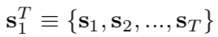

- Real videos (real)

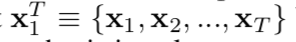

- Output videos

- 목적 : source video를 넣었을 때, 나오는 Real video의 Conditional Dist와 source video를 넣었을 때 나오는 Generative video의 Conditional Dist를 같게 만드는 것, 즉, source을 넣었을 때 실제와 비슷한 값이 나오도록 학습

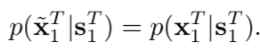

- **Conditional GAN**을 이용해 학습

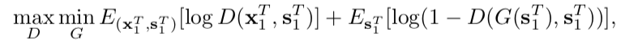

## Network Architecture

### Generators

- Sequential generator : Markov를 이용해 학습
  - output을 만들기 위해서, `현재 source`, `이전 souce`와 `이전 생성된 output`을 넣어 준다.
  - L=2로 설정

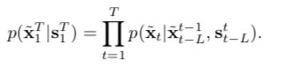

- Mask, Optical flow

  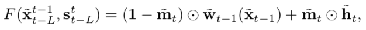

  - w : 예측한 optical flow
  - h : generative 이미지
  - m : mask 이미지, (0-1)사이의 값
    - 물체가 카메라 가까이 이동되면, 물체가 blur되는 현상이 발생. 마스크를 통해 수정

- Foreground-background prior

  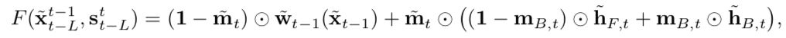

  - `background`의 경우, global transformation으로 `optical flow을 이용한 warp`이 이미지 생성을 더 잘함
  - `foreground`의 경우, 큰 움직임과 작은 크기로 optical flow을 이용한 warp이 어려워 `generated image`을 사용

- Coarse-to-fine generator: pix2pixHD를 이용

  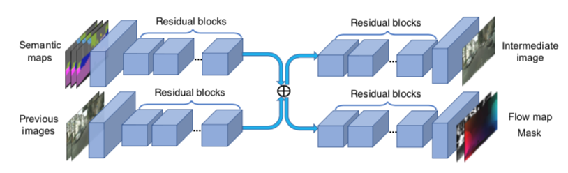

  - Low resolution network 
    - 입력으로 down-sampling하여 입력
    - source와 generate을 concat한 후 `residual block`을 거쳐 각각intermediate 결과를 생성하고 서로 더한다.
    - 더한 값을 input으로 hallucinated image와 optical flow와 mask (모델 공유)를 생성한다.

  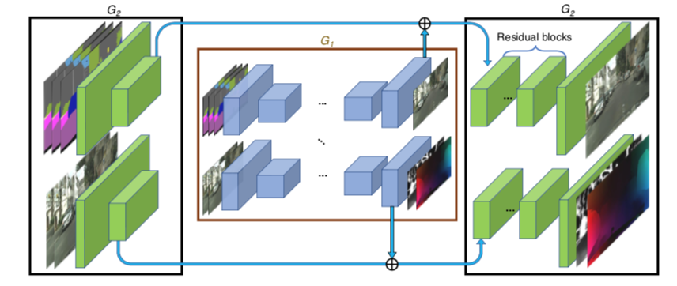

  - higher resolution network
    - Low resolution network의 위, 아래에 network를 추가
    - Higher resolution의 중간 값과 low resolution의 결과 값을 더한 후, 그 다음 residual block의 입력으로 들어간다.
    - 512x256, 1024x512, 2048x1024 3가지 단계을 이용

### Discriminator

- multiple discriminators : 

  - Conditional image discriminator (DI) : real image와 fake image를 구분
  - Conditional video discriminator (Dv) : (real image sequence와 real optical flow)와 (fake image sequence와 fake optical flow)를 구분

- Multi-scale PatchGAN 

  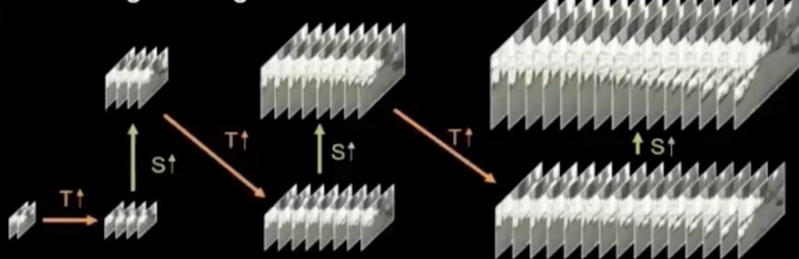

  - resolution down sampling
  - frame rate down sampling(long term, short term) + resolution down sampling
  - 초기에는 제일 작은 scale이고 original sequence에서, scale을 키운 다음, frame rate을 키워서 계산
  - 3 scale을 이용
  - mode collapse을 이용

- Sampling

  - DI를 위해서 1에서 T사이의 uniform distribution에서 random으로 하나를 샘플링
  - DV를 위해서 K+1에서 T+1사이의 uniform dist에서 random을 하나를 샘플링

## Objective function

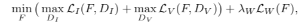

- LI : Image간 Loss

- LV : sequence영상과 optical flow의 Loss

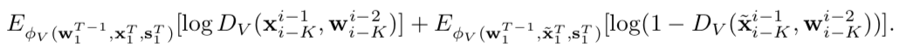

- LW : flow estimation Loss (optical flow 자체 + warp image) 

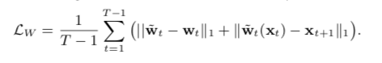

- 추후에, feature matching loss과 VGG feature matching loss 실험
- LSGAN 이용

## 응용

### Multimodal synthesis

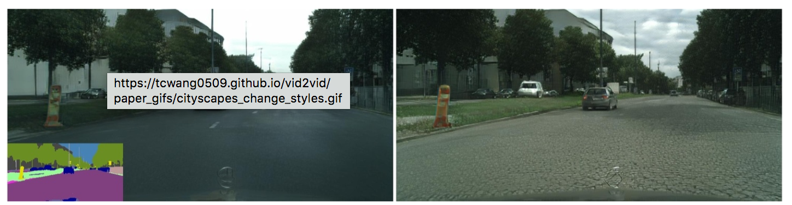

- F는 unimodal mapping function으로 하나의 style만 생성이 가능
- 하지만, multimodal mapping이 가능
- Real-image을 encoder-decoder 구조를 이용해 3차원 feature embedding을 생성한 후, instance별로 style을 조절하기 위해서 instance-wise의 feature average pooling을 시켜서 generator의 입력으로 들어간다.
- 그런 후, 같은 class에 대해서 gausian mixture을 수행한다.
- 그리고 inference할 때, 학습된 gausian mixture에서 샘플링하여 입력값으로 넣는다.

### Predict video

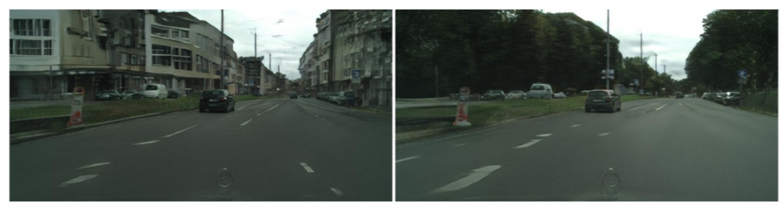

- 우선 future의 sementic을 생성한 후, 생성된 sementic을 실제 영상으로 변환
- 위에 LV을 이용해 학습

###Other

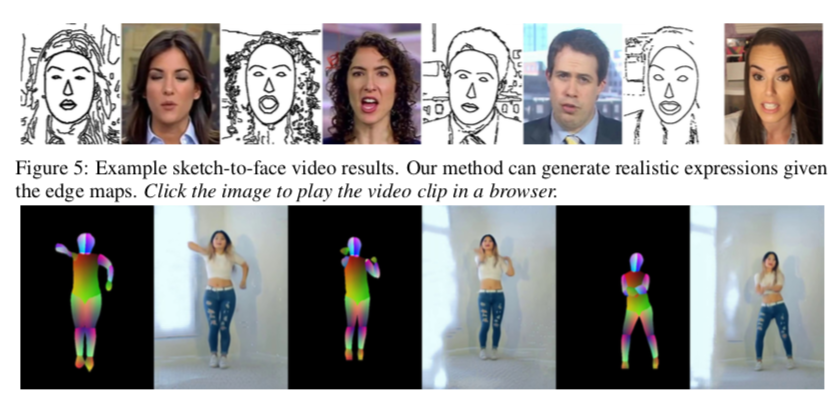

## 	Experiment

- 40 epoch
- ADAM (lr=0.0002, beta=0.5, 0.999)

- AMT을 이용해 AB test 진행 
  - 두 영상중 어느개 진짜와 가까운 지 조사
  - temporal coherence, image quality 조사
- FID (Frechet Inception Distance)
  - Inception을 이용한 video recognition CNN(ResNeXt, I3D)을 이용해 feature 을 얻고, feature의 평균과 공분산행렬을 계산하여, 이를 이용해 distance을 계산
  - 작을 수록 좋은 것

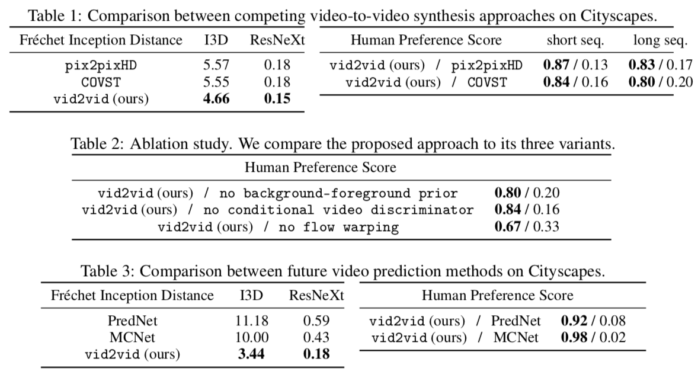

### 다른 비디오 변환 모델과 비교

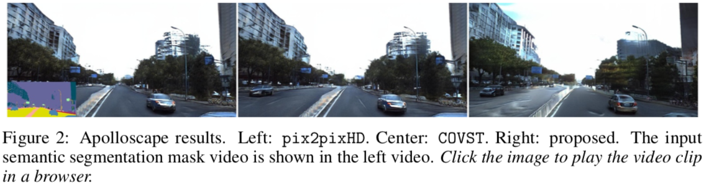

### Multi-modal synthesis

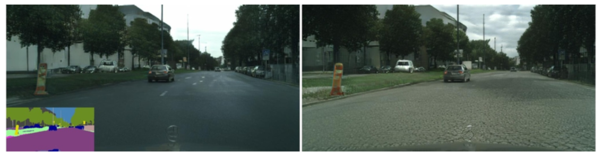

### semantic manipulation

## Limitation

- 몇몇 실패하는 경우 발생, 예를 들어 차가 회전할 때 학습 정보 부족으로 실패
- 물체의 외관이 일관되기가 힘듬. 색이 계속 변환
- semantic manipulation시 모양이 달라서 잘못되게 출력 된다.