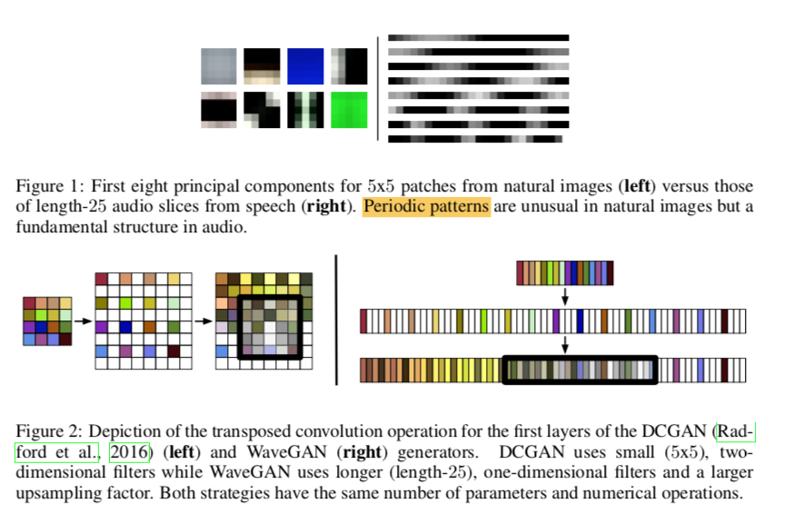
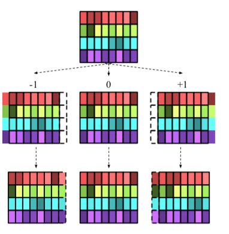
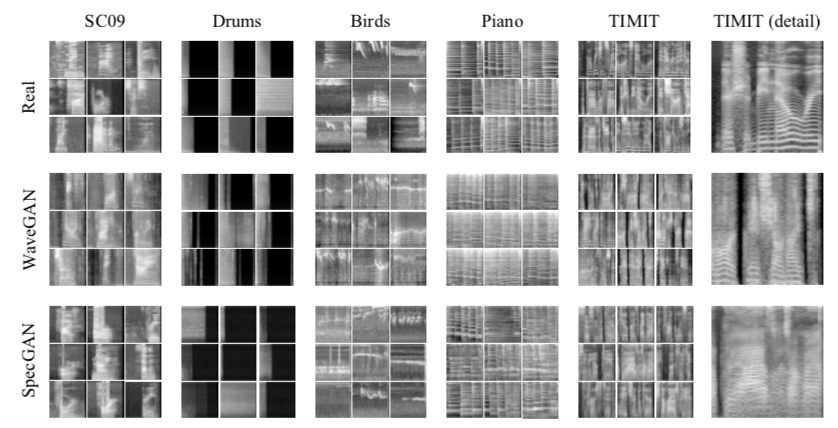
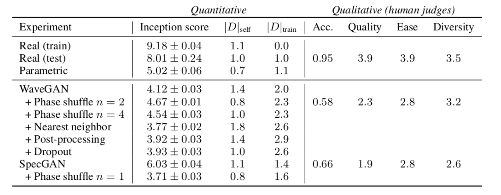

# Adversarial Audio Synthesis

- Date : 2018.02 

- Author : Chris Donahue, Julian McAuley, Miller Puckette

## Simple summary

>WaveGAN은 1초의 짧은 음성을 생성하는 GAN모델이다. 여기서는 두가지 GAN모델을 제안한다. 첫번째는 WaveGAN이며, 이는 기존의 DCGAN을 음성에 맞게 변형하여 사용한다. 여기서 DCGAN의 ckeckboard 효과를 줄여주기 위해서, Phase Shuffle을 사용해서 줄인다. 두번째는 SpecGAN이다. 이는 waveForm을 바로 생성하는 것이 아니라 Spectogram을 직접 생성한다. 이 spectogram을 waveForm을 바꿀 때에는 Griffin-Lim algorithm으로 변형하여 생성한다.

## Audio를 이용한 GAN

### Audio Generation의 사용 방법

- Data augmentation에 활용
- 대량의 오디오를 간단하게 샘플링이 가능

### 어려움

- 기존의 이미지를 이용한 GAN을 이용할 경우, Spectrogram을 생성할 수 있다. 하지만, spectrogram을 audio로 변경하는 것이 불가능
- autoregression을 이용할 경우, 성능은 매력적이지만 매우 느리게 생성

### 두가지 GAN

- SpecGAN : spectrogram을 생성하고, 이를 audio로 변환
- WaveGAN : DCGAN을 이용해 생성
  - 짧은 음성을 만드는 데 도움

## WaveGAN

- 이미지와 오디오의 차이 : 주요 특징을 뽑아보면, 오디오는 주파수 영역에서 주기적인 특징이 보임

- 넓은 receptive field을 보도록 학습.

- `DCGAN`을 이용
  - 대신에 5x5 2D kernel 대신에 25 1D kernel을 사용
  - 2개 업샘플링 대신에 4배 업샘플링을 사용
  - 중간은 interpolation을 사용
  - image DCGAN과 같은 파라미터 수를 사용
- 마지막으로 fc layer을 사용 (4096 -> 16384)
- 16kHz에서 1초 이상 음성 생성

- 마지막으로 16bit ineger을 32-bit floating point로 생성
- `WGAN-GP`을 이용

### PHASE SHUFFLE

- DCGAN은 "Checkerboard" 효과가 발생
  - 주기적인 특징을 가진 artifact 생성 - > 특정 주파수에 잡음이 생김
  - 이미지에서는 이를 discriminator가 쉽게 거절하나, 음성 데이터의 경우, 주기적인 특징 때문에 진짜와 가짜를 구분하기가 힘들어진다.
  - 이를 해결하기 위해, Phase shuffle 이용

- Uniform dist [-n, n]에서 하나의 숫자를 뽑고, 그 숫자만큼 구간을 shift 시킴.
- 빈 구간은 reflection 패딩으로 채움
- 이 방법은 discriminator에만 적용

## SpecGAN

- DCGAN으로 Spectogram을 생성
- 하지만 spectogram에서 raw audio로 변환이 힘듬
- spectorgram을 waveform으로 바꾸기 위해 `Griffin-Lim algorithm`을 사용

### 전처리

- Sampling Data : 16ms로 짧은 시간의 fourier transform을 사용 -> 0~8kHz의 128bin의 데이터 사용
- 각 데이터에 log을 취하고, mean: 0 var: 1 로 normalize을 시킴
- 가장 높은 frequency는 지워 주었음.

## 결과

### Inception Score

- SC09 데이터를 10개의 class로 분류
- 모델은 4개의 convolution과 pooling 레이어 + softmax layer를 사용해 학습 (accurancy 93%)
- spectrogram을 이용해 분류했기 때문에, waveGAN보다 SpecGAN이 성능이 더 좋게 나옴

### Nearest Neighbor Comparisons

- 종종 좋지 않은 성능에도 불구하고 inception score가 높게 측정되는 경우가 발생
  - 이유 : mode collapse에 의해서 하나의 샘플만 생성, trainset에 overfitting 되는 경우
  - 이를 판단하기 위해서 새로운 measure을 사용
- D_self : 가장 가까운 샘플의 euclidean distance 평균
  - 높을수록 다양한 샘플을 생성
- D_train : train data와 가까운 1k sample 데이터의 euclidean distance 평균

### Amazon Mechanical Turk

- 숫자 발음을 생성하는 데이터를 사용하며, 숫자에 정확도와 qaulity 평가

