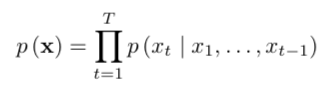
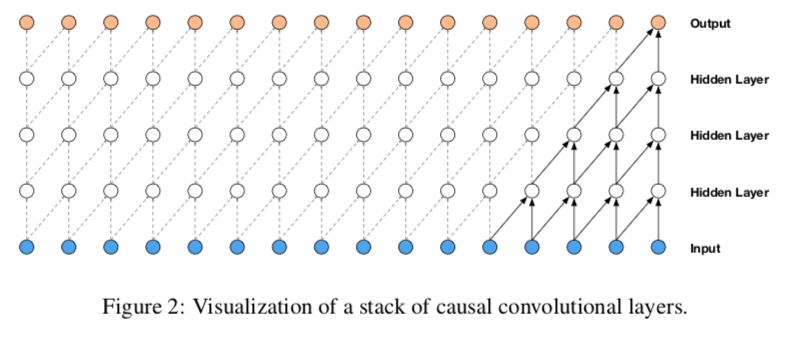
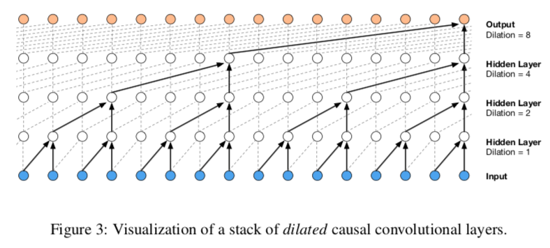
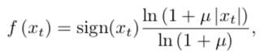
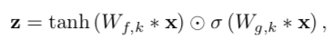
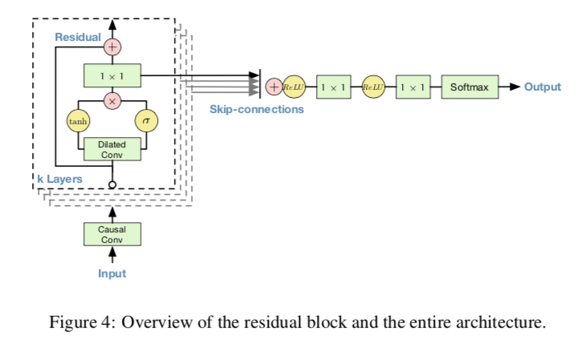
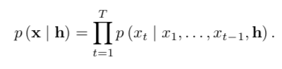
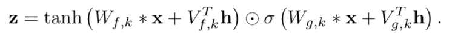
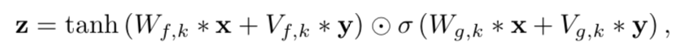

# WaveNet

> WaveNet은 음성을 생성하는 방법으로, Pixel CNN과 같이 Auto-regressive 모델을 사용해 생성. 이 때, 넓은 reception field을 위해서 dialted conv을 사용한다.

- Auto-regressive model
  - stack of conv layer
  - No pooling
  - softmax layer
  - Maximum log-likehood

## DILATED CAUSAL CONVOLUTION

- causal convolution : 오직 과거의 값만 이용해서 현재를 생성
  - 2D에서 쓰이는 Mask conv와 달리, 1D에서는 오직 shift을 이용해서 형성
  - 학습시에는 parallel 계산이 가능, 하지만 생성시에는 sequential 
  - RNN과 다르게 빠른 학습 가능
  - 단점으로 높은 reception field을 위해서는 많은 층이 요구

- dilated convolution : 적은 레이어로 더 넓은 reception 필드를 가질 수 있음
  - 레이어가 커질수록 dilated 가 두배씩 증가, 그리고 이를 반복
  - 2, 4, 6, ..., 512, 2, 4, 6, ..., 512
    - 사용이유 
    - dilated가 커질수록, reception field도 지수적으로 증가
    - block을 쌓을 수록, model capacity와 receptive field size도 휠씬 증가

## Softmax distribution

- pooling 대신에 softmax을 사용
  - categorical dist가 모양에 제한이 없기 때문에
- Sampling : u-law companding transformation 
  - 16-bit integer(65,536) -> 256으로 변경
  - Non-linear quantization이 휠씬 효율적임

## GATED ACTIVATION UNIT

- filter, gate을 activation으로 활용
- Audio signal에서 ReLU보다 더 잘 수행

## RESIDUAL AND SKIP CONNECTIONS

- 더 깊은 모델 학습과 빠른 학습이 가능
- residual block과 skip connection을 사용
- Skip connection은 elementary sum을 사용

## Conditional wavenet

- h을 조건으로 주어 다양한 캐릭터를 생성

- CODITIONAL 의 종류

  - global conditioning 

    - single latent을 입력하여, 전체 output distribution에 영향을 줌
    - 모든 time 영역에 적용
    - V는 linear layer 사용
    - TTS

    

  - lobal conditioning

    - 초 마다 히든 값 h을 가짐
    - h을 transposed conv을 이용해서 upsampling 함
    - 적은 샘플링 주파수일 때, 사용이 가능
    - V는 1x1conv을 사용
    - linguistic features in TTS

    