# Improved Training of Wasserstein GANs

- Date : 2017.03

- Author : Ishaan Gulrajani, Faruk Ahmed, Martin Arjobsky, Vincent Dumoulin, Aaron Courville

## Simple summary

>WGAN-GP는 WGAN의 weight-clipping을 대안한  gradient-norm을 활용한 새로운 1-Lipschitz function constraint을 제시했다. 기존 WGAN은 weight-clipping은 K-Lipschitz constraint이기에 잘 학습이 되지 않았다. 하지만, WGAN-GP는 기존 WGAN보다 빠른 학습과 더 좋은 성능을 보여주며, 다른 GAN들과 비교해서는 안정적인 학습이 가능해져, 딥한 모델의 학습이 가능하게 만들었다.

#Properties of the optimal WGAN critic

### Proposition 1

> compact space에 Pr과 Pg가 존재할 때, WGAN Loss을 만족하는 최적의 1-Lipschitz function이 존재한다.

>WGAN을 최소로 만드는 Pr과 Pg의 coupling이 존재할 때, f가 미분가능하다면, $\pi$(x=y) =0이고 $			x_t=tx+(1-t)y$ 이다.그리고 f의 미분값은 1이다.

### Corollary 1

> f의 gradient norm은 Pr과 Pg의 어디든 거의 1이다.

## WGAN의 문제점

- `Kantorovich-Rubinstein duality` 을 이용해 `EM-distance`변형

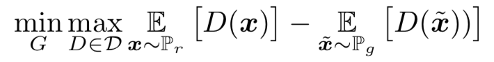

- WGAN의 `critic` 은 `1-Lipschitz function` 이 요구
- 이를 위해, WGAN에서 `weight clipping` 이 사용
  - weight clipping은 c와 critic에 따른 K-Lipschitz function됨
  - Corollary 1에서 최적의 f의 gradient-norm은 1임, 하지만 weight clipping은 최대 K을 가짐

### Capacity underuse

- generator을 (실제 분포 + gaussian noise)에 고정 시킨 채, critics 학습 
  - BN은 생략
  - Weight clipping은 높은 moments값은 무시하고, optimal function이 simple해짐

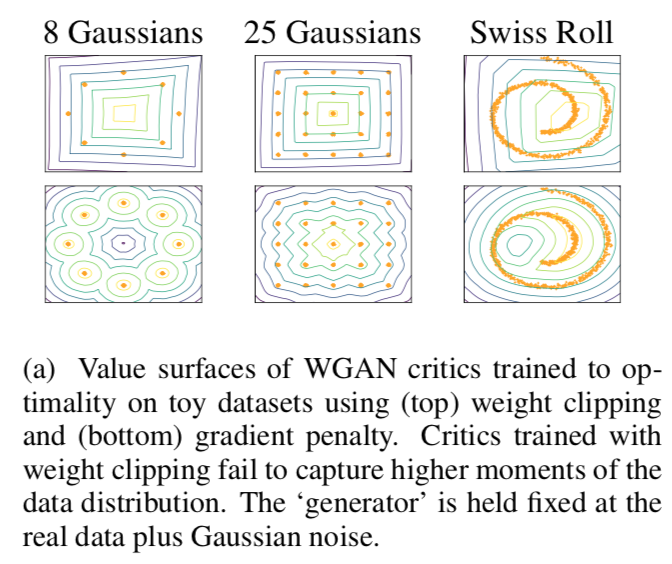

### Exploding and vanishing gradient

- Weight constraint와 cost function에 교차에 따라, `vanishing` 혹은 `exploding` 문제가 발생
- Swiss Roll에서 다양한 c [0.1, 0.01, 0.001] 에서 학습하고, gradient norm 표시
  - generator와 discriminator : 12-layer, ReLU, MLP, w/o BN
  - WGAN-GP가 gradient 가 안정적

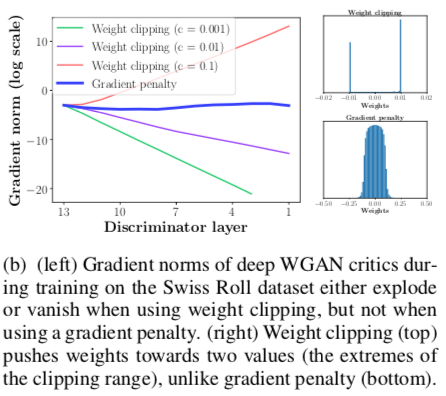

## Gradient penalty

- f가 1-Lipschtiz일 때, gradient norm은 어디서든 1이다.

 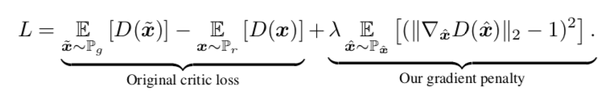

- Algorithm

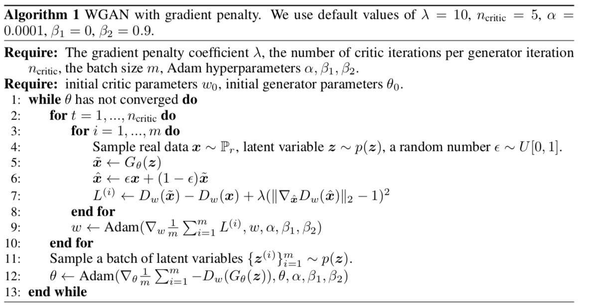

### Sampling distribution

- Px는 Pr과 Pg에서 샘플링한 데이터 사이에서 균등하게 샘플링한 데이터이다.
- 이는, Proposition 1에서 최적의 f는 Pr과 Pg 사이의 gradient norm 1의 직선을 담고 있는 것에 영향을 받음

### Penalty coefficient

- $\lambda$ 는 10을 사용(toy data에서 ImageNet까지 다양하게 사용됨)

### No critic batch normalization

- Batch normalization은 discriminator을 `single->single` 을 `batch->batch` 로 변화시킴
- 제한된 방법은 각 `single input`에 대해 gradient norm을 제한시킴
- BN 대신에 `layer normalization` 을 사용

### Two-sided penalty

- Gradient을 어떻게 줄지를 파악
- Two-sided penalty : gradient norm이 1을 향해 감
- One-sided penalty : gradient norm이 1보다 적게 할 것인지
- 실험적으로 one-sided penalty가 잘 수행할 것 같으나, two-sided penalty가 약간 잘 수행한다.

## Experiments

### Training random architectures within a set

- 다양한 모델을 통해 학습 결과를 보여줌
- 이 모델이 완전한 것은 아님, 그러니 독자는 사용 도메인에 맞게 모델을 평가해야 됨

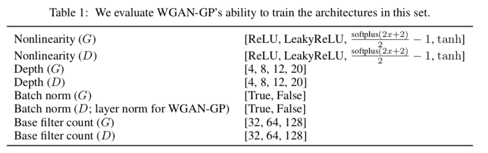

- 200개의 모델을 샘플링하고, ImageNet을 학습 (WGAN-GP, Origin)
- inception score가 min_score보다 높은 것을 통해 성공여부 판단
  - Min_score가 3이상을 WGAN만 성공한 것이 많아짐

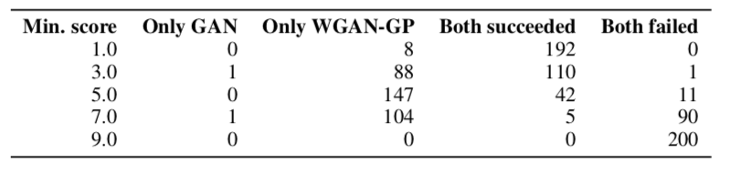

### Training varied architectures on LSUN bedroom

- 6개의 모델과 `WGAN-GP`, `WGAN clipping`, `LSGAN`, `DCGAN` 등 4 Loss에서 LSUN bedroom 데이터을 학습
  - 동일한 optimizer사용, (LSGAN의 lr만 제외)
  - WGAN-GP은 BN대신 Layer Normalization 사용
- 논문에서 아는 한에서, 딥한 모델을 학습시키는 데 최초의 성공
- WGAN-GP만 같은 파라미터를 사용해 모든 경우를 성공 시킴

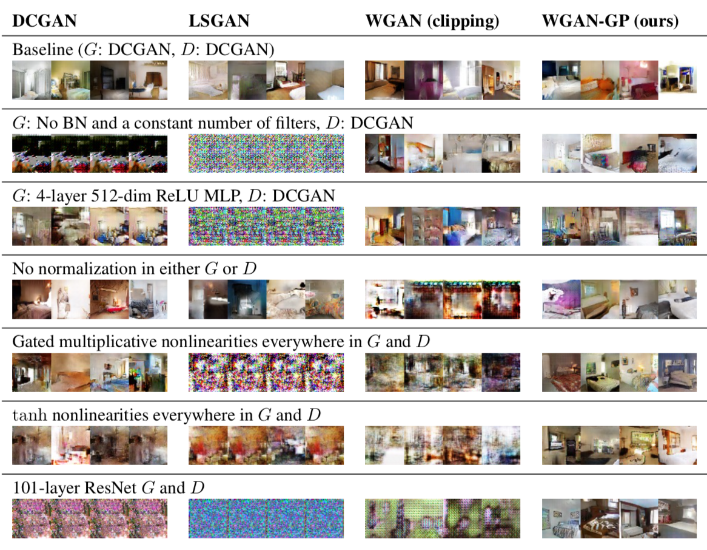

### Improved performance over weight clipping

- WGAN-GP의 장점 
  - training speed
  - sample quality
- CIFAR-10을 이용해 `WGAN-GP` 와 `WGAN-Clipping` 을 비교해 Inception score을 구했을 때
  - 같은 RMSProp과 lr을 사용
  - 같은 Adam과 좀더 높은 lr을 사용
- WGAN-GP가 WGAN-Clipping보다 빠르고, 좋은 성능을 보여줌
- DCGAN가 비교했을 때, WGAN-CP가 늦게 수렴하지만, 안정적인 성능을 보여줌
  - 성능은 비슷하게 나옴

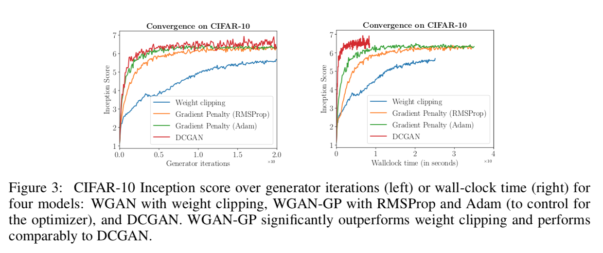

### Sample quality on CIFAR-10 and LSUN bedrooms

- 안정성의 증가는 딥한 모델 학습이 가능

- Unsupervised 에서는 제일 좋은 성능 얻음
- label이 추가한 supervised에서는 SGAN을 제외한 좋은 성능을 얻음
- Deep ResNet에서 128x128 이미지 학습이 가능

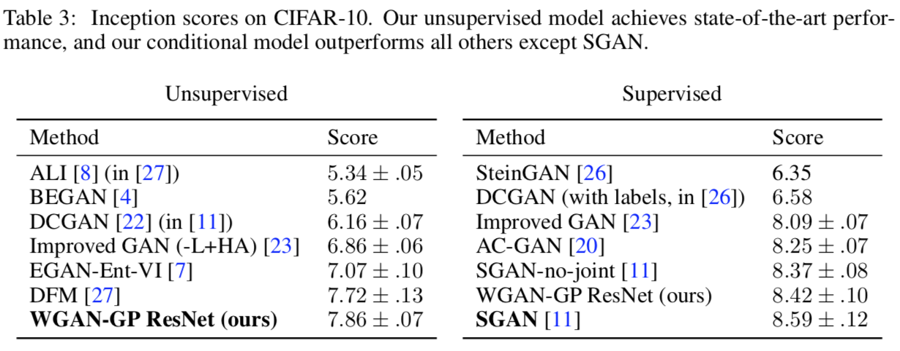

### Modeling discrete data with a continuous generator

- Discrete data에서의 모델 능력을 보여주기 위해, `character-level GAN` 을 학습
  - Generator
    - 1D-CNN을 이용해 데이터 생성 (`latent vector` -> `연속의 32 one-hot character` )
    - softmax을 적용
  - Discriminator
    - sample없이 바로 critic(1D-CNN 적용) 에 전달
    - agmax을 이용해 데이터 decoding
- 종종 실수가 있지만, 언어 분포를 학습 (Origin에서는 학습이 불가능)

 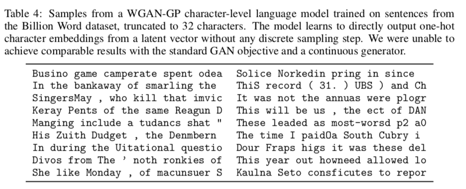

- Pr은 discrete (대다수가 0), Pg는 continuous
  - 그러므로 KL-Divergence은 무한대, JS-Divergence은 saturated 됨
  - discriminator는 one-hot이외 값을 모두 거절하도록 학습

### Meaningful loss curves and detecting overfitting

- image quality와 loss가 상관관계가 있음
- 우리의 방법이 generator보다 빠르게 over-fitting됨

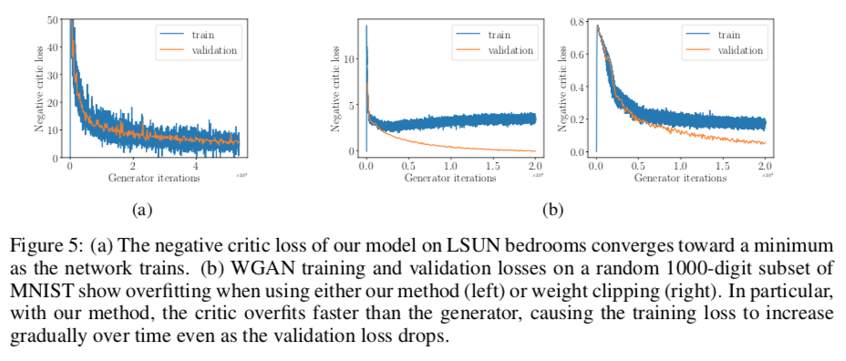

## Conclusions

- WGAN의 weight clipping을 대안할 penalty term을 소개
- 다양한 모델에 대해 강력한 modeling performance와 stability을 보여줌
- 더 딥한 모델을 안정적으로 학습이 가능
- Origin GAN에 penalty을 추가해도 학습이 안정적으로 진행됨